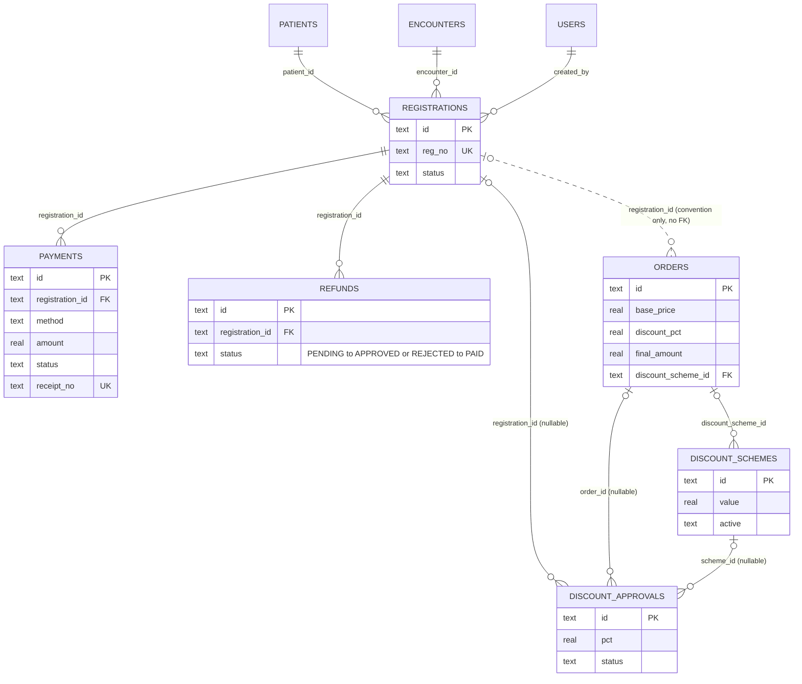
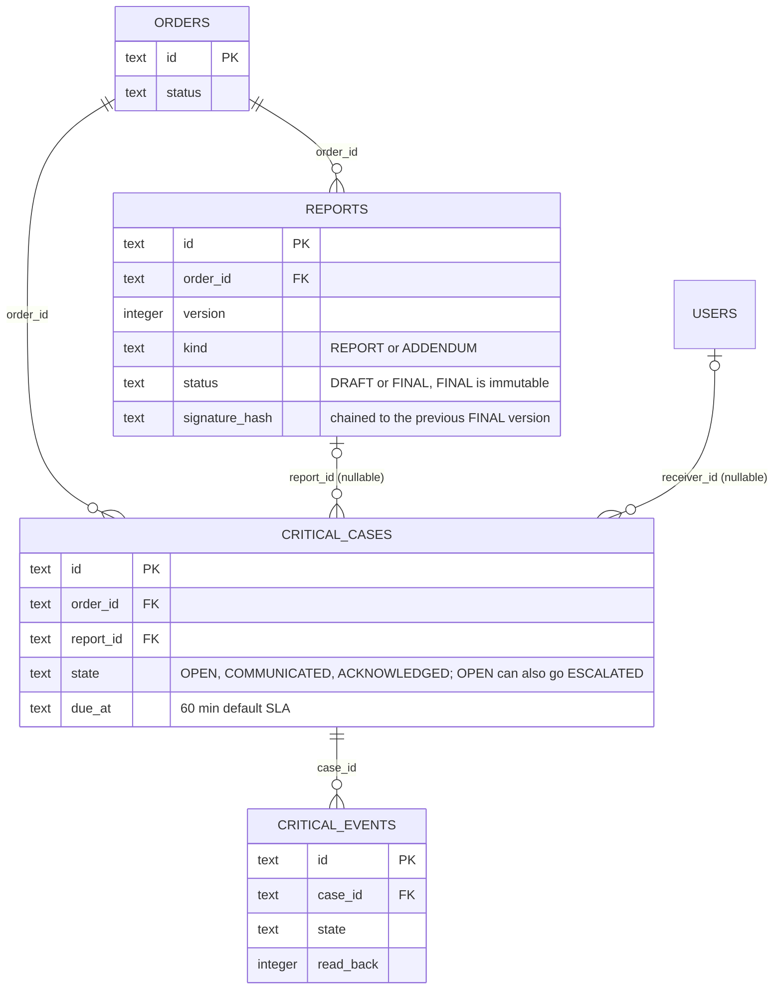
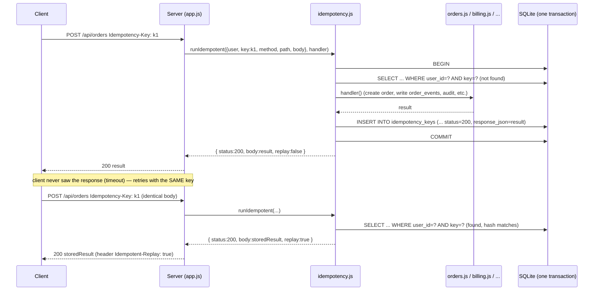
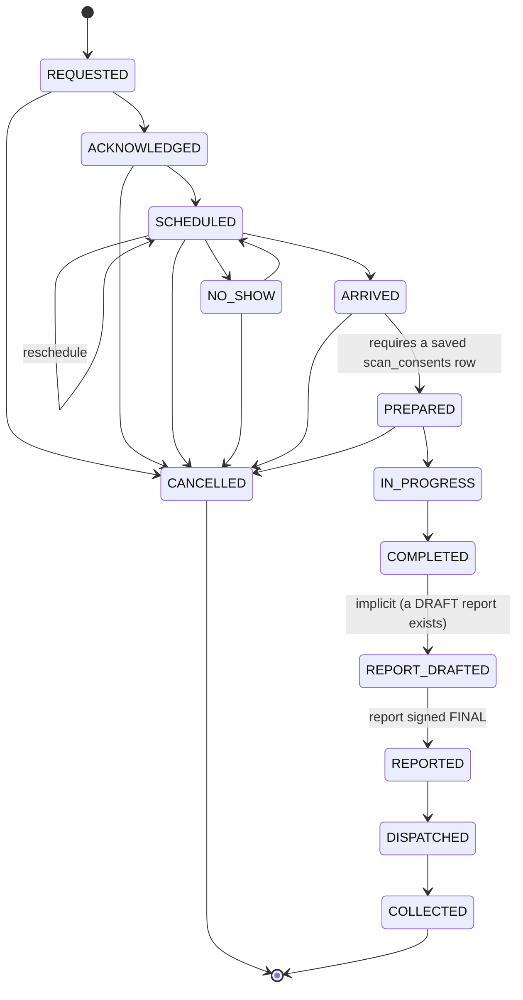

# 1. Data model and relationships

This chapter is the authoritative reference for the data the reference RIS implementation keeps, how its tables relate to
each other, and which database-level guarantees a production rebuild must reproduce regardless of the stack chosen.

The reference implementation is a single-file **SQLite** database (`node:sqlite`, WAL mode, foreign keys **on**) opened in
`server/db.js`. There is no ORM: every query in `server/*.js` is hand-written SQL. The schema is owned entirely by
`server/migrations/*.js` — never infer the schema from a model file, because none exists.

Out of scope for this system entirely: PACS, DICOM, an image viewer, image storage, image-based AI. No table here holds
pixel data; `patient_documents.front_data`/`back_data` and `patient_word_audio.data` hold small base64 ID-proof images and
voice notes, not studies.

## 1.1 How the schema evolves

Schema changes are versioned migrations, applied in order, tracked in a `schema_version(version INTEGER PRIMARY KEY, name
TEXT NOT NULL, applied_at TEXT NOT NULL)` table created by the migration runner itself (`server/migrations/index.js`), not
by a migration file. On open, `db.js` calls `migrate()`, which brings the database to the latest version and takes a
`VACUUM INTO` backup first if the database is already populated. There are four migrations today:

| # | File | What it did |
|---|---|---|
| 1 | `001_baseline.js` | Everything that existed before versioned migrations: all core tables, plus columns that used to be bolted on with an `ensureColumn` helper (idempotent `ALTER TABLE ... ADD COLUMN`) |
| 2 | `002_foundation.js` | `idempotency_keys`, `audit_anchors`, append-only/immutability triggers, report signature v2 columns, soft-delete columns |
| 3 | `003_service_master.js` | Rebuilt `exam_catalog` with pricing/admin fields (table rebuild, not a plain `ALTER TABLE`, to make `price` nullable); added `discount_schemes` and the first shape of `discount_approvals` |
| 4 | `004_discount_scheme_link.js` | `orders.discount_scheme_id`; rebuilt `discount_approvals` so `scheme_id` is optional and the table carries `pct`/`reason` directly |

A backend team on a different stack should treat each migration's `up()` as the authoritative diff for that schema change —
the column lists below already reflect the **cumulative, final** shape (i.e. after migration 4), but the migration files
are the audit trail of *why* a column is shaped the way it is (e.g. why `exam_catalog.price` is nullable, why
`discount_approvals.scheme_id` is nullable).

Two migrations (`003`, `004`) rebuild a table (create-copy-drop-rename) instead of using `ALTER TABLE`, because SQLite
cannot relax a `NOT NULL` constraint or add a `NOT NULL` column without a default via a plain `ALTER TABLE`. That is a
SQLite-specific constraint; a relational database with native `ALTER COLUMN` (PostgreSQL, MySQL 8+, SQL Server) does not
need this dance, but the **resulting column shape** (nullability, defaults) is what must be reproduced.

## 1.2 Conventions used throughout the schema

These are implicit conventions enforced in application code (`server/util.js` and callers), not by SQLite itself — a
different backend stack must decide how to enforce the same guarantees (application code, DB constraints, or both):

- **Primary keys** are `TEXT`, generated as `<prefix>_<uuid v4>` (e.g. `ord_3f2...`, `rpt_...`) via `uid(prefix)` in
  `server/util.js`. A few legacy/auxiliary tables use `INTEGER PRIMARY KEY AUTOINCREMENT` instead: `audit_events.id`,
  `medicines.id`, `diseases.id`, `surgery_tree.id`.
- **Timestamps** are `TEXT`, ISO-8601 strings (`new Date(...).toISOString()`), always UTC, produced by a single
  `now()`/`nowMs()` pair in `server/util.js` so that demo-data seeding can replay a simulated clock. A production rebuild
  should use a real timestamp/timestamptz column type if the target database has one; just keep sortable ISO-8601
  semantics if it doesn't.
- **Booleans** are `INTEGER` (`0`/`1`): `active`, `uses_contrast`, `ionising`, `mri`, `no_charge`, `phone_verified`,
  `email_verified`, `read_back`, `requires_reason`, `requires_approval`.
- **Money** is `REAL` (IEEE double), e.g. `orders.base_price`, `payments.amount`, `exam_catalog.price`. **This is a known
  gap for a production rebuild**: floating-point currency invites rounding drift; a production schema should use a
  fixed-point/decimal or integer-minor-units type for every money column.
- **JSON blobs** (`TEXT` columns ending `_json`: `safety_checks.flags_json`, `payments.details_json`,
  `medical_consents.data_json`, `past_history.data_json`, `scan_consents.data_json`) are opaque to the database — SQLite
  has no JSON column type here. A production database with native JSON (PostgreSQL `jsonb`, MySQL `JSON`) can use it, but
  the *shape* inside each blob is defined by the handler in the matching `server/*.js` module, not by the schema; read the
  code before assuming a shape for those fields.
- **Foreign keys are not always declared**, even where a logical relationship exists. Two cases to know about, because
  they will NOT be enforced as referential integrity by SQLite today, and a rebuild should decide deliberately whether to
  tighten them:
  - `orders.registration_id` — added by `ensureColumn` in migration 1 as a bare `TEXT` column with **no `REFERENCES`
    clause**, even though every order created through registration carries a real `registrations.id`. It is indexed
    (`orders_reg`) but not FK-constrained.
  - `notifications.order_id` and `patient_documents.proof_type` are similarly bare `TEXT`, referencing `orders.id` and
    `proof_types.id` respectively only by application convention.
  - `surgery_tree.parent_id` (self-reference, tree structure) is also a bare `INTEGER` with no declared FK.

## 1.3 Full entity-relationship diagram

This covers every table and every foreign-key relationship (declared or convention-only — convention-only edges are
marked). Attributes are trimmed to primary/foreign keys and the handful of columns needed to read the diagram; see
§1.4 for complete column lists.

```mermaid
erDiagram
    USERS {
        text id PK
        text username UK
        text role
    }
    PATIENTS {
        text id PK
        text mrn UK
    }
    ENCOUNTERS {
        text id PK
        text patient_id FK
        text type
        text doctor_id FK
    }
    EXAM_CATALOG {
        text code PK
        text active
    }
    ORDERS {
        text id PK
        text accession UK
        text patient_id FK
        text encounter_id FK
        text exam_code FK
        text requested_by FK
        text technologist_id FK
        text radiologist_id FK
        text registration_id "no FK (convention only)"
        text discount_scheme_id FK
        text status
    }
    ORDER_EVENTS {
        text id PK
        text order_id FK
    }
    SAFETY_CHECKS {
        text id PK
        text order_id FK
    }
    REPORT_TEMPLATES {
        text id PK
    }
    REPORTS {
        text id PK
        text order_id FK
        integer version
        text status
    }
    CRITICAL_CASES {
        text id PK
        text order_id FK
        text report_id FK
        text receiver_id FK
        text state
    }
    CRITICAL_EVENTS {
        text id PK
        text case_id FK
    }
    MESSAGES {
        text id PK
        text order_id FK
        text sender_id FK
    }
    NOTIFICATIONS {
        text id PK
        text user_id FK
        text order_id "no FK (convention only)"
    }
    AUDIT_EVENTS {
        integer id PK
        text event_id UK
        text prev_hash
        text event_hash
    }
    AUDIT_ANCHORS {
        text id PK
        integer audit_id
    }
    IDEMPOTENCY_KEYS {
        text user_id PK
        text key PK
    }
    REGISTRATIONS {
        text id PK
        text reg_no UK
        text patient_id FK
        text encounter_id FK
        text created_by FK
        text status
    }
    PAYMENTS {
        text id PK
        text registration_id FK
        text receipt_no UK
    }
    REFUNDS {
        text id PK
        text registration_id FK
        text status
    }
    DISCOUNT_SCHEMES {
        text id PK
        text active
    }
    DISCOUNT_APPROVALS {
        text id PK
        text registration_id FK
        text order_id FK
        text scheme_id FK
        text status
    }
    PATIENT_DOCUMENTS {
        text id PK
        text patient_id FK
        text proof_type "no FK (convention only)"
        text superseded_at
    }
    PROOF_TYPES {
        text id PK
    }
    REFERRALS {
        text id PK
    }
    DESIGNATIONS {
        text id PK
    }
    MEDICINES {
        integer id PK
    }
    DISEASES {
        integer id PK
    }
    SURGERY_TREE {
        integer id PK
        integer parent_id "self-FK, not declared"
    }
    OTP_CHALLENGES {
        text id PK
    }
    PATIENT_WORDS {
        text id PK
        text encounter_id FK
        text patient_id FK
        text deleted_at
    }
    PATIENT_WORD_AUDIO {
        text id PK
        text words_id FK
    }
    MEDICAL_CONSENTS {
        text id PK
        text encounter_id FK
        text patient_id FK
    }
    PAST_HISTORY {
        text id PK
        text encounter_id FK
        text patient_id FK
    }
    SCAN_CONSENTS {
        text id PK
        text order_id FK
    }

    PATIENTS ||--o{ ENCOUNTERS : "patient_id"
    USERS ||--o{ ENCOUNTERS : "doctor_id (nullable)"
    PATIENTS ||--o{ ORDERS : "patient_id"
    ENCOUNTERS ||--o{ ORDERS : "encounter_id"
    EXAM_CATALOG ||--o{ ORDERS : "exam_code"
    USERS ||--o{ ORDERS : "requested_by"
    USERS |o--o{ ORDERS : "technologist_id (nullable)"
    USERS |o--o{ ORDERS : "radiologist_id (nullable)"
    REGISTRATIONS |o..o{ ORDERS : "registration_id (convention only)"
    DISCOUNT_SCHEMES |o--o{ ORDERS : "discount_scheme_id (nullable)"
    ORDERS ||--o{ ORDER_EVENTS : "order_id"
    ORDERS ||--o{ SAFETY_CHECKS : "order_id"
    ORDERS ||--o{ REPORTS : "order_id"
    ORDERS ||--o{ MESSAGES : "order_id"
    USERS ||--o{ MESSAGES : "sender_id"
    ORDERS |o..o{ NOTIFICATIONS : "order_id (convention only)"
    USERS ||--o{ NOTIFICATIONS : "user_id"
    ORDERS ||--o{ CRITICAL_CASES : "order_id"
    REPORTS |o--o{ CRITICAL_CASES : "report_id (nullable)"
    USERS |o--o{ CRITICAL_CASES : "receiver_id (nullable)"
    CRITICAL_CASES ||--o{ CRITICAL_EVENTS : "case_id"
    USERS ||--o{ IDEMPOTENCY_KEYS : "user_id"
    PATIENTS ||--o{ REGISTRATIONS : "patient_id"
    ENCOUNTERS ||--o{ REGISTRATIONS : "encounter_id"
    USERS ||--o{ REGISTRATIONS : "created_by"
    REGISTRATIONS ||--o{ PAYMENTS : "registration_id"
    REGISTRATIONS ||--o{ REFUNDS : "registration_id"
    REGISTRATIONS |o--o{ DISCOUNT_APPROVALS : "registration_id (nullable)"
    ORDERS |o--o{ DISCOUNT_APPROVALS : "order_id (nullable)"
    DISCOUNT_SCHEMES |o--o{ DISCOUNT_APPROVALS : "scheme_id (nullable)"
    PATIENTS ||--o{ PATIENT_DOCUMENTS : "patient_id"
    PROOF_TYPES |o..o{ PATIENT_DOCUMENTS : "proof_type (convention only)"
    PATIENTS ||--o{ PATIENT_WORDS : "patient_id"
    ENCOUNTERS ||--o{ PATIENT_WORDS : "encounter_id"
    PATIENT_WORDS ||--o{ PATIENT_WORD_AUDIO : "words_id"
    PATIENTS ||--o{ MEDICAL_CONSENTS : "patient_id"
    ENCOUNTERS ||--o{ MEDICAL_CONSENTS : "encounter_id"
    PATIENTS ||--o{ PAST_HISTORY : "patient_id"
    ENCOUNTERS ||--o{ PAST_HISTORY : "encounter_id"
    ORDERS ||--o{ SCAN_CONSENTS : "order_id"
    SURGERY_TREE |o..o{ SURGERY_TREE : "parent_id (self, convention only)"
```

`REPORT_TEMPLATES`, `REFERRALS`, `DESIGNATIONS`, `MEDICINES`, `DISEASES` and `OTP_CHALLENGES` are standalone reference
tables with no outgoing FK (templates are matched to an order by `modality`/`body_part` string equality in
`server/catalog.js`, not a key; OTP challenges are looked up by `purpose`/`channel`/`target`, not a key either) — they are
listed in the box diagram above for completeness but have no relationship edges.

See also §1.3.1 for two focused sub-diagrams (billing/discounts, reporting/critical results) and §1.7 for the order
status state machine.

### 1.3.1 Focused sub-diagrams

The full diagram above is dense. These two subsets are the ones a backend engineer will want on their own when working
on money or on the reporting/critical-result loop specifically.

**Billing & discounts**

**Reporting & critical results**

## 1.4 Table reference

Every table, grouped as requested. "PK" marks the primary key; "FK → table(col)" marks a declared `REFERENCES`; a
relationship that exists only by naming convention (no `REFERENCES` in the DDL) is called out explicitly instead of
written as "FK".

### 1.4.1 Identity & staff

**`users`** — one row per sign-in-capable person (all seven roles: `radiologist`, `technologist`, `clinician`, `nurse`,
`reception`, `admin`, `auditor`). Source of truth is `server/roster.js`, loaded by `server/seed.js`.

| Column | Type | Null | Default | Notes |
|---|---|---|---|---|
| `id` | TEXT | NOT NULL | — | PK |
| `username` | TEXT | NOT NULL | — | UNIQUE. This is the **employee code** used to sign in (see §1.8 placeholders) |
| `password_hash` | TEXT | NOT NULL | — | see `server/auth.js` for the hashing scheme |
| `password_salt` | TEXT | NOT NULL | — | |
| `full_name` | TEXT | NOT NULL | — | |
| `role` | TEXT | NOT NULL | — | one of the seven role strings above |
| `ward` | TEXT | NULL | — | set only for `nurse` accounts (HDU/ICU/Ward A/Ward B/Private) |
| `active` | INTEGER | NOT NULL | `1` | |
| `created_at` | TEXT | NOT NULL | — | |
| `phone` | TEXT | NULL | — | added by `ensureColumn` in migration 1 |
| `designation` | TEXT | NULL | — | added by `ensureColumn` in migration 1 |

No DB-level session table exists. **Sessions are an in-memory `Map` in `server/auth.js`** (`sessions`, `attempts`), not
persisted anywhere — a server restart signs every user out, and horizontal scaling to more than one process would not
share sessions. A production rebuild needs a real session store (DB table, Redis, JWT, etc.) — see the handoff chapter on
auth for detail; flagged here because it is the one piece of "identity & staff" state that has **no table**.

### 1.4.2 Patients & encounters

**`patients`** — one row per person, deduplicated by phone/email/UHID/Aadhaar at registration time (`server/registration.js`
`lookupPatients`). No hard delete path exists anywhere in the codebase.

| Column | Type | Null | Default | Notes |
|---|---|---|---|---|
| `id` | TEXT | NOT NULL | — | PK |
| `mrn` | TEXT | NOT NULL | — | UNIQUE. Medical record number |
| `name` | TEXT | NOT NULL | — | |
| `dob` | TEXT | NOT NULL | — | date string |
| `sex` | TEXT | NOT NULL | — | |
| `phone` | TEXT | NULL | — | |
| `allergy` | TEXT | NOT NULL | `'None recorded'` | free text |
| `source_system` | TEXT | NOT NULL | `'LOCAL'` | reserved for a future HIS integration (see README "Before real use") |
| `created_at` | TEXT | NOT NULL | — | |
| `first_name`, `middle_name`, `last_name` | TEXT | NULL | — | |
| `email` | TEXT | NULL | — | |
| `address`, `country`, `state`, `city`, `zipcode` | TEXT | NULL | — | |
| `occupation` | TEXT | NULL | — | matched against `OCCUPATIONS` in `server/reference-data.js` |
| `designation` | TEXT | NULL | — | patient's own designation (agency form field), unrelated to `users.designation` |
| `reference` | TEXT | NULL | — | referral free text |
| `aadhaar_hash` | TEXT | NULL | — | SHA-256 of the validated (Verhoeff) Aadhaar number — **never the plaintext number** |
| `aadhaar_last4` | TEXT | NULL | — | last 4 digits only, for display |
| `phone_verified`, `email_verified` | INTEGER | NOT NULL | `0` | set by OTP verification |

**`encounters`** — one row per OPD/IPD/OT/EXTERNAL visit/admission; an order always belongs to exactly one.

| Column | Type | Null | Default | Notes |
|---|---|---|---|---|
| `id` | TEXT | NOT NULL | — | PK |
| `patient_id` | TEXT | NOT NULL | — | FK → `patients(id)` |
| `type` | TEXT | NOT NULL | — | `OPD` \| `IPD` \| `OT` \| `EXTERNAL` (`EXTERNAL` = a walk-in registration created without an OPD/IPD visit; see `registration.js`) |
| `ref_no` | TEXT | NOT NULL | — | |
| `ward`, `room`, `bed` | TEXT | NULL | — | required for `IPD` by application validation (`patients.js`), not by the DB |
| `diagnosis` | TEXT | NULL | — | |
| `doctor_id` | TEXT | NULL | — | FK → `users(id)` |
| `admitted_at` | TEXT | NULL | — | set only when `type = 'IPD'` |
| `status` | TEXT | NOT NULL | `'ACTIVE'` | |
| `created_at` | TEXT | NOT NULL | — | |

**Indexes**: none beyond the PK/FK (no explicit `CREATE INDEX` on `encounters`).

### 1.4.3 Orders & workflow

**`exam_catalog`** — the service/tariff master (rebuilt shape, migration 3). One row per orderable exam code.

| Column | Type | Null | Default | Notes |
|---|---|---|---|---|
| `code` | TEXT | NOT NULL | — | PK, human-meaningful (e.g. `MRI_LSPINE`) |
| `name` | TEXT | NOT NULL | — | |
| `modality` | TEXT | NOT NULL | — | `MRI`, `CT`, `XRAY`, `USG`/sonography, `DEXA`, `OPEN_MRI` etc. — see `server/reference-data.js` for the live set |
| `body_part` | TEXT | NOT NULL | — | |
| `est_minutes` | INTEGER | NOT NULL | — | drives scheduling duration |
| `prep` | TEXT | NOT NULL | `''` | patient-prep instructions |
| `uses_contrast` | INTEGER | NOT NULL | `0` | boolean |
| `ionising` | INTEGER | NOT NULL | `0` | boolean — gates the pregnancy safety check |
| `mri` | INTEGER | NOT NULL | `0` | boolean — gates the implant safety check |
| `keywords` | TEXT | NOT NULL | `''` | space/comma list matched against clinical indication text for exam suggestion |
| `price` | REAL | **NULL** | — | **CASH** price. `NULL` = the hospital's rate sheet gave no figure yet (see `price_note`); never defaulted to `0` |
| `sub_group` | TEXT | NULL | — | e.g. `MRI SPINE`, matches the tariff import's `subGroup` |
| `online_price` | REAL | NULL | — | online/digital rate, independent of `price` |
| `source` | TEXT | NOT NULL | `'SEED'` | `SEED` \| `ADMIN` \| `HOSPITAL_SHEET` \| `PLACEHOLDER` (see `server/import-master.js`) |
| `active` | INTEGER | NOT NULL | `1` | soft "is this orderable" flag — see §1.9 |
| `price_note` | TEXT | NULL | — | human-readable pricing caveat, e.g. "Priced via the ... tier" or "no rate on the hospital sheet" |
| `updated_at`, `updated_by` | TEXT | NULL | — | admin-edit audit trail |

**`orders`** — the central workflow entity: one row per requested exam.

| Column | Type | Null | Default | Notes |
|---|---|---|---|---|
| `id` | TEXT | NOT NULL | — | PK |
| `accession` | TEXT | NOT NULL | — | UNIQUE, human-facing order number |
| `patient_id` | TEXT | NOT NULL | — | FK → `patients(id)` |
| `encounter_id` | TEXT | NOT NULL | — | FK → `encounters(id)` |
| `source` | TEXT | NOT NULL | — | copied from `encounters.type` at creation: `OPD` \| `IPD` \| `OT` \| `EXTERNAL` |
| `exam_code` | TEXT | NOT NULL | — | FK → `exam_catalog(code)` |
| `priority` | TEXT | NOT NULL | — | `ROUTINE` \| `URGENT` \| `STAT` (`server/orders.js` `PRIORITIES`); `STAT` is restricted to ward/radiologist roles |
| `clinical_indication` | TEXT | NOT NULL | — | free text, also drives exam suggestion and the critical-wording detector on report text (not on this field) |
| `requested_by` | TEXT | NOT NULL | — | FK → `users(id)` |
| `status` | TEXT | NOT NULL | — | see the state machine in §1.7 |
| `scheduled_at` | TEXT | NULL | — | |
| `technologist_id` | TEXT | NULL | — | FK → `users(id)`, set on `IN_PROGRESS` by a technologist |
| `radiologist_id` | TEXT | NULL | — | FK → `users(id)` |
| `due_at` | TEXT | NOT NULL | — | SLA deadline, computed at creation from priority (1h/4h/24h-class targets; see the SLA chapter) |
| `revision` | INTEGER | NOT NULL | `0` | optimistic-concurrency counter — every transition's `UPDATE` is `WHERE id = ? AND revision = ?` |
| `cancel_reason` | TEXT | NULL | — | required by application code when `status → CANCELLED` |
| `created_at`, `updated_at` | TEXT | NOT NULL | — | |
| `completed_at`, `reported_at` | TEXT | NULL | — | |
| `registration_id` | TEXT | NULL | — | **no declared FK** (see §1.2) → `registrations(id)` by convention |
| `side` | TEXT | NULL | — | e.g. left/right, for paired-organ exams |
| `base_price` | REAL | NOT NULL | `0` | snapshot of `exam_catalog.price` (or `online_price`) at order time |
| `discount_pct` | REAL | NOT NULL | `0` | |
| `discount_amount` | REAL | NOT NULL | `0` | |
| `final_amount` | REAL | NOT NULL | `0` | always server-calculated (README: "Totals are always calculated by the server") |
| `no_charge` | INTEGER | NOT NULL | `0` | boolean |
| `waiver_reason` | TEXT | NULL | — | required when `no_charge` or a ≥50% discount is applied |
| `external_order_id` | TEXT | NULL | — | reserved for a future upstream HIS/order-placing system |
| `discount_scheme_id` | TEXT | NULL | — | FK → `discount_schemes(id)`, added migration 4 |

**Indexes**: `orders_status(status)`, `orders_patient(patient_id)`, `orders_reg(registration_id)`,
`orders_external_order_id` **UNIQUE** `WHERE external_order_id IS NOT NULL` (partial unique index — enforces uniqueness
only among non-null values, SQLite's usual pattern for "unique if present"), `orders_discount_scheme(discount_scheme_id)
WHERE discount_scheme_id IS NOT NULL`.

**`order_events`** — append-only transition log for every order (see §1.5).

| Column | Type | Null | Default | Notes |
|---|---|---|---|---|
| `id` | TEXT | NOT NULL | — | PK |
| `order_id` | TEXT | NOT NULL | — | FK → `orders(id)` |
| `from_status` | TEXT | NULL | — | null for the initial `REQUESTED` event |
| `to_status` | TEXT | NOT NULL | — | |
| `actor_id`, `actor_name` | TEXT | NOT NULL | — | denormalised at write time, so the log reads correctly even if the user is later renamed/deactivated |
| `note` | TEXT | NOT NULL | `''` | |
| `at` | TEXT | NOT NULL | — | |

**`safety_checks`** — one row per safety-screening submission for an order (technologist/radiologist led).

| Column | Type | Null | Default | Notes |
|---|---|---|---|---|
| `id` | TEXT | NOT NULL | — | PK |
| `order_id` | TEXT | NOT NULL | — | FK → `orders(id)` |
| `pregnant` | TEXT | NOT NULL | — | tri-state string (yes/no/unknown-style), not boolean |
| `contrast_allergy` | TEXT | NOT NULL | — | tri-state string |
| `egfr` | REAL | NULL | — | kidney function value, gates contrast safety |
| `mri_implant` | TEXT | NOT NULL | — | tri-state string |
| `notes` | TEXT | NOT NULL | `''` | |
| `flags_json` | TEXT | NOT NULL | — | JSON array of which rules fired |
| `status` | TEXT | NOT NULL | — | `CLEARED` \| `BLOCKED` (only a radiologist can move a blocked check forward, via `override_reason`) |
| `override_reason` | TEXT | NULL | — | required when a radiologist overrides a `BLOCKED` result |
| `actor_id`, `actor_name` | TEXT | NOT NULL | — | |
| `at` | TEXT | NOT NULL | — | |

### 1.4.4 Safety & consent

**`scan_consents`** — the patient consent form (CT/MRI contrast, sedation; English/Gujarati) gating scan start.

| Column | Type | Null | Default | Notes |
|---|---|---|---|---|
| `id` | TEXT | NOT NULL | — | PK |
| `order_id` | TEXT | NOT NULL | — | FK → `orders(id)` |
| `data_json` | TEXT | NOT NULL | — | consent form fields |
| `full_name` | TEXT | NOT NULL | — | signer's name |
| `signed_date` | TEXT | NOT NULL | — | |
| `language` | TEXT | NOT NULL | `'en'` | |
| `actor_id`, `actor_name` | TEXT | NOT NULL | — | |
| `created_at` | TEXT | NOT NULL | — | |

Per the README, saving this record is what moves a scan to "Prepared" — a scan cannot be started (`IN_PROGRESS`) before
it exists for that order; see `server/clinical.js` and the state machine in §1.7.

**`medical_consents`** — general medical consent, per encounter.

| Column | Type | Null | Default | Notes |
|---|---|---|---|---|
| `id` | TEXT | NOT NULL | — | PK |
| `encounter_id` | TEXT | NOT NULL | — | FK → `encounters(id)` |
| `patient_id` | TEXT | NOT NULL | — | FK → `patients(id)` |
| `data_json` | TEXT | NOT NULL | — | |
| `actor_id`, `actor_name` | TEXT | NOT NULL | — | |
| `created_at` | TEXT | NOT NULL | — | |

**`past_history`** — diseases, medicines, surgery tree selections, other-disease notes, per encounter.

| Column | Type | Null | Default | Notes |
|---|---|---|---|---|
| `id` | TEXT | NOT NULL | — | PK |
| `encounter_id` | TEXT | NOT NULL | — | FK → `encounters(id)` |
| `patient_id` | TEXT | NOT NULL | — | FK → `patients(id)` |
| `data_json` | TEXT | NOT NULL | — | structured selections, referencing `diseases`/`medicines`/`surgery_tree` ids inside the JSON, not via FK |
| `notes` | TEXT | NOT NULL | `''` | |
| `actor_id`, `actor_name` | TEXT | NOT NULL | — | |
| `created_at` | TEXT | NOT NULL | — | |

**`patient_words`** — the patient's own words (text), per encounter; soft-deletable (see §1.9).

| Column | Type | Null | Default | Notes |
|---|---|---|---|---|
| `id` | TEXT | NOT NULL | — | PK |
| `encounter_id` | TEXT | NOT NULL | — | FK → `encounters(id)` |
| `patient_id` | TEXT | NOT NULL | — | FK → `patients(id)` |
| `text` | TEXT | NOT NULL | `''` | |
| `created_by`, `created_by_name` | TEXT | NOT NULL | — | |
| `created_at` | TEXT | NOT NULL | — | |
| `deleted_at` | TEXT | NULL | — | soft delete, migration 2 |
| `deleted_by` | TEXT | NULL | — | |

**`patient_word_audio`** — an optional audio recording attached to a `patient_words` row.

| Column | Type | Null | Default | Notes |
|---|---|---|---|---|
| `id` | TEXT | NOT NULL | — | PK |
| `words_id` | TEXT | NOT NULL | — | FK → `patient_words(id)` |
| `mime` | TEXT | NOT NULL | — | |
| `data` | TEXT | NOT NULL | — | base64 audio payload, stored inline (no object storage) |
| `created_at` | TEXT | NOT NULL | — | |

### 1.4.5 Reporting

**`report_templates`** — canned technique/findings/impression text, matched to an order by `modality` + `body_part`
string equality (no FK; see `server/catalog.js` `templatesFor`).

| Column | Type | Null | Default | Notes |
|---|---|---|---|---|
| `id` | TEXT | NOT NULL | — | PK |
| `name` | TEXT | NOT NULL | — | |
| `modality`, `body_part` | TEXT | NOT NULL | — | matched against `exam_catalog` values, not FK-constrained |
| `technique`, `findings`, `impression` | TEXT | NOT NULL | — | template bodies |

**`reports`** — every draft, signed and addendum report version for an order.

| Column | Type | Null | Default | Notes |
|---|---|---|---|---|
| `id` | TEXT | NOT NULL | — | PK |
| `order_id` | TEXT | NOT NULL | — | FK → `orders(id)` |
| `version` | INTEGER | NOT NULL | — | 1 = the original report; 2+ = addenda |
| `kind` | TEXT | NOT NULL | — | `REPORT` \| `ADDENDUM` |
| `status` | TEXT | NOT NULL | — | `DRAFT` \| `FINAL` |
| `technique`, `findings`, `impression`, `recommendation` | TEXT | NOT NULL | `''` | |
| `critical_declared` | TEXT | NULL | — | `'YES'`/`'NO'`-style explicit decision required at signing |
| `author_id`, `author_name` | TEXT | NOT NULL | — | reassigned on sign if a different radiologist signs an addendum |
| `revision` | INTEGER | NOT NULL | `1` | optimistic-concurrency counter, same pattern as `orders.revision` |
| `created_at`, `updated_at` | TEXT | NOT NULL | — | |
| `signed_at` | TEXT | NULL | — | set when `status → FINAL` |
| `signature_hash` | TEXT | NULL | — | SHA-256 over the signature payload (§1.5) |
| `addendum_reason` | TEXT | NULL | — | required for `kind = 'ADDENDUM'` |
| `sig_version` | INTEGER | NOT NULL | `1` | `1` = pre-migration-2 payload shape; `2` = current (adds signer/addendum reason/critical fields to the hash) |
| `critical_summary` | TEXT | NULL | — | |
| `critical_no_reason` | TEXT | NULL | — | required when `critical_declared = 'NO'` for a report whose text matched a critical pattern, per `server/reports.js` |

**Indexes**: `reports_order(order_id)`, `reports_order_version` **UNIQUE** `(order_id, version)` — this is what guarantees
versions cannot collide even under concurrent addendum writes.

**Immutability**: once `status = 'FINAL'`, a report row can never be `UPDATE`d or `DELETE`d (DB trigger, see §1.5).
Corrections are new rows (`kind = 'ADDENDUM'`, `version = max+1`).

### 1.4.6 Critical results

**`critical_cases`** — one row per critical finding requiring communication to the referring clinician/ward.

| Column | Type | Null | Default | Notes |
|---|---|---|---|---|
| `id` | TEXT | NOT NULL | — | PK |
| `order_id` | TEXT | NOT NULL | — | FK → `orders(id)` |
| `report_id` | TEXT | NULL | — | FK → `reports(id)`, set if raised from a specific report |
| `summary` | TEXT | NOT NULL | — | |
| `receiver_id` | TEXT | NULL | — | FK → `users(id)`, who is expected to acknowledge |
| `state` | TEXT | NOT NULL | — | `OPEN` → `COMMUNICATED` → `ACKNOWLEDGED`; separately, `OPEN` → `ESCALATED` if `due_at` passes before communication (lazy sweep, `sweepCritical()` in `server/critical.js`, run on read rather than on a schedule — only a state still `OPEN` is escalated, `COMMUNICATED` is not swept) |
| `due_at` | TEXT | NOT NULL | — | `created_at + RIS_CRITICAL_MINUTES` (default-config 60 minutes) — the escalation deadline |
| `created_by` | TEXT | NOT NULL | — | |
| `created_at` | TEXT | NOT NULL | — | |

**`critical_events`** — append-only timeline for a critical case (communicate / read-back / acknowledge / escalate).

| Column | Type | Null | Default | Notes |
|---|---|---|---|---|
| `id` | TEXT | NOT NULL | — | PK |
| `case_id` | TEXT | NOT NULL | — | FK → `critical_cases(id)` |
| `state` | TEXT | NOT NULL | — | the state the case moved to |
| `receiver_name` | TEXT | NULL | — | who was actually told (may differ from `critical_cases.receiver_id`'s name) |
| `channel` | TEXT | NULL | — | how they were told (phone, in person, etc. — free text/enum in UI) |
| `read_back` | INTEGER | NULL | — | boolean: was the finding read back and confirmed |
| `note` | TEXT | NOT NULL | `''` | also holds the action plan text on an `ACKNOWLEDGED` event |
| `actor_id`, `actor_name` | TEXT | NOT NULL | — | |
| `at` | TEXT | NOT NULL | — | |

### 1.4.7 Messaging & notifications

**`messages`** — free-text thread attached to an order (clinician ↔ radiology).

| Column | Type | Null | Default | Notes |
|---|---|---|---|---|
| `id` | TEXT | NOT NULL | — | PK |
| `order_id` | TEXT | NOT NULL | — | FK → `orders(id)` |
| `sender_id` | TEXT | NOT NULL | — | FK → `users(id)` |
| `sender_name`, `sender_role` | TEXT | NOT NULL | — | denormalised at write time |
| `body` | TEXT | NOT NULL | — | |
| `created_at` | TEXT | NOT NULL | — | |

**Index**: `messages_order(order_id)`.

**`notifications`** — per-user inbox items (new order, STAT order, report ready, addendum, critical escalation, etc.).

| Column | Type | Null | Default | Notes |
|---|---|---|---|---|
| `id` | TEXT | NOT NULL | — | PK |
| `user_id` | TEXT | NOT NULL | — | FK → `users(id)` |
| `order_id` | TEXT | NULL | — | **no declared FK** → `orders(id)` by convention |
| `kind` | TEXT | NOT NULL | — | e.g. `NEW_ORDER`, `STAT_ORDER`, `READY_TO_REPORT`, `REPORT_FINAL`, `REPORT_ADDENDUM` |
| `text` | TEXT | NOT NULL | — | |
| `created_at` | TEXT | NOT NULL | — | |
| `read_at` | TEXT | NULL | — | |

**Index**: `notifications_user(user_id, read_at)`.

### 1.4.8 Billing & registration

**`registrations`** — the reception "registration" wrapping one or more orders for one visit/invoice.

| Column | Type | Null | Default | Notes |
|---|---|---|---|---|
| `id` | TEXT | NOT NULL | — | PK |
| `reg_no` | TEXT | NOT NULL | — | UNIQUE, human-facing |
| `patient_id` | TEXT | NOT NULL | — | FK → `patients(id)` |
| `encounter_id` | TEXT | NOT NULL | — | FK → `encounters(id)` |
| `referring_doctor` | TEXT | NULL | — | free text, matched against `referrals` only in the UI picker |
| `status` | TEXT | NOT NULL | `'ACTIVE'` | `ACTIVE` \| `CANCELLED` |
| `report_no`, `report_date` | TEXT | NULL | — | |
| `delivery_at` | TEXT | NULL | — | |
| `created_by` | TEXT | NOT NULL | — | FK → `users(id)` |
| `created_at`, `updated_at` | TEXT | NOT NULL | — | |

**`payments`** — one row per payment attempt/collection against a registration.

| Column | Type | Null | Default | Notes |
|---|---|---|---|---|
| `id` | TEXT | NOT NULL | — | PK |
| `registration_id` | TEXT | NOT NULL | — | FK → `registrations(id)` |
| `method` | TEXT | NOT NULL | — | cash \| cheque \| online (free text in `details_json`/`method`; see `server/billing.js`) |
| `amount` | REAL | NOT NULL | — | |
| `discount`, `discount_reason` | REAL/TEXT | NOT NULL/NULL | `0`/— | |
| `status` | TEXT | NOT NULL | — | varies by method; cheques go through a separate `processCheque` step |
| `details_json` | TEXT | NOT NULL | `'{}'` | e.g. cash denominations/change, online reference |
| `receipt_no` | TEXT | NOT NULL | — | UNIQUE |
| `collected_by`, `collected_by_name` | TEXT | NOT NULL | — | |
| `at` | TEXT | NOT NULL | — | |
| `processed_at`, `processed_note` | TEXT | NULL | — | cheque clearing step |

**Index**: `payments_reg(registration_id)`.

**`refunds`** — request → admin-decision → pay-out, always a different person than the requester approves (application
rule, not DB-enforced).

| Column | Type | Null | Default | Notes |
|---|---|---|---|---|
| `id` | TEXT | NOT NULL | — | PK |
| `registration_id` | TEXT | NOT NULL | — | FK → `registrations(id)` |
| `amount` | REAL | NOT NULL | — | |
| `reason` | TEXT | NOT NULL | — | |
| `status` | TEXT | NOT NULL | — | `PENDING` → `APPROVED`/`REJECTED` → (`APPROVED` only) `PAID` |
| `requested_by`, `requested_by_name`, `requested_at` | — | NOT NULL | — | |
| `decided_by`, `decided_note`, `decided_at` | TEXT | NULL | — | |
| `paid_by`, `paid_via`, `paid_reference`, `paid_at` | TEXT | NULL | — | |

**`patient_documents`** — ID-proof uploads (front/back image data inline), supersede-on-reupload (§1.9).

| Column | Type | Null | Default | Notes |
|---|---|---|---|---|
| `id` | TEXT | NOT NULL | — | PK |
| `patient_id` | TEXT | NOT NULL | — | FK → `patients(id)` |
| `proof_type` | TEXT | NOT NULL | — | **no declared FK** → `proof_types(id)` by convention |
| `number` | TEXT | NULL | — | document number |
| `front_data`, `back_data` | TEXT | NULL | — | base64 image data, inline in the row |
| `created_at` | TEXT | NOT NULL | — | |
| `superseded_at` | TEXT | NULL | — | set when a new document of the same `proof_type` is uploaded for the same patient (migration 2) |

### 1.4.9 Masters & discounts

**`discount_schemes`** — admin-managed named discount tiers (e.g. "25% — staff referral").

| Column | Type | Null | Default | Notes |
|---|---|---|---|---|
| `id` | TEXT | NOT NULL | — | PK |
| `label` | TEXT | NOT NULL | — | |
| `kind` | TEXT | NOT NULL | `'PERCENT'` | only kind implemented today |
| `value` | REAL | NOT NULL | — | percentage value |
| `requires_reason` | INTEGER | NOT NULL | `0` | boolean |
| `requires_approval` | INTEGER | NOT NULL | `0` | boolean |
| `active` | INTEGER | NOT NULL | `1` | deactivate, never delete (§1.9) |
| `created_at`, `created_by`, `updated_at`, `updated_by` | — | mixed | — | |

**`discount_approvals`** — pending/decided requests to apply a discount (scheme-based or a custom one-off percentage) to
a registration or a single order. Reshaped by migration 4; **not yet wired into `billing.js`'s actual discount
application** at the time of writing — confirm current wiring against `server/discounts.js` and `server/billing.js`
before building on it.

| Column | Type | Null | Default | Notes |
|---|---|---|---|---|
| `id` | TEXT | NOT NULL | — | PK |
| `registration_id` | TEXT | NULL | — | FK → `registrations(id)` |
| `order_id` | TEXT | NULL | — | FK → `orders(id)` |
| `scheme_id` | TEXT | NULL | — | FK → `discount_schemes(id)` — NULL means a custom percentage, not a named scheme |
| `pct` | REAL | NOT NULL | `0` | the percentage actually requested/applied, copied in even for a scheme (so history survives the scheme changing later) |
| `reason` | TEXT | NULL | — | |
| `requested_by`, `requested_by_name`, `requested_at` | — | NOT NULL | — | |
| `status` | TEXT | NOT NULL | `'PENDING'` | |
| `decided_by`, `decided_by_name`, `decided_at`, `note` | TEXT | NULL | — | |

**Indexes**: `discount_approvals_status(status)`, `discount_approvals_scheme(scheme_id)`, `discount_approvals_order(order_id)`.

**`proof_types`** `(id TEXT PK, name TEXT NOT NULL, document_side TEXT NOT NULL)` — ID-proof type picklist (e.g. Aadhaar,
Passport) with whether it has a front/back side.

**`referrals`** `(id TEXT PK, name TEXT NOT NULL)` — referring-doctor/source picklist.

**`designations`** `(id TEXT PK, name TEXT NOT NULL)` — patient-designation picklist (distinct from `users.designation`).

**`medicines`** `(id INTEGER PK AUTOINCREMENT, name TEXT UNIQUE NOT NULL, group_name TEXT NOT NULL)` — past-history
medicine picklist.

**`diseases`** `(id INTEGER PK AUTOINCREMENT, body_part TEXT NOT NULL, name TEXT NOT NULL, UNIQUE(body_part, name))` —
past-history disease picklist, grouped by body part.

**`surgery_tree`** `(id INTEGER PK AUTOINCREMENT, parent_id INTEGER, level INTEGER NOT NULL, name TEXT NOT NULL)` — a
self-referencing tree for past-surgery selection; `parent_id` is **not** a declared FK (nullable, root nodes have
`parent_id IS NULL`).

**`otp_challenges`** — one row per OTP send/verify attempt (registration, password reset).

| Column | Type | Null | Default | Notes |
|---|---|---|---|---|
| `id` | TEXT | NOT NULL | — | PK |
| `purpose` | TEXT | NOT NULL | — | e.g. `REGISTER` |
| `channel` | TEXT | NOT NULL | — | `phone` \| `email` |
| `target` | TEXT | NOT NULL | — | normalised phone/email |
| `code_hash`, `salt` | TEXT | NOT NULL | — | the code itself is never stored in the clear |
| `expires_at` | TEXT | NOT NULL | — | 10-minute TTL |
| `attempts` | INTEGER | NOT NULL | `0` | capped at 5 |
| `verified_at`, `consumed_at` | TEXT | NULL | — | |
| `created_at` | TEXT | NOT NULL | — | |

### 1.4.10 Audit & integrity

**`audit_events`** — the hash-chained, append-only audit log (§1.5).

| Column | Type | Null | Default | Notes |
|---|---|---|---|---|
| `id` | INTEGER | NOT NULL | — | PK, `AUTOINCREMENT` — the only monotonically ordered integer id in the schema, used to find "the last row" reliably |
| `event_id` | TEXT | NOT NULL | — | UNIQUE, `randomUUID()` |
| `ts` | TEXT | NOT NULL | — | |
| `action` | TEXT | NOT NULL | — | e.g. `SERVICE_DEACTIVATED`, `AUDIT_ANCHORED`, order/report/critical actions |
| `actor_id`, `actor_name`, `actor_role` | TEXT | NOT NULL | — | `actor_id = 'system'` / `actor_role = 'service'` for system-generated events (e.g. escalation) |
| `patient_id` | TEXT | NULL | — | not FK-constrained |
| `resource` | TEXT | NULL | — | free-form resource identifier (often another table's id) |
| `outcome` | TEXT | NOT NULL | — | `SUCCESS`/other |
| `details_json` | TEXT | NULL | — | |
| `prev_hash` | TEXT | NOT NULL | — | previous row's `event_hash`, or 64 zeros (`GENESIS`) for the first event |
| `event_hash` | TEXT | NOT NULL | — | SHA-256 of this row's canonical payload chained to `prev_hash` |

**`audit_anchors`** — periodic "chain head" snapshots, meant to be exported/printed outside the server so truncation of
recent rows is detectable (§1.5).

| Column | Type | Null | Default | Notes |
|---|---|---|---|---|
| `id` | TEXT | NOT NULL | — | PK |
| `audit_id` | INTEGER | NOT NULL | — | the `audit_events.id` this anchor points at |
| `event_hash` | TEXT | NOT NULL | — | that row's hash at anchor time |
| `total` | INTEGER | NOT NULL | — | row count at anchor time |
| `created_by`, `created_by_name`, `created_at` | — | NOT NULL | — | admin who anchored |

**`idempotency_keys`** — the at-most-once ledger for `Idempotency-Key`-protected POSTs (§1.6).

| Column | Type | Null | Default | Notes |
|---|---|---|---|---|
| `user_id` | TEXT | NOT NULL | — | PK (composite with `key`) |
| `key` | TEXT | NOT NULL | — | PK (composite with `user_id`) — client-supplied, 8–128 chars, `[A-Za-z0-9._:-]` |
| `method`, `path` | TEXT | NOT NULL | — | |
| `request_hash` | TEXT | NOT NULL | — | SHA-256 of `METHOD path\n<canonical JSON body>` |
| `status` | INTEGER | NULL | — | always `200` in the current implementation (handler exceptions roll back and store nothing) |
| `response_json` | TEXT | NULL | — | the replayed response body |
| `created_at` | TEXT | NOT NULL | — | |
| `completed_at` | TEXT | NULL | — | |

**Index**: `idempotency_created(created_at)` — used to expire rows older than `RIS_IDEMPOTENCY_TTL_HOURS` (default 24) on
every call.

**`schema_version`** — `(version INTEGER PK, name TEXT NOT NULL, applied_at TEXT NOT NULL)`, created by the migration
runner itself, one row per applied migration.

## 1.5 Append-only and immutability guarantees — a REQUIREMENT, not an implementation detail

Migration 2 installs SQLite `BEFORE UPDATE`/`BEFORE DELETE` triggers (`RAISE(ABORT, ...)`) on four tables —
`audit_events`, `order_events`, `critical_events`, `audit_anchors` — plus two conditional triggers on `reports` that fire
only `WHEN OLD.status = 'FINAL'`. The exact set is exported from `server/migrations/002_foundation.js` as
`IMMUTABLE_TABLES` and `TRIGGERS_SQL`, so that a test can drop and restore a trigger to probe the guarantee (see
`test/flow.test.js`, `test/review-fixes.test.js`).

**The requirement a production rebuild must preserve, independent of database engine, is:**

1. **`audit_events`, `order_events`, `critical_events`, `audit_anchors` are write-once.** No row, once inserted, may ever
   be updated or deleted by any code path, any admin tool, or any manual `UPDATE`/`DELETE` statement — not just "the
   application doesn't do this today."
2. **A `reports` row with `status = 'FINAL'` is write-once.** A correction is always a new row (`kind = 'ADDENDUM'`,
   `version = previous max + 1`), never an edit of the signed row. A report in `DRAFT` status may still be freely edited
   (see `saveDraft` in `server/reports.js`).
3. **`audit_events` is hash-chained**: each row's `event_hash` is `SHA-256(JSON({prev: prev_hash, id: event_id, ts,
   action, actor, name, role, patient, resource, outcome, details}))` (see `digest()` in `server/audit.js`), and
   `prev_hash` must equal the previous row's `event_hash` (or 64 zero characters for the very first row — `GENESIS`).
   `verifyAudit()` walks the whole table in `id` order and recomputes every hash; a broken link or a hash mismatch fails
   verification and reports exactly where. **This is the mechanism — not triggers alone — that detects tampering**:
   triggers stop an in-place edit, but someone with raw file/DB access could still delete the *last* row(s) and the chain
   would look internally consistent again. That is what `audit_anchors` is for: an anchor records `(audit_id,
   event_hash, total)` at a point in time and is meant to be **exported or printed and kept outside this server** (the
   code comment is explicit about this); `verifyAudit()` also checks every anchor still matches the row it pointed at,
   which is what actually catches truncation of the newest events.
4. **Reports are also hash-chained, independently of the audit log.** `signatureFor(report, order, prevHash)` hashes a
   payload (see `server/reports.js` — the exact fields differ by `sig_version` 1 vs 2) chained to the previous **signed**
   report's `signature_hash` for the same order; `verifyReportChain(orderId)` recomputes and compares. This means a
   report's signature depends on both its own content and the integrity of every earlier signed version for that order.

**What a different backend stack must do to replicate this**, in rough order of preference:
- A database with real `BEFORE`/trigger support (PostgreSQL, MySQL/MariaDB, SQL Server) can use the same pattern:
  triggers that raise on `UPDATE`/`DELETE` against the append-only tables, and a conditional trigger on `reports` keyed
  off `status = 'FINAL'`.
- A database without triggers (or an event-sourced/CQRS design) must enforce this at the application layer instead —
  e.g. by only ever exposing `INSERT`-capable repository methods for these tables, and by code review/access control
  preventing any other write path — and should still keep the hash-chain-plus-anchor mechanism (or an equivalent, such as
  a Merkle log or an external, append-only ledger) to make silent deletion of the newest rows detectable, since
  "the application doesn't delete rows" is not itself verifiable after the fact.
- Either way, state the guarantee as a product requirement to QA/compliance: *"a clinical signed report and the audit
  trail must be provably tamper-evident, not merely 'not editable through the normal UI.'"*

## 1.6 The `Idempotency-Key` contract

**Why it exists**: a client (the web UI, or any future integrator) may time out or lose the response to a `POST` — order
creation, payment recording, registration, etc. — and need to safely retry without creating the same order/payment twice.

**Wire contract** (`server/app.js`, `server/idempotency.js`):

- The client sends header `Idempotency-Key: <token>`, token matching `^[A-Za-z0-9._:-]{8,128}$`
  (`server/idempotency.js` `KEY` regex; an invalid token is rejected with `400 IDEMPOTENCY_KEY_INVALID`).
- It applies **only** to `POST` requests, **only** when the route itself opts in (`idem: true`, the default for routes
  registered via `route(...)` — a handful of routes explicitly opt out with `{ idem: false }`: login, logout-adjacent
  auth routes, forgot/reset password, and the OTP-send route), and **only** when the caller is authenticated (`user` is
  truthy — unauthenticated routes never get idempotency protection, by construction).
- The key is scoped **per user**: the ledger's primary key is `(user_id, key)`. Two different users may reuse the same
  key value with no interference.
- The server computes `request_hash = SHA-256("<METHOD> <path>\n<canonical-JSON(body)>")`, where the canonical JSON
  recursively sorts object keys (`stable()` in `idempotency.js`) so semantically identical bodies hash identically
  regardless of key order.
- **First time a key is seen** for that `(user, key)`: the handler runs, and `(user_id, key, method, path,
  request_hash, status=200, response_json, created_at, completed_at)` is inserted — **in the same database transaction**
  as the handler's own writes (`tx(db, () => { ...; db.prepare('INSERT INTO idempotency_keys ...').run(...); return out;
  })`). This is the core guarantee: **the business write and the idempotency-key write commit or roll back together.**
  There is no window where the order was created but the key wasn't recorded (which would let a retry create a
  duplicate), and no window where the key was recorded but the order wasn't (which would make a legitimate retry
  incorrectly look like a replay).
- **Same key seen again, same request body** (hash matches): the stored response is returned byte-for-byte, with
  response header `Idempotent-Replay: true`, and the handler does **not** run again.
- **Same key seen again, different request body** (hash differs): `409 IDEMPOTENCY_KEY_REUSED` — the key is refused for
  reuse with different content, rather than silently running the new request or silently replaying the old response.
- **Rows expire** after `RIS_IDEMPOTENCY_TTL_HOURS` (default 24; `config.idempotencyTtlHours`) — pruned lazily, at the
  start of every idempotent request, by a `DELETE ... WHERE created_at < ?` inside the same transaction.
- A handler used this way **must be synchronous** — `runIdempotent` throws `500 INTERNAL` if the handler returns a
  thenable, because the whole point is doing the DB write and the key write in one atomic transaction, which an
  `await` inside would break.

**What a different backend stack must replicate**: the `(user_id, key)` uniqueness, the request-body fingerprint check
(to reject key reuse with a different payload, not just blindly replay), and — most importantly — **atomicity between the
business write and the idempotency-key write**. In a stack without an equivalent single-transaction primitive, this
typically means either (a) a single relational transaction exactly as here, (b) a unique constraint on
`(user_id, idempotency_key)` on the primary written row itself (e.g. `orders`) with a catch-and-fetch-existing pattern on
conflict, or (c) an outbox/saga pattern if the write spans services — but *some* mechanism is required, because order
creation, payment recording and refund pay-out are all exactly the kind of non-retry-safe-by-default operation this key
exists to protect.

## 1.7 Order status state machine

`orders.status` plus `orders.revision` (optimistic concurrency: every transition's `UPDATE` carries `WHERE id = ? AND
revision = ?`) is the workflow backbone. The transition table lives in `server/orders.js` (`TRANSITIONS`); each edge also
has an associated "mode" tag (`triage`, `acquire`, `cancel`, `handover`) used for role checks via `requireRole`, not shown
below.

Notes:
- `COMPLETED` and `REPORT_DRAFTED` have **no outgoing edges in `TRANSITIONS`** themselves — the move from `COMPLETED`
  toward `REPORTED` actually happens as a side effect of the reporting flow (`reports.saveDraft`/`reports.signReport`),
  not through `orders.transition()`. Treat the arrows out of those two states above as "what effectively happens next,"
  not literal entries in the transition table.
- `OPEN_STATUSES` (worklist-visible) = everything except `REPORTED`, `DISPATCHED`, `COLLECTED`, `CANCELLED`.
  `FINAL_STATUSES` = `REPORTED`, `DISPATCHED`, `COLLECTED`.
- `CANCELLED` requires a `note` (becomes `cancel_reason`); cancelling an order also supersedes any pending discount
  approval for it (`supersedePendingApprovals`, `server/discounts.js`).
- Every transition writes one `order_events` row (append-only, §1.5) — this is the authoritative history, not just the
  current `orders.status` value.

## 1.8 Placeholder / demo-only values to replace before production

(Flagged here because they live in or alongside tables described in this chapter; the full cross-chapter list is in the
operations/config chapter.)

- **`users.username` (employee codes)**: `server/roster.js` hardcodes codes `101`–`902` with an explicit comment that
  these are placeholders for the real Stavya employee codes. Changing them means updating `roster.js` and reseeding, or
  updating `users.username` directly for an already-populated database.
- **`exam_catalog.price` = `NULL`**: 59 rows in `server/data/radiology-master-import.json` have `"cash": null`; these
  import with `price_note` set (via `server/import-master.js`) rather than a fabricated `0`. Any production billing
  logic must treat `price IS NULL` as "cannot be charged yet," not as free.
- **`exam_catalog.source = 'PLACEHOLDER'`**: rows whose modality has no coverage at all in the hospital's rate sheet
  (`NO_SHEET_COVERAGE` in `import-master.js`) are marked this way and also carry a `price_note`.

## 1.9 Soft-delete vs. hard-delete conventions

There is **no hard delete anywhere in this schema** for clinical/financial data — every "remove" operation in the
application is one of:

| Pattern | Tables | Mechanism |
|---|---|---|
| Soft delete (row hidden, kept) | `patient_words` | `deleted_at`/`deleted_by` columns; every read filters `WHERE deleted_at IS NULL` (`server/clinical.js`) |
| Supersede (old row kept, new row added) | `patient_documents` | `superseded_at` set on the previous row for the same `(patient_id, proof_type)` when a new one is uploaded; reads filter `WHERE superseded_at IS NULL` |
| Deactivate (active flag, no delete) | `exam_catalog` (`active`), `discount_schemes` (`active`) | `UPDATE ... SET active = 0`; non-admin reads filter `active = 1`; admins can see inactive rows too |
| Cancel (status value, no delete) | `orders` (`CANCELLED`), `registrations` (`CANCELLED`) | Same idea as deactivate, but modeled as a terminal workflow state rather than a boolean |
| Hard delete | **none** | Not used anywhere in the schema for domain data |

A production rebuild should keep this policy explicitly rather than rediscover it: clinical, financial and safety records
in this system are designed to be permanently retrievable even after being "removed" from normal views, which is also
what the append-only audit/order/critical-event logs (§1.5) assume holds true around them.

## Open questions for the hospital / backend team

- `discount_approvals` is fully migrated (migration 3 then 4) but `server/discounts.js`/`server/billing.js` should be
  checked against the current build to confirm whether discount requests actually flow through this table in practice
  yet, or whether it is still ahead of its UI/wiring — the table's own migration comment says it "only needs to exist and
  be queryable for now."
- `patients.source_system` defaults to `'LOCAL'` and is never set to anything else in the code read for this chapter —
  confirm with the hospital whether a future HIS/swapi-adapter integration (README "Before real use") is expected to
  populate this column, and if so with what value set.
- `orders.registration_id` and `notifications.order_id` are relied on everywhere as if they were foreign keys but are
  plain, unconstrained `TEXT` columns. Confirm with the backend team whether the production schema should tighten these
  to real FKs (recommended) or whether there's a reason (e.g. an order existing before a registration in some flow) that
  the reference implementation deliberately left them loose.
- `exam_catalog.price`/`online_price` are `REAL`. Confirm the hospital's tolerance for floating-point currency before
  deciding whether the production schema must move to fixed-point/decimal money columns (recommended) or whether the
  billing volumes here make it a non-issue in practice.
- The `idempotency_keys` TTL (24h default) and the fact that completed-but-unretried keys are pruned by a background-free,
  request-triggered `DELETE` (only runs when *some* idempotent request arrives) rather than a scheduled job — confirm
  this lazy-expiry approach is acceptable for the production deployment, or whether a real scheduled cleanup is expected.
