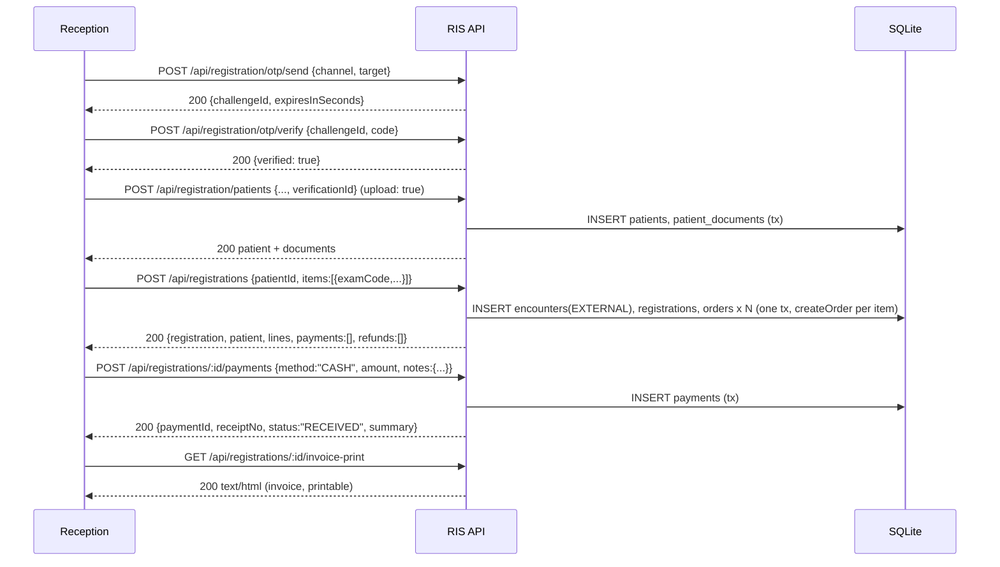
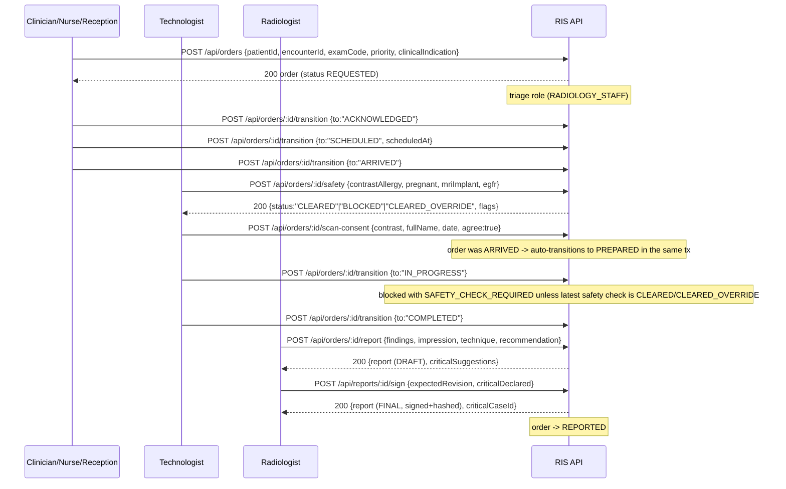
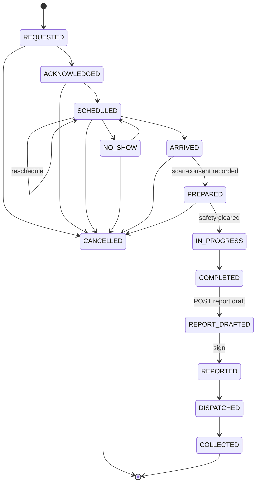
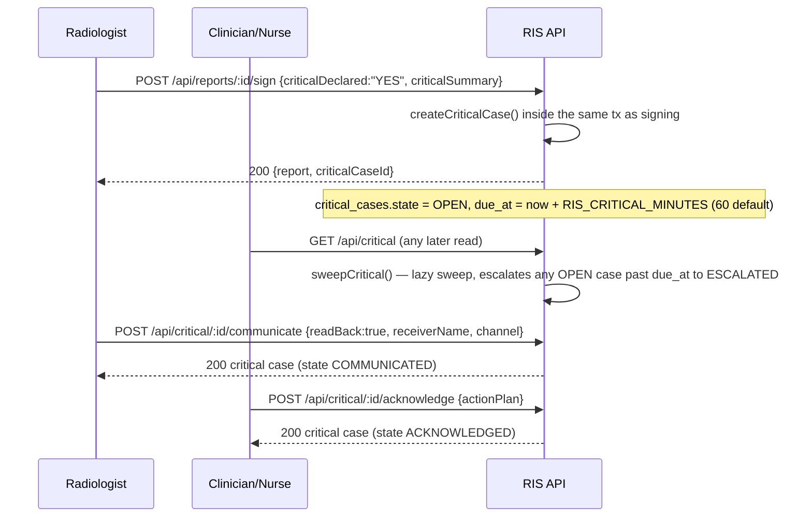

# API Reference

Reference for every HTTP route the RIS server exposes. The reference implementation is
`/Users/stavyaspinehospital/Radiology/radiology-ms/ris` (Node.js 22.5+, `node:sqlite`, zero npm dependencies on the
server). All 87 routes are declared in one place, `server/app.js`, lines 50–167, via a small `route(method, pattern,
handler, opts)` registrar (`server/app.js:48`). This document was built by reading that file and the domain module
each handler delegates to — not by guessing from naming conventions — so every method, path, role check and error
code below is grep-able in the code. **This system stores no images and has no PACS/DICOM/viewer routes**; that is
out of scope everywhere in this document.

A target stack does not need the same route table, the same JSON shapes, or SQLite — but it should reproduce the
same *behavior*: the same role gates, the same state machine, the same validation and error semantics, because the
reference UI (`web/src/`) and the test suite (`test/*.test.js`) were built against exactly this contract.

## Table of contents
- [Conventions used below](#conventions-used-below)
- [Auth mechanism](#auth-mechanism)
- [Standard error envelope](#standard-error-envelope)
- [Idempotency](#idempotency)
- [Key end-to-end flows](#key-end-to-end-flows)
- [1. Auth & session](#1-auth--session) (6 routes)
- [2. Catalog & masters](#2-catalog--masters) (8 routes)
- [3. Patients & registration](#3-patients--registration) (16 routes)
- [4. Orders & worklist](#4-orders--worklist) (5 routes)
- [5. Safety & consent](#5-safety--consent) (14 routes)
- [6. Reporting](#6-reporting) (4 routes)
- [7. Critical results](#7-critical-results) (3 routes)
- [8. Messaging & notifications](#8-messaging--notifications) (5 routes)
- [9. Billing & discounts](#9-billing--discounts) (9 routes)
- [10. Radiology load](#10-radiology-load) (1 route)
- [11. Admin: roster/services/discounts](#11-admin-rosterservicesdiscounts) (11 routes)
- [12. Audit](#12-audit) (4 routes)
- [13. Analytics](#13-analytics) (1 route)
- [Known placeholders and demo-only values affecting this API](#known-placeholders-and-demo-only-values-affecting-this-api)
- [Open questions for the hospital / backend team](#open-questions-for-the-hospital--backend-team)

(6+8+16+5+14+4+3+5+9+1+11+4+1 = 87, matching `grep -c "^route(" server/app.js`.)

## Conventions used below

- **Role(s)** is the effective gate a caller must pass, whichever file enforces it. Most are `requireRole(user,
  [...])` from `server/auth.js:66`, either inline in the route (`server/app.js`) or inside the module function it
  calls. A handler with no role check and `auth: true` (the default) is reachable by **any authenticated role** —
  called out explicitly where that matters.
- **Request body** lists the fields the handler actually reads (`body.x`), with the validator that constrains it
  (`requireText`, `optionalText`, `oneOf`, etc. — all in `server/util.js`). Fields not listed are ignored, not
  rejected (the body is only required to be a JSON object — `server/app.js:38`, `requireObject` in `server/util.js:68`).
- **Errors** lists `CODE (HTTP status) — trigger`, read from the `bad()/conflict()/forbidden()/notFound()` calls in
  the handler and the functions it calls (`server/util.js:10-13` defines the status each maps to: `bad`→400,
  `forbidden`→403, `notFound`→404, `conflict`→409). A route can also return the **global** errors in
  [Standard error envelope](#standard-error-envelope) (401/413/500/503) which are not repeated per route.
- **GET** routes are read-only and never idempotency-key aware (the key is only honoured for POST — see
  [Idempotency](#idempotency)).

## Auth mechanism

`server/auth.js`. Sign-in is `POST /api/auth/login` with an **employee code** (`username`, case-insensitive,
upper-cased before lookup) and password. On success the server mints a bearer token:

```
token = 'ris_' + 32 random bytes as hex   // e.g. ris_3f9a1c...
```

and stores `sessions.set(token, { user, expires: now + config.sessionHours * 3600_000 })` — **`sessions` is a plain
in-memory `Map`, not a database table or Redis/JWT** (`server/auth.js:34`). Every other route reads
`Authorization: Bearer <token>`, resolves it with `getSession(token)` (`server/app.js:185-187`), and returns `401
UNAUTHENTICATED` if the token is missing, unknown, or past `expires`. `config.sessionHours` defaults to 8
(`RIS_SESSION_HOURS`, capped at 72 by `validateConfig`).

**Production gap to flag prominently**: because `sessions` lives in process memory, *restarting the Node process
logs every signed-in user out* (`README.md` "Before real use" section says the same). There is also no token
refresh endpoint, no MFA, and a simple failed-login lockout (`attempts` Map, also in-memory): 5 wrong passwords for
one username locks that username for 5 minutes (`server/auth.js:39-44`), and this lockout, too, is reset by a
restart. A production rebuild needs a persistent, ideally revocable session/token store (DB-backed sessions,
signed JWT with a server-side blacklist, or similar) and should decide whether to keep the bearer-token model or
move to cookies/OAuth2.

`requireRole(user, roles)` (`server/auth.js:66-68`) is a flat `roles.includes(user.role)` check — there is no
per-resource ACL beyond that and the **visibility** filters described per route (mainly `orders.js`'s `visibility()`,
`server/orders.js:35-39`, which restricts a ward/clinician's view of orders to their own requests, their patients,
or their ward).

Roles (`server/auth.js:8`): `radiologist`, `technologist`, `reception`, `clinician`, `nurse`, `admin`, `auditor`.
Grouped constants used across the codebase: `RADIOLOGY_STAFF = [radiologist, technologist, reception]`,
`WARD_ROLES = [clinician, nurse]`.

## Standard error envelope

Every error response (`server/app.js:200-209`) is:

```json
{ "error": "SOME_CODE", "message": "Human-readable explanation", "hits": ["optional, only on CRITICAL_DECLARATION_REQUIRED"] }
```

with the HTTP status carried by the thrown `HttpError` (`server/util.js:3-13`). Three statuses are produced outside
any per-route logic and apply globally:

| Status | error code | When |
|---|---|---|
| 401 | `UNAUTHENTICATED` | No/expired/unknown bearer token on a route with `auth: true` (default) |
| 404 | `NOT_FOUND` | No route matches method+path at all (different from a route-level `notFound()`, e.g. `Order not found`, which carries a more specific `message`) |
| 413 | `TOO_LARGE` | Body exceeds `config.maxBodyBytes` (1 MB default) or `config.maxUploadBodyBytes` (12 MB, only on routes marked `upload: true`) |
| 400 | `BAD_JSON` | Body is not valid JSON |
| 400 | `BODY_NOT_OBJECT` | Body parsed but is `null`, an array, or a scalar |
| 500 | `INTERNAL` | Uncaught exception — logged server-side, message deliberately generic |
| 503 | `DATABASE_UNAVAILABLE` | SQLite reports BUSY/LOCKED/FULL/IO (errcodes 5, 6, 13, 10); response carries `Retry-After: 2`; nothing was committed |

An `__html` response (printable reports, invoices, receipts, visit summaries) bypasses this envelope entirely and
returns `Content-Type: text/html` with a `Content-Security-Policy: default-src 'none'; style-src 'unsafe-inline'`
header (`server/app.js:198`) — these are meant to be opened in a new tab/iframe and printed, not consumed as JSON.

## Idempotency

`server/idempotency.js`. A client may send `Idempotency-Key: <8-128 chars, [A-Za-z0-9._:-]>` on a POST request. The
server fingerprints `method + path + stable(body)` with SHA-256; if the same `(user, key)` is seen again:

- same fingerprint → the **original stored response is replayed verbatim**, with header `Idempotent-Replay: true`,
  without re-running the handler;
- different fingerprint → `409 IDEMPOTENCY_KEY_REUSED`.

The handler, and the row that records the key, are written in **one transaction** (`server/idempotency.js:22-35`
wraps `tx(db, ...)`), so there is no window where the work happened but the key wasn't recorded, and a failed
attempt (exception → transaction rolls back) stores nothing, so the same key can be safely retried after a fix.
Keys are purged after `config.idempotencyTtlHours` (24h default, `RIS_IDEMPOTENCY_TTL_HOURS`).

Idempotency only engages when **all** of: method is POST, the route's `idem` flag is true (the registrar default —
`server/app.js:48`), a key header is actually sent, and the caller is authenticated (`server/app.js:193`). Four POST
routes opt out explicitly with `{ idem: false }` and must not be retried blindly by a client:

| Route | Why it's excluded |
|---|---|
| `POST /api/auth/login` | Must check credentials fresh every call (also brute-force-locks on failure) |
| `POST /api/auth/forgot` | Would otherwise suppress a legitimate second password-reset code request |
| `POST /api/auth/reset` | One-time code consumption; replaying must not succeed twice |
| `POST /api/registration/otp/send` | Each call should actually attempt delivery again, not replay a cached "sent" response |

Every other POST route listed below (around 60 of them) is idempotency-key aware. The idempotency store itself also
has an important corollary: since the handler must be **synchronous** to be cached, the three routes above that
really are `async` (OTP send/verify flows, which call `fetch` for `RIS_OTP_WEBHOOK`) are precisely the ones that
needed `idem: false` — `runIdempotent` would throw `500 INTERNAL ("Idempotency needs a synchronous handler")`
otherwise (`server/idempotency.js:30`). The web client (`web/src/api.js`) should be checked to see whether it
already sends `Idempotency-Key` on writes; if not, that's a gap the rebuild should close for network-retry safety,
particularly around payments and order creation.

## Key end-to-end flows

### Walk-in registration → payment → invoice



Notes grounded in the code: `createRegistration` (`server/registration.js:140-168`) wraps the encounter, the
registration row, and every line's `createOrder()` call in **one transaction** — a refused scan (e.g. a possible
duplicate without `confirmDuplicate`) rolls back the whole registration, not just that line. New-patient OTP is
enforced server-side (`config.requirePatientOtp`, default on) and the code is checked and consumed inside the same
transaction as the patient write (`server/registration.js:81-98`), so a failed save never burns the one-time code.

### Order lifecycle: request → safety → consent → acquire → report → sign



The full status machine (`FLOW` in `server/orders.js:16-25`, `OPEN_STATUSES`/`FINAL_STATUSES` same file):
`REQUESTED → ACKNOWLEDGED → SCHEDULED → ARRIVED → PREPARED → IN_PROGRESS → COMPLETED → REPORT_DRAFTED → REPORTED →
DISPATCHED → COLLECTED`, with `NO_SHOW` (from `SCHEDULED`, returns to `SCHEDULED`) and `CANCELLED` (from most
open states) as side branches. Every transition requires `expectedRevision` to match the order's current
`revision` column once `RIS_REQUIRE_REVISION=1` (the web app always sends it); a mismatch is `409 STALE_REVISION`,
optimistic concurrency control, not a lock.



### Critical result → communicate → acknowledge



Escalation (`sweepCritical`, `server/critical.js:23-33`) is **not** a cron job or background timer — it is a lazy
sweep run at the top of `listCritical()`, i.e. on every `GET /api/critical`. If nobody polls that endpoint, an
overdue case silently stays `OPEN` until someone does. A production rebuild should decide whether this needs a real
scheduled job instead.

---

## 1. Auth & session

`server/auth.js`, `server/otp.js`. 6 routes.

| Method & path | Role(s) | Request body | Success response | Errors |
|---|---|---|---|---|
| `POST /api/auth/login` | public (`auth:false`) | `{ username, password }` | `{ token, user }` — `user = {id, username, fullName, role, ward, designation, employeeCode}` | `429 TOO_MANY_ATTEMPTS` (5th+ bad password within the lockout window for this username); `401 BAD_CREDENTIALS` |
| `GET /api/auth/me` | any authenticated role | — | `{ user }` | — |
| `POST /api/auth/logout` | any authenticated role | — | `{ ok: true }` | — |
| `GET /api/health` | public (`auth:false`) | — | `{ status: "OK", audit: <bool, audit chain valid> }` | — |
| `POST /api/auth/forgot` | public (`auth:false`) | `{ phone }` | `{ ok: true, challengeId?, expiresInSeconds?, devCode? }` — **same shape for an unknown phone number**, so accounts can't be enumerated (`server/auth.js:80`) | `400 PHONE_INVALID`; `429 OTP_TOO_SOON` (resend within 30s); `502 OTP_DELIVERY_FAILED`; `503 OTP_DELIVERY_NOT_CONFIGURED` |
| `POST /api/auth/reset` | public (`auth:false`) | `{ challengeId, code, newPassword }` | `{ ok: true }` (also invalidates every existing session for that user and clears their lockout) | `400 OTP_INVALID`; `410 OTP_EXPIRED`; `429 OTP_LOCKED` (5 wrong code attempts); `400 PASSWORD_TOO_SHORT` (<10 chars unless `RIS_DEMO_WEAK_PASSWORDS=1` and not production); `400 OTP_USED` |

`devCode` is only present when `RIS_DEV_OTP=1` and `NODE_ENV!=production` — it echoes the one-time code in the API
response for local demos; `validateConfig()` (`server/config.js:72-74`) refuses to start if this flag is set with
`NODE_ENV=production`.

## 2. Catalog & masters

`server/catalog.js`, read-only reference tables. 8 routes, all **any authenticated role** (none call `requireRole`).

| Method & path | Request | Success response | Errors |
|---|---|---|---|
| `GET /api/catalog/exams` | — | Array of `exam_catalog` rows, active only (`modality, name` order) | — |
| `GET /api/catalog/suggest` | query `indication` (free text) | Array (max 3) of `{code, name, modality, score, matched}` — keyword overlap against `keywords`, not an AI call | — |
| `GET /api/staff` | — | Array `{id, full_name, role}` of active radiologists/technologists | — |
| `GET /api/clinicians` | — | Array `{id, full_name, ward}` of active clinicians | — |
| `GET /api/masters` | — | `{ proofTypes, referrals, designations, occupations, bodyParts, medicineGroups }` | — |
| `GET /api/masters/medicines` | query `q` | Array (max 15) `{id, name, group_name}`, `LIKE` search | — |
| `GET /api/masters/diseases` | query `bodyPart` | Array `{id, name}` | — |
| `GET /api/masters/surgery` | query `parent` (surgery_tree node id, omit for roots) | Array `{id, name, level}` | — |

`suggestExams` is explicitly **rule-based keyword overlap**, not any form of AI/NLP — see README's "Smart features"
section; do not over-engineer this in the rebuild unless the hospital asks for something smarter.

## 3. Patients & registration

`server/patients.js`, `server/registration.js`. 16 routes.

| Method & path | Role(s) | Request body | Success response | Errors |
|---|---|---|---|---|
| `GET /api/patients` | any authenticated role (no `requireRole`!) | query `q` | Array (max 30), `LIKE` on name/mrn/phone | — |
| `POST /api/patients` | `reception`, `admin` | `{ mrn, name, dob, sex (M/F/O), phone?, allergy? }` | Patient row | `400 FIELD_REQUIRED`/`FIELD_TOO_LONG`; `409 MRN_EXISTS`; `400 DOB_INVALID`; `400 FIELD_INVALID` (sex) |
| `GET /api/patients/:id` | any authenticated role (no `requireRole`, no visibility filter on demographics) | — | `{ patient, encounters, orders }` — `orders` is filtered by caller's `visibility()`, patient/encounters are **not** | `404 Patient not found` |
| `POST /api/patients/:id/encounters` | `reception`, `admin`, `nurse` | `{ type (OPD/IPD/OT/EXTERNAL), ward (required if IPD), doctorId?, room?, bed?, diagnosis?, refNo }` | Encounter row | `404 Patient not found`; `400 FIELD_INVALID` (type); `400 FIELD_REQUIRED` (ward for IPD, refNo); `400 BAD_DOCTOR` (doctorId not an active clinician) |
| `GET /api/registration/capabilities` | `reception`, `admin` | — | `{ otpDelivery, otpRequiredForNewPatients, aadhaarLookup, aadhaarOtpVerification: false, note }` | — |
| `POST /api/registration/otp/send` | `reception`, `admin` | `{ channel ("phone"/"email"), target }` — fixed `purpose: "REGISTER"` | `{ challengeId, expiresInSeconds, devCode? }` | `400 PHONE_INVALID`/`EMAIL_INVALID`/`CHANNEL_INVALID`; `429 OTP_TOO_SOON`; `502 OTP_DELIVERY_FAILED`; `503 OTP_DELIVERY_NOT_CONFIGURED` |
| `POST /api/registration/otp/verify` | `reception`, `admin` | `{ challengeId, code }` | `{ verified: true, channel }` | `400 OTP_INVALID`; `410 OTP_EXPIRED`; `429 OTP_LOCKED` |
| `POST /api/registration/lookup` | `reception`, `admin`, `radiologist`, `technologist` | one of `{ phone }` / `{ email }` / `{ uhid }` / `{ aadhaar }` | Array of **masked** patients (`mask()`, `server/registration.js:29` — phone shown as `91******12`) | `400 AADHAAR_INVALID`; `400 LOOKUP_KEY_REQUIRED` |
| `GET /api/registration/patients/:id` | same 4 roles | — | Full patient (minus `aadhaar_hash`) + `documents[]` (front/back presence flags, not the image bytes) | `404 Patient not found` |
| `POST /api/registration/patients` | `reception`, `admin` — **`upload: true`, 12 MB limit** | Full intake form: `firstName, lastName, middleName?, dob, gender (M/F/O), phone, email?, address, occupation?, zipcode?, country?, state?, city?, designation?, reference?, allergy?, aadhaar?, proofs: [{proofType, number, front?, back?}], occupationIdFront?, occupationIdBack?, patientId? (update), verificationId?` | Same shape as `GET /api/registration/patients/:id` | Many `FIELD_REQUIRED`/`_INVALID` (`DOB_INVALID`, `ZIP_INVALID`, `AADHAAR_INVALID`); `400 OCCUPATION_ID_REQUIRED` (Police Man occupation without both ID images); `400 IMAGE_INVALID`/`IMAGE_TOO_LARGE` (>1.5 MB, must be `data:image/{png,jpeg,webp};base64,...}`); `400 PROOF_INVALID`/`IMAGE_REQUIRED`; `400 VERIFICATION_REQUIRED` (new patient, OTP required, no valid `verificationId`); `404 Patient not found` (update with bad `patientId`) |
| `GET /api/registrations` | `reception`, `admin`, `radiologist` | query: date filters (`date_type`/`date`/`start_date`/`end_date`), `q`, `field`, `equipment`, `payment_status` | Array (max 1000) of registration summaries with `patient`, `exams`, `statuses` | — |
| `POST /api/registrations` | `reception`, `admin` | `{ patientId, items: [{examCode, priority?, side?, indication?, noCharge?, schemeId?, discountPct?, waiverReason?}] (1-12), referringDoctor?, diagnosis?, priority?, indication?, confirmDuplicate? }` | Full registration (`GET /api/registrations/:id` shape) | `404 Patient not found`; `400 ITEMS_REQUIRED`/`TOO_MANY_ITEMS` (>12)/`ITEMS_INVALID`; plus any `createOrder` error per line (see §4) |
| `GET /api/registrations/:id` | `reception`, `admin`, `radiologist` | — | `{ registration (with totals/payment_status), patient, lines, payments, refunds }` | `404 Registration not found` |
| `POST /api/registrations/:id/invoice` | `reception`, `admin` | `{ reportNo?, reportDate?, deliveryAt?, update: [{orderId, schemeId?, discountPct?, noCharge?, waiverReason?}], remove: [{orderId, reason}], add: [{examCode, side?, priority?, indication?, noCharge?, schemeId?, discountPct?, waiverReason?}] }` | Updated registration | `409 REGISTRATION_CLOSED`; `400 DATE_INVALID`; `404 Invoice line not found`; `409 LINE_STARTED` (removing a line already past `NO_SHOW`); plus discount/order errors |
| `POST /api/registrations/:id/cancel` | `reception`, `admin` | `{ reason }` | Cancelled registration | `409 REGISTRATION_CLOSED` ("Already cancelled"); `409 LINE_STARTED`; `409 REFUND_FIRST` (payments taken, must refund before cancel) |
| `GET /api/dashboard/summary` | any authenticated role (no `requireRole`; scoped via `listOrders`' `visibility()`) | query: equipment/date filters | `{ total_radiology_order, total_dexa, total_mri, total_open_mri, total_xray, total_sonography, total_ct_scan, breakdown: {arrived, prepared, scan_in, scan_out, report_finalization, dispatched, received} }` | — |

Aadhaar is validated with a **Verhoeff checksum** (`server/registration.js:17-23`) and stored only as
`SHA-256('ris-aadhaar:' + number)` plus the last 4 digits — the raw number is never persisted.
`POST /api/registration/otp/send` is one of the 4 routes with `idem: false` (see [Idempotency](#idempotency)).

## 4. Orders & worklist

`server/orders.js`. 5 routes — the central order/worklist state machine.

| Method & path | Role(s) | Request body | Success response | Errors |
|---|---|---|---|---|
| `GET /api/orders` | any authenticated role, filtered by `visibility(user)` | query: `status` (CSV), `open=1`, `source`, `priority`, `modality`, `patientId`, `registrationId`, `equipment`, date filters, `mine=1`, `q` | Array (max 500), sorted overdue → priority (STAT>URGENT>ROUTINE) → earliest due | — |
| `POST /api/orders` | `clinician`, `nurse`, `reception`, `radiologist` | `{ patientId, encounterId, examCode, priority? (ROUTINE default), side?, clinicalIndication (≥5 chars), externalOrderId?, noCharge?, schemeId?, discountPct?, waiverReason?, confirmDuplicate? }` | `{ order, duplicateOverridden, replayed? }` | `404 Patient not found`; `400 ENCOUNTER_MISMATCH`; `409 ENCOUNTER_CLOSED`; `400 UNKNOWN_EXAM`/`EXAM_INACTIVE`; **`400 EXAM_PRICE_NOT_SET`** (catalog price is `NULL` — blocks ordering until priced); `400 FIELD_REQUIRED`/`INDICATION_TOO_SHORT`; `403 forbidden` (STAT from a role that isn't ward/radiologist); `400 EXTERNAL_ORDER_ID_INVALID`; `409 EXTERNAL_ORDER_ID_CONFLICT`; `409 POSSIBLE_DUPLICATE` (same exam/side, same patient, within `RIS_DUPLICATE_WINDOW_DAYS`, not yet confirmed); discount errors (see §9) |
| `GET /api/orders/:id` | any role w/ `visibility()` | — | Composite: `{ order, events, safety, messages, critical, reports, templates, integrity }` | `404 Order not found`; `403 forbidden` (out of scope for caller) |
| `POST /api/orders/:id/transition` | depends on the target state's permission group: `triage`=`RADIOLOGY_STAFF`, `acquire`=`[technologist, radiologist]`, `handover`=`[reception, radiologist]`; `cancel`=requester, or reception/radiologist (not technologist) | `{ to, note?, scheduledAt? (required if to=SCHEDULED), expectedRevision? }` | Updated order | `409 INVALID_TRANSITION`; `400 REVISION_REQUIRED` (if `RIS_REQUIRE_REVISION=1` and omitted)/`EXPECTED_REVISION_INVALID`; `409 STALE_REVISION`; `403 forbidden` (cancel permission); `400 REASON_REQUIRED` (cancel without note); `400 SCHEDULE_REQUIRED`; `409 CONSENT_REQUIRED` (→PREPARED without a scan-consent row); `409 SAFETY_CHECK_REQUIRED` (→IN_PROGRESS on a contrast/ionising/MRI exam without a CLEARED/CLEARED_OVERRIDE safety check) |
| `POST /api/orders/:id/assign` | `reception`, `radiologist` | `{ technologistId?, radiologistId?, expectedRevision? }` | Updated order | `409 STALE_REVISION`; `400 BAD_ASSIGNEE` (id isn't an active user of the right role) |

`accession` numbers are generated per-year (`RAD-2026-000123`), counted by `COUNT(*) WHERE accession LIKE
'RAD-<year>-%'` (`server/orders.js:41-45`) — **not** a dedicated sequence table, so concurrent inserts rely on
SQLite's single-writer serialization; a multi-process rebuild needs a real sequence/allocator here to avoid a race.
`externalOrderId` is the hook for upstream-system idempotency (e.g. a HIS resending the same order): a repeat with
the same id, patient, exam and side replays the original order (`replayed: true`) instead of creating a duplicate;
a repeat with a different patient/exam/side is `409 EXTERNAL_ORDER_ID_CONFLICT`.

## 5. Safety & consent

`server/orders.js` (`recordSafety`), `server/clinical.js` (patient's words, medical consent, past history, scan
consent, visit summary/timeline). 14 routes, all technologist/radiologist-authored, all behind `getOrderForUser`
visibility for reads.

| Method & path | Role(s) | Request body | Success response | Errors |
|---|---|---|---|---|
| `POST /api/orders/:id/safety` | `technologist`, `radiologist` | `{ pregnant (YES/NO/NA), contrastAllergy (YES/NO/NA), mriImplant (YES/NO/NA/UNKNOWN), egfr? (0-200), notes?, overrideReason? }` | `{ id, status (CLEARED/BLOCKED/CLEARED_OVERRIDE), flags: [{level: BLOCK/WARN, text}] }` | `400 FIELD_INVALID` (enum fields); `400 EGFR_INVALID`; `403 forbidden` (override attempted by non-radiologist) |
| `GET /api/orders/:id/words` | any w/ order visibility | — | Array of patient's-words entries + attached audio metadata | — |
| `POST /api/orders/:id/words` | `technologist`, `radiologist` — **`upload: true`** | `{ text?, audio?: [{data: "data:audio/...;base64,..."}] (max 5, ≤4 MB each) }` | Updated words list | `400 WORDS_EMPTY`; `400 TOO_MANY_RECORDINGS`; `400 AUDIO_INVALID`/`AUDIO_TOO_LARGE` |
| `POST /api/words/:id/delete` | `technologist`, `radiologist` (author or any radiologist) | — | `{ ok: true }` (soft delete, row kept) | `404 Entry not found`; `403 forbidden` |
| `GET /api/audio/:id` | any role that can see **some** order on the same encounter | — | `{ mime, data }` (base64) | `404 Recording not found`; `403 forbidden` |
| `GET /api/orders/:id/medical-consent` | any w/ visibility | — | Latest consent record or `null` | — |
| `POST /api/orders/:id/medical-consent` | `technologist`, `radiologist` | `{ medicalDevices: [...DEVICES], medicalHistory: [...HISTORY], allergiesHas, allergiesDetails?, isPregnant, monthsPregnant? (1-9), weight? (1-400), provisionalReport? }` | Saved consent (also back-fills `patients.allergy` if it was still "None recorded") | `400 FIELD_INVALID` (unknown device/history value); `400 WEIGHT_INVALID`; `400 ALLERGY_DETAILS_REQUIRED`; `400 PREGNANCY_MONTHS_INVALID` |
| `GET /api/orders/:id/past-history` | any w/ visibility | — | Latest history record or `null` | — |
| `POST /api/orders/:id/past-history` | `technologist`, `radiologist` | `{ diseases: [{disease, year?, month?, day?, condition?, medicines?, allergyTo?, mhOption?}], surgeries: [{...path/other/where}], otherDisease?, notes? }` | Saved history | `400 MH_FEMALE_ONLY`; `400 YEAR_INVALID`; `400 FIELD_INVALID` (condition/mhOption/where enums); `400 SURGERY_INVALID` (tree path doesn't match parent/level); `400 FIELD_REQUIRED` (otherName/bodyPart/disease) |
| `GET /api/orders/:id/scan-consent` | any w/ visibility | — | Latest scan consent or `null` | — |
| `POST /api/orders/:id/scan-consent` | `technologist`, `radiologist` | `{ contrast (PLAIN/CONTRAST), routes?/contrastTypes? (CT), mlContrast?/egfr?/serumCreatinine? (MRI), sedation?: {required, nbm, anaesthetistInformed, medicineUsed?, notes?}, fullName, date, agree: true, language (en/hi/gu) }` | `{ consent, prepared: bool }` — auto-transitions `ARRIVED → PREPARED` in the same transaction if the order was `ARRIVED` | `409 CONSENT_CLOSED` (order already past PREPARED/terminal); `400 PLAIN_ONLY` (XR/USG/DEXA with contrast requested); `400 CONTRAST_REQUIRED`; `400 ROUTE_REQUIRED`/`CONTRAST_TYPE_REQUIRED` (CT); `400 CONTRAST_ML_INVALID`/`EGFR_INVALID`/`CREATININE_INVALID` (MRI); `400 FIELD_REQUIRED` (fullName/date); `400 DATE_INVALID`; `400 AGREE_REQUIRED` |
| `GET /api/patients/:id/timeline` | `technologist`, `radiologist`, `reception`, `admin` | query `module` (`words`/`pastHistory`) | Array, cross-visit | `404 Patient not found`; `400 MODULE_INVALID` |
| `GET /api/visits/:id/summary` | any role that can access **any** order on that encounter | — | `{ patient, encounter, words, pastHistory, medicalConsent, orders: [{..., report?}] }` | `404 Visit not found`; `403 forbidden` |
| `GET /api/visits/:id/summary-print` | same | query `modules` (CSV subset of `patientInfo,words,pastHistory,consent,orders,reports`) | `text/html` printable summary | same as above |

Safety-check **BLOCK** flags: reported contrast allergy, missing/low eGFR (<30 hard block, 30-45 warn) for
contrast studies, pregnancy + ionising exam, MRI implant reported or unknown. Only a `radiologist` can clear a
block via `overrideReason` (`CLEARED_OVERRIDE`). These rules live in `server/orders.js:248-257` as plain `if`
statements, not a rules engine — flag this if the hospital wants configurable safety policy later.

## 6. Reporting

`server/reports.js`. 4 routes — immutable, hash-chained signed reports with addenda.

| Method & path | Role(s) | Request body | Success response | Errors |
|---|---|---|---|---|
| `POST /api/orders/:id/report` | `radiologist` | `{ technique?, findings?, impression?, recommendation?, expectedRevision? }` | `{ report (DRAFT), criticalSuggestions: [pattern names] }` | `409 NOT_READY_TO_REPORT` (order not COMPLETED/REPORT_DRAFTED); `409 STALE_REPORT_REVISION` |
| `POST /api/orders/:id/addendum` | `radiologist` | `{ reason, findings, impression? }` | New `ADDENDUM` report row (status FINAL immediately, chained to the prior signature) | `409 NO_FINAL_REPORT` (no signed report yet); `400 FIELD_REQUIRED` |
| `GET /api/orders/:id/print` | any w/ visibility | — | `text/html` printable report (all FINAL versions) | `404 "Signed report" not found` |
| `POST /api/reports/:id/sign` | `radiologist` | `{ expectedRevision, criticalDeclared? (YES/NO), criticalNoReason? (required if hits detected & declared NO), criticalSummary? (required if YES), receiverId? }` | `{ report (FINAL), criticalCaseId }` | `404 Report not found`; `409 IMMUTABLE_FINAL_REPORT` (already signed — use addendum); `409 STALE_REPORT_REVISION`; `400 FIELD_REQUIRED` (findings/impression empty); `400 CRITICAL_DECLARATION_INVALID`; **`409 CRITICAL_DECLARATION_REQUIRED`** (critical-wording pattern detected and `criticalDeclared` missing — response includes `hits: [...]`, the matched pattern names); `400 FIELD_REQUIRED` (criticalNoReason/criticalSummary) |

Signed reports are **immutable**: `signReport` writes `status='FINAL'` and a `signature_hash` over a versioned JSON
payload (`SIG_VERSION = 2`, `server/reports.js:19-31`) chained to the previous final version's hash (first version
chains to `null`). `verifyReportChain()` (`server/reports.js:33-42`) recomputes every hash on each read and is
returned as `integrity` on `GET /api/orders/:id`. Critical wording detection (`detectCritical`,
`server/reports.js:12-14`) runs a fixed regex list from `CRITICAL_PATTERNS` in `server/reference-data.js` against
`findings + impression` — review that pattern list with radiology before go-live (false negatives here are a
patient-safety gap, false positives are an alert-fatigue problem).

## 7. Critical results

`server/critical.js`. 3 routes — see the [sequence diagram](#critical-result--communicate--acknowledge) above.

| Method & path | Role(s) | Request body | Success response | Errors |
|---|---|---|---|---|
| `GET /api/critical` | any authenticated role, filtered to orders the caller can see; runs `sweepCritical()` first (lazy auto-escalation) | query `state?` (OPEN/COMMUNICATED/ACKNOWLEDGED/ESCALATED) | Array (max 200) with patient/exam/ward joined | — |
| `POST /api/critical/:id/communicate` | `radiologist` | `{ readBack: true, receiverName, channel (PHONE/IN_PERSON/PAGER), note? }` | Full case + event history | `404 Critical case not found`; `409 INVALID_STATE` (not OPEN/ESCALATED); `400 READ_BACK_REQUIRED` (readBack must be literal `true`); `400 FIELD_INVALID` (channel) |
| `POST /api/critical/:id/acknowledge` | `clinician`, `nurse` (`WARD_ROLES`) | `{ actionPlan }` | Full case + event history | `404 Critical case not found`; `409 INVALID_STATE` (already ACKNOWLEDGED); `403 forbidden` (no access to the underlying order) |

A critical case is created only as a side effect of `POST /api/reports/:id/sign` with `criticalDeclared: "YES"`
(`createCriticalCase`, `server/critical.js:11-20`) — there is no standalone "create critical case" endpoint. `due_at
= now + RIS_CRITICAL_MINUTES` (60 default). Escalation notifies `admin` + `radiologist` roles but does **not**
page/SMS anyone outside this app (no integration with a paging system) — flag this for the hospital: is in-app +
whatever `RIS_OTP_WEBHOOK` happens to cover sufficient, or does escalation need a real on-call/paging integration?

## 8. Messaging & notifications

`server/messages.js`, `server/notifications.js`. 5 routes. Notifications are **advisory only** — `notify()`
(`server/notifications.js:5-9`) wraps every insert in `bestEffort()`, so a notification failure is logged and never
rolls back or fails the action that triggered it.

| Method & path | Role(s) | Request body | Success response | Errors |
|---|---|---|---|---|
| `GET /api/orders/:id/messages` | any w/ order visibility | — | Array, chronological | — |
| `POST /api/orders/:id/messages` | any authenticated role **except `auditor`** | `{ body }` (≤2000 chars) | New message row | `403 forbidden` (auditor); `400 FIELD_REQUIRED` |
| `GET /api/notifications` | any authenticated role | query `unread=1` | Array (max 100), own notifications only (`user.id` from token) | — |
| `POST /api/notifications/read-all` | any authenticated role | — | `{ ok: true }` | — |
| `POST /api/notifications/:id/read` | any authenticated role | — | `{ ok: true }` | — |

Messages auto-route by sender: a ward/OPD sender's message notifies the order's assigned
radiologist/technologist (or any radiologist/reception if unassigned); a radiology-staff sender's message notifies
the requester and the encounter's doctor. There is no read-receipt or delivery-confirmation concept beyond the
notification's own `read_at`.

## 9. Billing & discounts

`server/billing.js`, `server/discounts.js`. 9 routes. All monetary math is **server-side** (`money()`,
`server/billing.js:11`, rounds to paisa and rejects negative/non-finite) — the client never computes totals that are
trusted.

| Method & path | Role(s) | Request body | Success response | Errors |
|---|---|---|---|---|
| `GET /api/registrations/:id/invoice-print` | `reception`, `admin`, `radiologist` | — | `text/html` invoice | — |
| `POST /api/registrations/:id/payments` | `reception`, `admin` | `{ method (CASH/CHEQUE/ONLINE), amount, discount?, discountReason? (required if discount>0); CASH: notes/coins denomination maps, returnNotes/returnCoins, collectorName?, remarks?; CHEQUE: ifsc, chequeDate, depositDate, chequeNumber (6 digits), bank, accountHolder; ONLINE: gateway (UPI/Card/NetBanking/Razorpay/Other), reference }` | `{ paymentId, receiptNo, status (RECEIVED/IN_PROCESS), summary }` | `409 REGISTRATION_CLOSED`; `409 PAYMENT_COMPLETE`; `400 FIELD_INVALID` (method/gateway); `400 AMOUNT_INVALID`/`AMOUNT_TOO_HIGH`; `400 FIELD_REQUIRED` (discountReason); `400 DENOMINATION_INVALID`; `400 INSUFFICIENT_CASH`; `400 CHANGE_MISMATCH`; `400 IFSC_INVALID`; `400 DATE_INVALID`; `400 CHEQUE_NUMBER_INVALID`; `400 FIELD_REQUIRED` (bank/accountHolder); `409 REFERENCE_USED` (duplicate online reference); `400 FIELD_REQUIRED` (reference) |
| `POST /api/registrations/:id/refunds` | `reception`, `admin` | `{ amount, reason }` | `{ refundId, summary }` (status PENDING) | `400 AMOUNT_INVALID`; `400 REFUND_TOO_HIGH` (exceeds paid-minus-already-requested) |
| `POST /api/payments/:id/cheque` | `reception`, `admin` | `{ decision (CLEARED/BOUNCED), note? (required if BOUNCED) }` | `{ summary }` | `404 "Cheque payment" not found`; `409 INVALID_STATE` (not IN_PROCESS); `400 FIELD_REQUIRED` |
| `GET /api/payments/:id/receipt` | `reception`, `admin` | — | `text/html` receipt | `404 Payment not found` |
| `POST /api/refunds/:id/decision` | `admin` | `{ decision (APPROVED/REJECTED), note }` | `{ summary }` | `404 Refund not found`; `409 INVALID_STATE`; `403 forbidden` (requester cannot decide their own refund — segregation of duties); `400 FIELD_REQUIRED` |
| `POST /api/refunds/:id/pay` | `reception`, `admin` | `{ via (CASH/BANK_TRANSFER/UPI/CHEQUE), reference? (required unless CASH) }` | `{ summary }` | `404 Refund not found`; `409 INVALID_STATE` (not APPROVED); `400 FIELD_REQUIRED` |
| `GET /api/discount-approvals` | `admin` | query `status?` (PENDING/APPROVED/REJECTED) | Array (max 500), joined with order/registration context | `400 FIELD_INVALID` |
| `POST /api/discount-approvals/:id/decision` | `admin` | `{ decision (APPROVED/REJECTED), note? (required if REJECTED) }` | `{ approval, order }` — **REJECTED reverts the order line to full price** (discount_pct→0, final_amount→base_price) | `404 Discount approval not found`; `409 INVALID_STATE`; `403 forbidden` (self-approval); `400 FIELD_REQUIRED` |

Discount resolution (`resolveDiscount`, `server/discounts.js:14-33`, used by both `createOrder` and
`updateInvoice`): a discount ≥50% (or a scheme flagged `requires_reason`) always needs a `waiverReason`; a discount
flagged `requires_approval` (or ≥50% regardless of the flag) creates a `PENDING` row in `discount_approvals` and the
order still charges the discounted price **pending** admin sign-off — i.e. the discount is live immediately and
only reverted retroactively if rejected. No payment gateway is integrated anywhere (`ONLINE` payments are a
manually typed reference from a UPI/card/Razorpay confirmation the staff member saw elsewhere) — this is explicit
in the README and `server/billing.js:57-58`'s comment.

## 10. Radiology load

`server/load.js`. 1 route, any authenticated role.

| Method & path | Request | Success response |
|---|---|---|
| `GET /api/radiology/load` | — | Array, always 6 entries in fixed order (`LOAD_MODALITIES = [MRI, CT, XR, DEXA, USG, OPEN_MRI]`): `{modality, queued, inProgress, overdue, total, label (Quiet/Busy/Very busy)}` |

Purely informational — "never blocks an order" per the inline comment (`server/load.js:3`). `label` thresholds come
from **`RIS_LOAD_BUSY_AT`/`RIS_LOAD_VERY_BUSY_AT`** (defaults 3/6, same for every modality) — explicitly flagged as
provisional in `server/config.js:35-38`; a modality with fewer machines may need its own threshold.

## 11. Admin: roster/services/discounts

`server/auth.js` (`listStaffRoster`), `server/masters.js`. 11 routes, almost entirely `admin`-only.

| Method & path | Role(s) | Request body | Success response | Errors |
|---|---|---|---|---|
| `GET /api/staff/roster` | `admin` | — | Array `{id, username, full_name, role, ward, designation, phone, active, created_at}` — **never** password hash/salt | — |
| `GET /api/masters/services` | `admin` | query `modality?`, `subGroup?`, `active?` (0/1) | Array of `exam_catalog` rows | — |
| `POST /api/masters/services` | `admin` | `{ modality, name, code? (auto-generated if omitted — `makeExamCode`), subGroup?, bodyPart, price? (null = unset), onlinePrice?, priceNote?, estMinutes? (1-600), prep?, keywords?, usesContrast?, ionising?, mri? }` | New `exam_catalog` row | `400 FIELD_REQUIRED` (modality/name/bodyPart); `400 CODE_INVALID`; `409 CODE_IN_USE`; `400 AMOUNT_INVALID` (price/onlinePrice); `400 FIELD_INVALID` (estMinutes) |
| `POST /api/masters/services/:code` | `admin` | Any subset of the create fields except `modality` | Updated row | `404 Service not found`; `400 MODALITY_LOCKED`; `400 NOTHING_TO_UPDATE`; same field errors |
| `POST /api/masters/services/:code/activate` | `admin` | — | Updated row | `404 Service not found` |
| `POST /api/masters/services/:code/deactivate` | `admin` | — | Updated row | `404 Service not found` |
| `GET /api/masters/discounts` | `admin`, `reception` (reception sees active-only) | query `active?` (admin only) | Array of `discount_schemes` | — |
| `POST /api/masters/discounts` | `admin` | `{ code (or id), label, kind: "PERCENT" (only value), value (0-100), requiresReason?, requiresApproval? }` | New scheme | `400 FIELD_REQUIRED`; `400 CODE_INVALID`; `409 CODE_IN_USE`; `400 VALUE_INVALID` |
| `POST /api/masters/discounts/:id` | `admin` | Any subset of create fields | Updated scheme | `404 "Discount scheme" not found`; `400 NOTHING_TO_UPDATE`; `400 VALUE_INVALID` |
| `POST /api/masters/discounts/:id/activate` | `admin` | — | Updated scheme | `404 Discount scheme not found` |
| `POST /api/masters/discounts/:id/deactivate` | `admin` | — | Updated scheme | `404 Discount scheme not found` |

**`exam_catalog.price` is nullable by design** (added in `server/migrations/003_service_master.js`) — an imported,
unpriced item is `NULL`, never a fabricated `0`, and `createOrder` hard-blocks ordering it (`EXAM_PRICE_NOT_SET`,
§4) until an admin sets a real price here. `kind` on a discount scheme is validated against `KINDS = ['PERCENT']`
(`server/masters.js:101`) — only percentage discounts exist today; a flat-amount discount type would need a schema
and validation change. `DISCOUNT_KINDS` is a single-element enum purely for forward compatibility, not because
multiple kinds are implemented.

## 12. Audit

`server/audit.js`. 4 routes — hash-chained, append-only log.

| Method & path | Role(s) | Request | Success response | Errors |
|---|---|---|---|---|
| `GET /api/audit` | `admin`, `auditor` | query `limit?` (max 500), `offset?` | Array, newest first | — |
| `GET /api/audit/verify` | `admin`, `auditor` | — | `{ valid, total, brokenAt, latestHash?, anchors, message }` — walks every row and recomputes `event_hash` | — |
| `GET /api/audit/anchors` | `admin`, `auditor` | — | Array (max 100) of recorded anchors | — |
| `POST /api/audit/anchors` | `admin` only | — | New anchor `{id, audit_id, event_hash, total, created_by, created_by_name, created_at}` | `409 NOTHING_TO_ANCHOR` (log empty) |

Every audited event's hash covers the previous event's hash (`digest()`, `server/audit.js:7-11`), genesis =
64 zero chars. `audit()` must be called **inside** the same transaction as the change it records (the code comment
at `server/audit.js:13-14` says so explicitly) so both commit or both roll back together — this is a convention
enforced by code review/discipline in every module, not by the database. An **anchor** records the chain head
(latest event id + hash + count) so that truncation (deleting recent rows) is detectable even though a normal
tamper check (`verifyAudit`) only re-walks what's currently in the table; the anchor itself should be exported and
kept somewhere outside this database (the inline comment at `server/audit.js:36-37` says so) — the API gives you
the anchor to export, but **exporting it anywhere durable is left entirely to the operator**.

## 13. Analytics

`server/analytics.js`. 1 route.

| Method & path | Role(s) | Request | Success response |
|---|---|---|---|
| `GET /api/analytics/summary` | `radiologist`, `reception`, `admin`, `auditor` | query `days?` (default 30, max 365) | `{ windowDays, total, byStatus, bySource, byPriority, byModality, backlog, overdue, medianMinutes: {requestToComplete, requestToReport}, slaMet (% signed within SLA), critical: {total, open, medianMinutesToCommunicate}, perDay: [{date, OPD, IPD, OT, EXTERNAL, n}] }` |

This loads **every order row created in the window into memory** and computes medians/counts in JavaScript
(`server/analytics.js:9`, a single `SELECT ... WHERE created_at >= ?` with no pagination) — fine at hospital scale
over a SQLite file, but a multi-year, multi-site rebuild on a real warehouse should probably push this aggregation
into SQL or a proper OLAP layer instead of porting the in-memory reduce logic verbatim.

---

## Known placeholders and demo-only values affecting this API

These change API *behavior* (thresholds, blocking conditions, session lifetime), not just cosmetics, so they belong
in this chapter specifically:

- **Employee codes as usernames** (`POST /api/auth/login`): the `username` field is literally `101`–`902` today
  (`server/roster.js`), placeholder numbers, not the hospital's real staff ID scheme. Login validation
  (`server/auth.js:25`) already accepts letters, so a real alphanumeric ID scheme fits without an API change — but
  every seeded account must be recreated with real codes before go-live.
- **`RIS_LOAD_BUSY_AT` / `RIS_LOAD_VERY_BUSY_AT`** (defaults 3/6, `server/config.js:38`): drive the `label` field
  returned by `GET /api/radiology/load`. Same thresholds for every modality; provisional.
- **`RIS_SLA_HOURS_STAT/URGENT/ROUTINE`** (defaults 1/4/24, `server/config.js:32`): set `orders.due_at` at order
  creation, which drives `overdue` on `GET /api/orders`, `GET /api/radiology/load`, and `slaMet` on `GET
  /api/analytics/summary`. Provisional, to confirm with radiology.
- **`RIS_CRITICAL_MINUTES`** (default 60, `server/config.js:33`): the escalation deadline in the [critical result
  flow](#critical-result--communicate--acknowledge). Provisional.
- **`RIS_OTP_WEBHOOK` unset**: every OTP-dependent route (`/api/auth/forgot`, `/api/registration/otp/send`) returns
  `503 OTP_DELIVERY_NOT_CONFIGURED` unless `RIS_DEV_OTP=1` is also set (local demo only, forbidden in production by
  `validateConfig`). There is no real SMS/email integration; the backend team must stand one up.
- **In-memory session store** (`server/auth.js`, see [Auth mechanism](#auth-mechanism)): every bearer token and
  login-lockout counter is lost on restart. This is the single biggest "do not ship as-is" item in this whole
  reference for the API layer.
- **SQLite / single-process assumptions**: optimistic concurrency (`expectedRevision`), the accession/registration
  number generators (`COUNT(*) LIKE 'PREFIX-%'`), and the idempotency store all rely on SQLite's single-writer
  serialization via `BEGIN IMMEDIATE` (`server/util.js:43-60`). A horizontally-scaled rebuild on Postgres/MySQL
  needs real sequences (or `SELECT ... FOR UPDATE`) in place of the `COUNT(*) LIKE` number generators, and should
  re-examine whether the revision/idempotency logic still holds under real concurrent writers.
- **Catalog prices**: `exam_catalog.price` is `NULL` for anything imported without a hospital-confirmed rate
  (`server/data/radiology-master-import.json`, `price_note` explains why); `POST /api/orders` hard-blocks on this
  (`EXAM_PRICE_NOT_SET`). Expect this error constantly against an unpriced import until admin fills in real prices
  via `POST /api/masters/services/:code`.

## Open questions for the hospital / backend team

- `GET /api/patients/:id` returns full demographics + encounter list to **any authenticated role** with no
  `visibility()` scoping (unlike orders, messages, critical cases, etc., which are all scoped). Is broad read
  access to patient demographics across every ward/OPD role intentional, or should this route be scoped the same
  way `GET /api/orders` is?
- `GET /api/dashboard/summary` similarly has no explicit `requireRole` — it relies entirely on `listOrders`'s
  internal visibility filter. Worth an explicit test/assertion in the rebuild so a future refactor of `listOrders`
  can't silently widen what a ward clinician sees on the dashboard.
- Critical-result escalation (`sweepCritical`) only runs when someone calls `GET /api/critical`. If the rebuild
  needs guaranteed-timely escalation (not "eventually, next time someone opens the critical list"), it needs an
  actual scheduler, not a lazy sweep — confirm this is acceptable for a patient-safety feature.
- `POST /api/registration/otp/send` is excluded from idempotency because it is `async`/webhook-based; it has **no
  other replay protection** on the server beyond the 30-second resend cooldown per `(purpose, target)`. If the web
  client doesn't already debounce double-clicks, duplicate SMS/email sends are possible within that window.
- Several "which role can do X" boundaries are enforced only inline in `server/app.js` rather than inside the
  module function (e.g. `registration.capabilities`, `otp/send`, `otp/verify`) — worth deciding in the rebuild
  whether role checks should live uniformly in one layer (route vs. service) to avoid a future route picking up a
  handler without its guard.
- No endpoint lets a client ask "what changed since revision/timestamp X" for an order — every poll re-fetches
  `GET /api/orders/:id` in full. If the rebuild adds WebSocket/SSE push for the worklist, decide whether these REST
  shapes stay as the source of truth or a dedicated events feed replaces polling.
