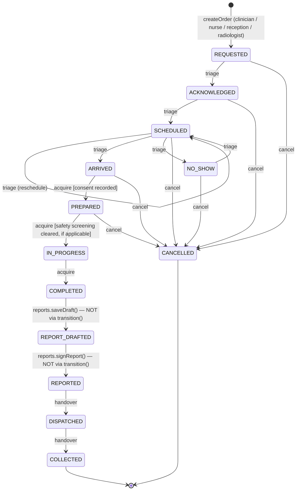
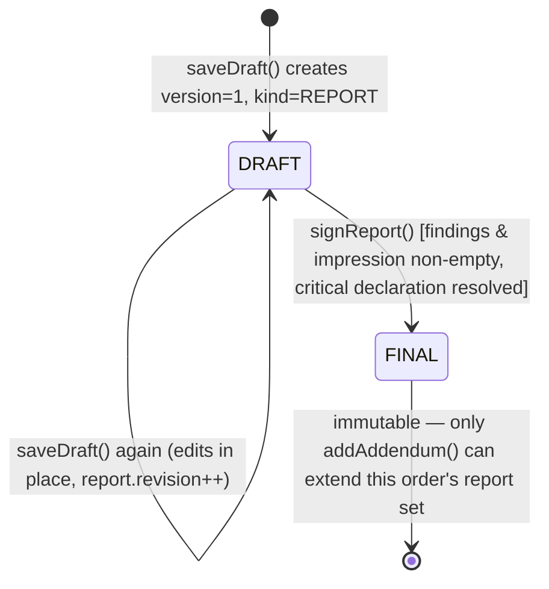
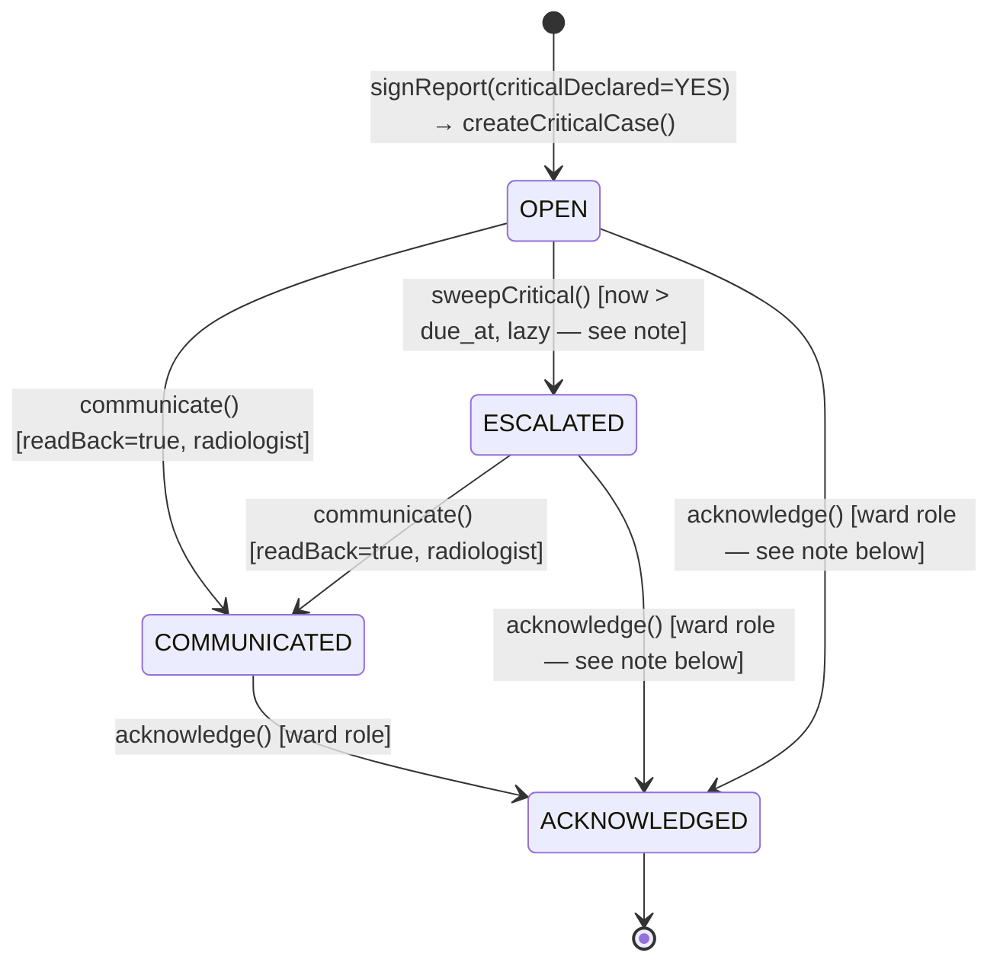
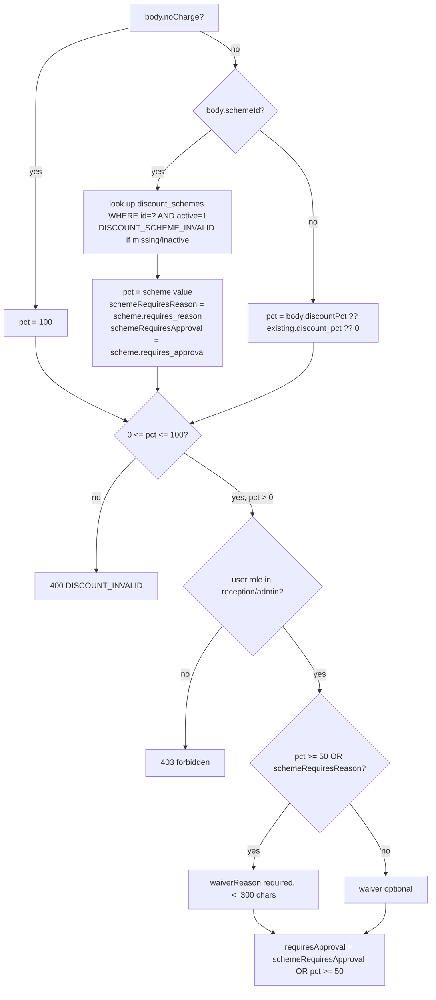
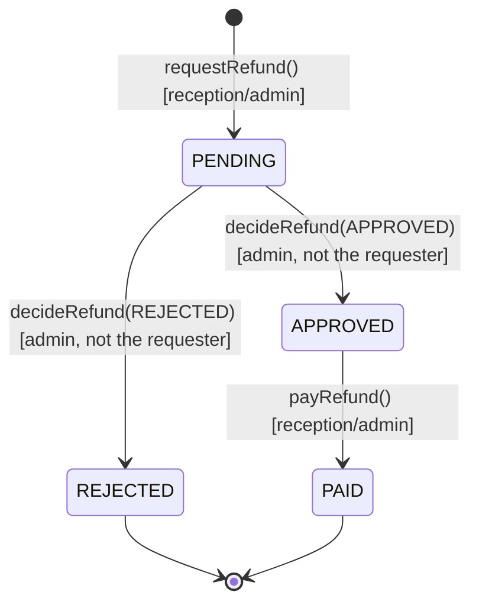

# 03 — Business rules and workflows

This chapter documents the **state machines and business rules** of the reference RIS that are not obvious from the
schema alone: who may do what, in what order, under which guard conditions, and what happens on every branch. It does
not restate the data model (see chapter 01) or the full endpoint list (see chapter 02) — endpoints are cited only
where needed to show which call performs which transition.

The reference implementation is Node.js + SQLite at `/Users/stavyaspinehospital/Radiology/radiology-ms/ris`. All file
paths below are relative to `ris/server/` unless stated otherwise. Everything here was read directly out of the code
(`orders.js`, `reports.js`, `critical.js`, `discounts.js`, `billing.js`, `registration.js`, `patients.js`,
`clinical.js`, `auth.js`, `config.js`) and cross-checked against `test/*.test.js`.

**Out of scope, noted once:** this system has no PACS/DICOM integration, no image storage, no image viewer and no
image-based AI. "Scan complete" is a status a technologist sets by hand; nothing transfers image data.

Role vocabulary used throughout (from `auth.js`): `radiologist`, `technologist`, `reception`, `clinician`, `nurse`,
`admin`, `auditor`. `RADIOLOGY_STAFF = ['radiologist', 'technologist', 'reception']`, `WARD_ROLES = ['clinician',
'nurse']`.

---

## 1. Order lifecycle

### 1.1 States and the transition table

The order state machine lives entirely in one object in `orders.js`, `FLOW` (status → next status → permission
group):

```js
const FLOW = {
  REQUESTED:  { ACKNOWLEDGED: 'triage', CANCELLED: 'cancel' },
  ACKNOWLEDGED: { SCHEDULED: 'triage', CANCELLED: 'cancel' },
  SCHEDULED:  { SCHEDULED: 'triage', ARRIVED: 'triage', NO_SHOW: 'triage', CANCELLED: 'cancel' },
  NO_SHOW:    { SCHEDULED: 'triage', CANCELLED: 'cancel' },
  ARRIVED:    { PREPARED: 'acquire', CANCELLED: 'cancel' },
  PREPARED:   { IN_PROGRESS: 'acquire', CANCELLED: 'cancel' },
  IN_PROGRESS:{ COMPLETED: 'acquire' },
  COMPLETED:  {}, REPORT_DRAFTED: {}, REPORTED: { DISPATCHED: 'handover' }, DISPATCHED: { COLLECTED: 'handover' },
  COLLECTED:  {}, CANCELLED: {}
};
const GROUPS = { triage: RADIOLOGY_STAFF, acquire: ['technologist','radiologist'], handover: ['reception','radiologist'] };
```

Every status change (except creation and the two report-driven jumps described in §1.4) goes through
`transition(orderId, body, user)`, called by `POST /api/orders/:id/transition` with `{ to, note, scheduledAt?,
expectedRevision }`. `transition()`:

1. Loads the order via `getOrderForUser` (role-scoped visibility, §7.2).
2. Looks up `FLOW[order.status][to]` — if that pair isn't in the table, `409 INVALID_TRANSITION`. **There is no
   generic "any status to any status" path**; every edge the system allows is literally enumerated above.
3. Checks `expectedRevision` (optimistic concurrency, §1.5).
4. Checks the permission group for that edge (`triage` / `acquire` / `handover` / `cancel` — see §1.3).
5. Runs the transition-specific guard, if any (§1.3).
6. Writes the new status, increments `orders.revision`, appends an `order_events` row, and audits `ORDER_<TO>`.



`OPEN_STATUSES` (orders.js) = everything up to and including `COMPLETED` and `REPORT_DRAFTED`; `FINAL_STATUSES` =
`REPORTED`, `DISPATCHED`, `COLLECTED` (a signed report exists in all three; the last two only record hand-over of the
printed report to the patient, not a further clinical step).

### 1.2 Creating an order (`createOrder`, `POST /api/orders`)

Roles: `clinician`, `nurse`, `reception`, `radiologist` (reception and radiologist can order on a patient's behalf;
`registration.js` also calls this internally with `skipRoleCheck: true` when reception creates a walk-in
registration). Guards, in the order the code checks them:

- **Encounter must exist, belong to the patient, and be `ACTIVE`** — `ENCOUNTER_MISMATCH` / `ENCOUNTER_CLOSED`.
- **Exam must exist and be active** — `UNKNOWN_EXAM` / `EXAM_INACTIVE` (an admin deactivated it in the service
  catalog).
- **`EXAM_PRICE_NOT_SET`** — if `exam_catalog.price IS NULL` the order is refused outright. This is deliberate:
  `exam.price == null` must never be coerced to `0`, which would silently bill the study as free. An admin must set a
  real price in the service catalog first (see chapter 01 and the placeholder note in §9).
- **Clinical indication** required, ≥5 characters after trimming (`INDICATION_TOO_SHORT`).
- **STAT priority gate**: `priority === 'STAT'` is only accepted from `WARD_ROLES` (clinician, nurse) or
  `radiologist`. Reception cannot place a STAT order (`403`, "STAT orders must come from a clinician, nurse or
  radiologist").
- **Duplicate detection**: same `patient_id` + `exam_code` + `side` (side-aware — left/right knee are not duplicates
  of each other), any non-`CANCELLED` status, created within `config.duplicateWindowDays` (default 30,
  `RIS_DUPLICATE_WINDOW_DAYS`) → `409 POSSIBLE_DUPLICATE` unless the caller resends with `confirmDuplicate: true`.
  The response still records `duplicateOverridden: true` on the resulting order object when the caller pushed
  through.
- **Idempotency by `externalOrderId`**: if the caller supplies an external system's own id for the order and that id
  was already used, the call *replays* the existing order (`replayed: true`) rather than creating a second one,
  provided patient/exam/side match; a mismatch is `409 EXTERNAL_ORDER_ID_CONFLICT`. This is the integration point a
  HIS/EMR feed would use to be safely retried.
- **Discount resolution** happens at order-creation time too (`resolveDiscount`, see §4) — a reception or admin user
  can apply a scheme or a one-off percentage directly on the order line.

On success the order is `REQUESTED`, `due_at = now + config.slaHours[priority]` (defaults STAT 1h / URGENT 4h /
ROUTINE 24h, all **PROVISIONAL**, see §9), and radiologist/technologist/reception are notified (`NEW_ORDER` or
`STAT_ORDER`).

### 1.3 Transition guards and permission groups

| Edge | Group | Who | Guard |
|---|---|---|---|
| any → `CANCELLED` | `cancel` | radiologist or reception (`RADIOLOGY_STAFF` minus `technologist`), **or** the original requester regardless of role | `REASON_REQUIRED` if no note |
| `REQUESTED → ACKNOWLEDGED`, `ACKNOWLEDGED → SCHEDULED`, `SCHEDULED → {SCHEDULED, ARRIVED, NO_SHOW}`, `NO_SHOW → SCHEDULED` | `triage` | radiologist, technologist, reception | `SCHEDULE_REQUIRED` if `to === 'SCHEDULED'` and `scheduledAt` is missing/invalid |
| `ARRIVED → PREPARED` | `acquire` | technologist, radiologist | `CONSENT_REQUIRED` unless a `scan_consents` row already exists for the order (see §7.1) |
| `PREPARED → IN_PROGRESS` | `acquire` | technologist, radiologist | `SAFETY_CHECK_REQUIRED` if the exam `uses_contrast`/`ionising`/`mri` and the latest `safety_checks` row isn't `CLEARED` or `CLEARED_OVERRIDE` (§6) |
| `IN_PROGRESS → COMPLETED` | `acquire` | technologist, radiologist | — |
| `REPORTED → DISPATCHED`, `DISPATCHED → COLLECTED` | `handover` | reception, radiologist | — |

The **cancel** rule is intentionally wider than the others: *any* requester — clinician, nurse, whoever placed the
order — may cancel their own request even though they have no role in `RADIOLOGY_STAFF`, but a technologist may only
cancel an order if they themselves happen to be its requester (a technologist cannot cancel on radiology's behalf the
way reception or a radiologist can).

Marking `SCHEDULED → SCHEDULED` is a legal "no-op" edge, used by the UI purely to change `scheduledAt` (reschedule)
without changing status.

### 1.4 The two transitions that bypass `FLOW`

`COMPLETED → REPORT_DRAFTED` and `REPORT_DRAFTED → REPORTED` are **not** reachable through
`POST /api/orders/:id/transition` at all — `FLOW.COMPLETED` and `FLOW.REPORT_DRAFTED` are both `{}`. They happen as a
side effect of the reporting endpoints instead:

- `reports.saveDraft()` (`POST /api/orders/:id/report`, radiologist only) creates the first draft report and, in the
  same transaction, runs `UPDATE orders SET status = 'REPORT_DRAFTED', ...`. Notably this particular `UPDATE` has
  **no `WHERE revision = ?` optimistic-lock clause** — unlike every `transition()` call, a concurrent edit here
  cannot produce `STALE_REVISION` on the order row (the draft itself is still revision-guarded via
  `STALE_REPORT_REVISION`).
- `reports.signReport()` (`POST /api/reports/:id/sign`, radiologist only) runs
  `UPDATE orders SET status='REPORTED', reported_at=..., ...` the same way, also without an order-revision check.

A backend reimplementation that models order status as its own guarded aggregate should either fold these two edges
into the same optimistic-concurrency mechanism as the rest of `FLOW`, or deliberately document why report-driven
status changes are exempt.

### 1.5 Optimistic concurrency

Every `transition()` and `assign()` call takes `body.expectedRevision`. If given, it must equal `orders.revision`
exactly or the call fails `409 STALE_REVISION` ("Order changed, reload and retry"); the `UPDATE` itself is
`WHERE id = ? AND revision = ?`, so a race is caught by the `changes !== 1` check even if two requests passed the
pre-check simultaneously. `expectedRevision` is **optional** unless `RIS_REQUIRE_REVISION=1`
(`config.requireRevision`) — the reference web app always sends it, but the API itself does not force it by default.

### 1.6 Assignment

`assign(orderId, body, user)` (`POST /api/orders/:id/assign`, reception or radiologist) sets `technologist_id` and/or
`radiologist_id` independently of status — it can be called at any point in the order's life, is not part of `FLOW`,
and only validates that the assignee is an **active** user with the matching role (`BAD_ASSIGNEE`). It is also
revision-guarded the same way as `transition()`.

---

## 2. Reporting lifecycle

### 2.1 Draft → Final



- `saveDraft()` (radiologist only) requires the **order** to be `COMPLETED` or `REPORT_DRAFTED`
  (`NOT_READY_TO_REPORT` otherwise). The first call creates `reports` row `version=1, kind='REPORT', status='DRAFT'`;
  subsequent calls on the same order update that same draft row in place, guarded by the report's own
  `expectedRevision` (`STALE_REPORT_REVISION`).
- `signReport()` (radiologist only, `reportId`) refuses if the report is already `FINAL`
  (`409 IMMUTABLE_FINAL_REPORT`, "add an addendum instead") — **signed reports can never be edited**, by design,
  not just by convention.
- Signing requires non-empty `findings` and `impression` (`requireText`).
- **Critical-wording detector**: `detectCritical(text)` in `reports.js` runs the combined findings+impression text
  against `CRITICAL_PATTERNS` (an array of `[name, RegExp]` pairs in `reference-data.js` — cauda equina, cord
  compression, pneumothorax, etc.). If any pattern hits, the signer **must** pass `criticalDeclared: 'YES'|'NO'` or
  the call fails `409 CRITICAL_DECLARATION_REQUIRED` and the response carries the matched pattern names in `e.hits`
  for the UI to show. If `criticalDeclared==='NO'` and there were hits, a `criticalNoReason` (≤500 chars) is
  mandatory. If `'YES'`, a `criticalSummary` (≤1000 chars) is mandatory and feeds `createCriticalCase()` (§3).
  **The declaration is mandatory only when the detector actually matched text** — a radiologist can sign a report
  with zero hits and never declare anything either way (`critical_declared` defaults to `'NO'`).
- On success: `reports.status='FINAL'`, `signed_at`, `signature_hash` computed (§2.2), order moves to `REPORTED`
  (§1.4), and the requester/ordering doctor are notified `REPORT_FINAL`.

### 2.2 The signature hash chain

`signatureFor(report, order, prevHash)` builds a JSON payload and SHA-256-hashes it. `SIG_VERSION` is currently `2`.
Version-1 rows (signed before this field existed) hash a smaller payload and keep verifying against *their own*
version's shape — `signatureFor` branches on `report.sig_version`.

- **v1 payload**: `accession, patient, version, kind, technique, findings, impression, recommendation, author,
  signedAt, prev`.
- **v2 payload** adds: `addendumReason, criticalDeclared, criticalSummary, criticalNoReason`.

What `prev` means differs by call site — this is easy to misread from the schema alone:

- `signReport()` always calls `signatureFor(signed, order, null)` — **the first FINAL version's hash chain root is
  always `null`**, regardless of the report's nominal `version` number (which is hard-pinned to `1` at sign time
  irrespective of how many draft revisions preceded it).
- `addAddendum()` (radiologist only, `FINAL_STATUSES` orders only — `NO_FINAL_REPORT` otherwise) creates a new
  `reports` row, `version = prev.version + 1`, `kind='ADDENDUM'`, and chains `prev = <previous FINAL row's
  signature_hash>`.

`verifyReportChain(orderId)` (run by `reportsForOrder`, i.e. on every `GET` of an order's reports) walks all `FINAL`
rows for the order in `version` order, recomputing `signatureFor(r, order, prevHashSoFar)` and comparing to the
stored `signature_hash`; the first mismatch returns `{ valid: false, brokenAtVersion }`. **What this proves**: no
field covered by the payload (clinical text, the author, the critical declaration, the addendum reason) was altered
in the database after signing, and no row in the FINAL sequence was removed or reordered without breaking the chain
for everything after it. It does **not** prove the chain is tamper-*evident* against someone with direct SQL access
recomputing the hash to match an edited row — there is no external anchor/ledger for the signature hash itself (the
audit log has its own, separate hash chain — see chapter 01/02 for `audit.js` / `audit_anchors`).

### 2.3 Addenda

Addenda are **new rows, never edits** — `findings`, `impression`, `addendum_reason` are required; `technique` and
`recommendation` are always empty strings on an addendum row. The original FINAL report(s) are untouched. All
addenda plus the original are returned together by `reportsForOrder` in `version` order; `printableReport()`
concatenates every FINAL row (original + addenda) into one printable document.

### 2.4 Visibility

`reportsForOrder` shows **all** report rows (draft and final) to radiology staff and admin/auditor; everyone else
(clinician, nurse, reception) only ever sees rows with `status='FINAL'` — a draft is invisible outside radiology
until it is signed, by filtering in application code, not a DB view.

---

## 3. Critical result loop



- **Raised**: only from `signReport()` when `criticalDeclared === 'YES'`; `createCriticalCase(order, report,
  summary, receiverId, user)` (`critical.js`) inserts `critical_cases` with `state='OPEN'`,
  `due_at = now + config.criticalMinutes` minutes (default 60, `RIS_CRITICAL_MINUTES`, **PROVISIONAL**), and
  `receiver_id = receiverId ?? order.requested_by`. A `critical_events` row (`state='OPEN'`) and a notification to
  the receiver and `order.encounter_doctor_id` are created in the same call. There is **no separate "manual
  declaration" entry point outside signing a report** — the only way a case is raised is through the sign-report
  flow; the wording detector only *suggests* (via `criticalSuggestions` returned from `saveDraft`), it never raises a
  case on its own. The radiologist's `YES`/`NO` declaration at sign time is what actually opens a case.
- **Communicated**: `communicate(caseId, body, user)` (radiologist only, `POST /api/critical/:id/communicate`).
  Allowed from `OPEN` or `ESCALATED` only (`409 INVALID_STATE` otherwise, including if already `COMMUNICATED` or
  `ACKNOWLEDGED`). **`body.readBack !== true` is rejected outright** (`400 READ_BACK_REQUIRED`) — the API will not
  record a communication without an explicit confirmation that the receiver read the result back. `receiverName`
  (required text) and `channel` (`PHONE` | `IN_PERSON` | `PAGER`) are stored on the `critical_events` row.
- **Escalation**: `sweepCritical()` in `critical.js` selects every `critical_cases` row with `state='OPEN'` and
  `due_at < now()`, flips it to `ESCALATED`, logs a `critical_events` row with actor `'system'`, and notifies
  `radiologist` + `admin` roles. **This is a lazy, on-read sweep, not a scheduler**: `sweepCritical()` is called from
  exactly one place in the codebase, the top of `listCritical()`, which itself only runs when something calls
  `GET /api/critical`. If nobody opens the critical-results list, a case that is actually overdue stays `OPEN` in the
  database and never escalates or notifies anyone until the next read. **This is a correctness gap a production
  backend must close with a real background scheduler/cron**, not a lazy sweep keyed to an unrelated GET request.
- **Acknowledged**: `acknowledge(caseId, body, user)` (any `WARD_ROLES` user — clinician or nurse —
  `POST /api/critical/:id/acknowledge`). Requires `actionPlan` text. The **only** state guard is
  `if (c.state === 'ACKNOWLEDGED') throw conflict('INVALID_STATE', 'Already acknowledged')` — **acknowledge does not
  require the case to have passed through `COMMUNICATED` first**. A ward user can acknowledge a case that is still
  `OPEN` or `ESCALATED`, i.e. before the radiologist has ever recorded a read-back communication. This is flagged
  again under "Open questions" below, since it looks like it should plausibly require `COMMUNICATED` first but the
  code does not enforce that ordering.

---

## 4. Discount approval workflow

`discounts.js` resolves and (where required) gates every discount applied to an order line, whether at order
creation (`orders.createOrder`) or an invoice-line edit (`registration.updateInvoice`).

### 4.1 Resolving a discount — `resolveDiscount(body, user, existing=null)`



- Only `reception` or `admin` may apply **any** non-zero discount (`forbidden` otherwise) — a clinician or nurse
  requesting an order cannot discount it themselves.
- **The 50%-or-more rule**: `pct >= 50` (which includes `noCharge`, which is `pct=100`) always forces a written
  `waiverReason` **and** always sets `requiresApproval = true`, independent of which scheme (or no scheme) was used.
  A scheme can separately force a reason/approval below 50% via its own `requires_reason` / `requires_approval`
  flags (`discount_schemes` table, `masters.js` manages these).
- **The discount takes effect immediately** — `createOrder`/`updateInvoice` write `discount_pct`, `discount_amount`,
  `final_amount` onto the order row right away, before any approval decision exists. `requiresApproval` only
  controls whether a `discount_approvals` row is queued for admin review; it does **not** block the order from being
  priced and paid at the discounted rate while the approval is pending. Only a **rejection** forces a correction
  (below).

### 4.2 The approval queue

`createPendingApproval({ orderId, registrationId, schemeId, pct, waiver }, user)` first calls
`supersedePendingApprovals(orderId, user)` — **at most one live (`PENDING`) approval request ever exists per
order**; any earlier `PENDING` row for that order is marked `SUPERSEDED` (not deleted — kept for audit) before the
new one is inserted. `supersedePendingApprovals` is also called whenever:
- the order is cancelled (`orders.transition` → `CANCELLED`) — a cancelled line's discount no longer charges
  anything, so a stale pending approval must not later reset it;
- an invoice line's discount is re-edited at all (`registration.updateInvoice`), even to a value that itself needs
  no approval — the previous request no longer describes what the order now charges.

`listDiscountApprovals(query, user)` — admin only, filterable by `status`. `decideDiscountApproval(id, body, user)`
— admin only:

- **Segregation of duties**: `if (a.requested_by === user.id) throw forbidden('You cannot approve a discount you
  requested')` — the admin who personally applied the discount cannot also be the one who signs off on it. (Note:
  reception can also apply discounts that need approval; only an admin can ever decide one, so a reception-requested
  discount can be approved by any admin, but an admin-requested one needs a *different* admin.)
- `decision` must be `APPROVED` or `REJECTED`. `REJECTED` requires a `note` (≤300 chars, the reason); `APPROVED`'s
  note is optional.
- **On `REJECTED`**, the order line is force-reverted to full price in the same transaction:
  `discount_pct=0, discount_amount=0, final_amount=base_price, no_charge=0, waiver_reason=NULL,
  discount_scheme_id=NULL`. The requester is notified that the discount was rejected and the order reverted.
- **On `APPROVED`**, nothing on the order changes — it was already charging the discounted amount; approval simply
  records that the discount is now sanctioned.

---

## 5. Refund approval workflow

Same shape as discounts (request → admin approval → done) but with an **extra step**, because real money has to move
out: `billing.js`.



- `requestRefund(regId, body, user)` (`reception`/`admin`) validates `amount <= s.refundable` where
  `refundable = max(0, netPaid - refundsAlreadyOpenOrApproved)` from `registration.summarize()` — you cannot request
  more than what's actually been collected and not already queued for refund.
- `decideRefund(refundId, body, user)` (admin only) — **same segregation-of-duties rule as discounts**:
  `if (r.requested_by === user.id) throw forbidden(...)`. Unlike discounts, **both** `APPROVED` and `REJECTED`
  require a `note` here (`requireText`, not optional) — there is no code path to reject or approve a refund silently.
  A `REJECTED` refund has **no reversal step**, because unlike a discount nothing was ever paid out yet — the money
  stays with the hospital and the registration's `refundable` figure simply goes back up (the rejected row no longer
  counts as "open").
- `payRefund(refundId, body, user)` (`reception`/`admin`) only succeeds when `status === 'APPROVED'`
  (`INVALID_STATE` otherwise). `via` is `CASH | BANK_TRANSFER | UPI | CHEQUE`; `reference` is required for every
  method except `CASH`. Sets `status='PAID'`.

**Key differences from the discount workflow**: refunds have a genuine third step (payout) that discounts don't
need; a refund's admin decision always demands a note either way, where a discount approval's note is only mandatory
on rejection; and a rejected refund needs no data correction on the order/registration (nothing was committed yet),
whereas a rejected discount must actively undo the price that was already in effect.

---

## 6. Safety screening rules

`recordSafety(orderId, body, user)` (`orders.js`, `technologist` or `radiologist`, `POST /api/orders/:id/safety`).
Guards apply **only for the fields the ordered exam is actually flagged for** (`exam_catalog.uses_contrast` /
`ionising` / `mri`, joined onto the order row) — an exam with none of those flags produces an always-`CLEARED` check
with no flags at all.

| Exam flag | Input | Condition | Flag level | Text |
|---|---|---|---|---|
| `uses_contrast` | `contrastAllergy` | `YES` | `BLOCK` | Reported contrast allergy |
| `uses_contrast` | `egfr` | missing (`null`) | `BLOCK` | eGFR required for contrast |
| `uses_contrast` | `egfr` | `< 30` | `BLOCK` | eGFR … is below 30 |
| `uses_contrast` | `egfr` | `30 ≤ egfr < 45` | `WARN` | eGFR … is below 45: hydrate, radiologist to confirm |
| `ionising` | `pregnant` | `YES` | `BLOCK` | Patient is pregnant and exam uses ionising radiation |
| `mri` | `mriImplant` | `YES` or `UNKNOWN` | `BLOCK` | MRI implant/device reported *or* MRI implant status unknown |

`egfr` itself must be a finite number `0–200` (`EGFR_INVALID`) when supplied at all.

- `status = 'BLOCKED'` if any flag is `BLOCK`-level, else `'CLEARED'`. A `WARN`-level flag (the eGFR 30–44 band)
  never blocks on its own — it is informational only and still yields `CLEARED`.
- **Override**: only possible when the check is blocked **and** `body.overrideReason` is supplied **and**
  `user.role === 'radiologist'` (`forbidden('Only a radiologist can override a safety block')` for anyone else,
  including the technologist who ran the check). A successful override sets `status = 'CLEARED_OVERRIDE'` and stores
  `override_reason`.
- If blocked with no override, radiologists are notified `SAFETY_BLOCK` with the human-readable list of BLOCK-level
  reasons.
- `latestSafety(orderId)` always picks the most recent row (`ORDER BY at DESC, rowid DESC LIMIT 1`) — safety checks
  are append-only; a second check (e.g. a radiologist re-running it to override, or a technologist correcting a
  value) **adds a new row**, it does not edit the first one. The gate that blocks `PREPARED → IN_PROGRESS` (§1.3)
  only ever looks at the *latest* row.

---

## 7. Registration / encounter rules

### 7.1 Encounter sources: OPD, IPD, EXTERNAL, OT

`encounters.type` is one of `OPD | IPD | OT | EXTERNAL` (`oneOf` validated in `patients.createEncounter`). Two
distinct code paths create them:

- **`POST /api/patients/:id/encounters`** (`patients.createEncounter`, roles `reception`, `admin`, `nurse`) — the
  general-purpose way to open an OPD visit, an IPD admission, or an OT episode for a patient who already exists in
  the system. `type='IPD'` forces a non-empty `ward` (`requireText`) and stamps `admitted_at = now()`; other types
  leave `ward` optional and `admitted_at` null. An optional `doctorId` must reference an active `clinician`
  (`BAD_DOCTOR` otherwise) and becomes `encounters.doctor_id` — this is the "consultant" shown on the order and
  invoice.
- **`registration.createRegistration`** (`POST /api/registrations`, roles `reception`, `admin`) always creates its
  **own** encounter with `type='EXTERNAL'` — walk-ins who present directly to radiology reception without an
  existing OPD/IPD visit. This is the third traffic source alongside clinician-placed OPD/IPD orders; its `ref_no`
  is minted as `EXT-RAD-<year>-<seq>`, distinct from an OPD/IPD `ref_no` supplied by the caller. A registration
  bundles one encounter with 1–12 scan order lines (`items`, max 12, `TOO_MANY_ITEMS`), created via `createOrder`
  with `skipRoleCheck: true` and `registrationId` set, inside one transaction — if any single scan is refused (e.g.
  a possible duplicate without `confirmDuplicate`), the **whole registration** is rolled back, nothing is left
  half-created.
- There is **no dedicated "OT" creation flow** beyond the generic `createEncounter` with `type='OT'` — OT
  (pre-/post-operative imaging) is just another encounter type an authorised user opens the same way as OPD/IPD.
- Orders inherit `source` directly from `encounters.type` (`orders.source = enc.type` at creation) — an order's
  `source` is never set independently of the encounter that carries it.

### 7.2 Visibility scoping by role — `visibility(user)`

```js
export function visibility(user) {
  if (canSeeAll(user)) return { sql: '1=1', args: [] };                                   // radiologist, technologist, reception, admin, auditor
  if (user.role === 'clinician') return { sql: '(o.requested_by = ? OR e.doctor_id = ?)', args: [user.id, user.id] };
  return { sql: '(o.requested_by = ? OR (e.ward IS NOT NULL AND e.ward = ?))', args: [user.id, user.ward || '\u0000'] }; // nurse
}
```

- `RADIOLOGY_STAFF` (radiologist, technologist, reception) plus `admin`/`auditor` see **every** order — there is no
  per-radiologist or per-technologist restriction; any radiology staff member can see and act on any order (subject
  to the role-group checks in §1.3).
- A **clinician** sees an order only if they personally requested it, or they are the encounter's attending doctor
  (`encounters.doctor_id`) — i.e. a consultant sees orders placed by their fellow/medical officer on their behalf
  (`encounter_id.doctor_id` matches the consultant even though `requested_by` is the junior doctor who typed the
  request).
- A **nurse** sees an order only if they personally requested it, or the order's encounter is on their own `ward`
  (`user.ward`); a nurse with no `ward` set falls back to the sentinel `'\u0000'`, which matches nothing, so a
  ward-less nurse sees only their own requests.
- This same `visibility()` SQL fragment backs every list/detail call that touches orders (`listOrders`,
  `getOrderForUser`), so it is the single point of truth for "can this user see this order" across the whole API —
  there is no separate ACL table.

---

## 8. Placeholders and demo-only values the backend/hospital team must replace

- **Employee codes** (`server/roster.js`) — plain numbers `101`–`902` used as login usernames. Must be replaced with
  real Stavya HR/employee codes before production, then the roster reseeded.
- **Exam prices** (`exam_catalog.price`, seeded from `server/data/radiology-master-import.json`) — rows the
  hospital's tariff sheet gave no rate for are `price = NULL` with a `price_note` explaining why; such exams cannot
  be ordered (`EXAM_PRICE_NOT_SET`, §1.2) until an admin sets a real price through the service-master screen.
- **Load thresholds** (`RIS_LOAD_BUSY_AT` / `RIS_LOAD_VERY_BUSY_AT`, defaults 3 / 6, `server/load.js` +
  `server/config.js`) — identical for every modality today; a modality with fewer machines likely needs its own,
  lower bar. Informational widget only, never blocks ordering.
- **SLA hours** (`RIS_SLA_HOURS_STAT/URGENT/ROUTINE`, defaults 1 / 4 / 24, `server/config.js`) — provisional report
  turnaround targets that drive `due_at` and the worklist's "overdue" sort.
- **Critical-communication window** (`RIS_CRITICAL_MINUTES`, default 60, `server/config.js`) — the minutes a critical
  case has before it escalates (§3). Also note the escalation mechanism itself is a lazy on-read sweep, not a
  scheduler (§3) — a correctness gap independent of what the number is set to.
- **OTP delivery** (`RIS_OTP_WEBHOOK`) — unset means no SMS/email code delivery is configured;
  `RIS_DEV_OTP=1` is a local-only shortcut (refused outright when `NODE_ENV=production`, enforced in
  `validateConfig()`) that echoes the code back in the API response instead of sending it.
- **Sessions are in-memory** (`server/auth.js`, a plain `Map`) — a server restart silently logs out every signed-in
  user; there is no persisted session store and no MFA.
- **SQLite / single-process assumptions** — `node:sqlite`, one file (`data/ris.db`), one writer connection with an
  in-process transaction depth counter (`util.js`'s `tx()`); there is no clustering, replication, or external lock
  coordination anywhere in this codebase.
- **Aadhaar OTP verification** is not implemented (`registration.capabilities().aadhaarOtpVerification === false`)
  — Aadhaar numbers are checksum-validated (Verhoeff) and usable to *look up* an existing patient, and stored only
  as a salted SHA-256 hash plus last 4 digits, but a licensed UIDAI provider would be needed for real OTP-based
  Aadhaar verification.
- **No payment gateway is integrated** — `ONLINE` payments and `payRefund`'s non-cash methods are staff manually
  recording a reference number from an external gateway/UPI confirmation; nothing calls out to Razorpay or any other
  processor.

---

## Open questions for the hospital / backend team

- `acknowledge()` on a critical case does not require the case to have passed through `COMMUNICATED` first — a ward
  user can acknowledge an `OPEN` or `ESCALATED` case before any radiologist-recorded read-back exists (§3). Confirm
  whether this is intentional (e.g. a ward that already knows verbally, ahead of the formal call) or a gap that
  should force `COMMUNICATED` first.
- `saveDraft()`'s and `signReport()`'s direct `UPDATE orders SET status = ...` calls carry no
  `WHERE revision = ?` optimistic-lock clause, unlike every status change that goes through `transition()` (§1.4).
  Confirm whether report-driven order-status changes should be brought under the same concurrency guard, or whether
  there's a reason (radiologist-exclusive, effectively single-writer-per-order in practice) they were left out.
- The discount-approval queue is advisory-after-the-fact, not a hold: a discount above the 50% threshold (or one a
  scheme flags) charges immediately and is only unwound if an admin later rejects it (§4.1). Confirm the hospital is
  comfortable billing at the discounted rate before sign-off, rather than holding the line at full price until
  approved.
- `critical_cases.receiver_id` defaults to `order.requested_by` if no `receiverId` is passed at sign time (§3) — for
  an IPD order placed by a fellow or medical officer "on behalf of" a consultant, confirm whether the consultant
  (`encounters.doctor_id`) or the requesting junior doctor is meant to be the default critical-result receiver.
- Discount-scheme `requires_reason` / `requires_approval` flags (`discount_schemes` table, managed in `masters.js`)
  are themselves seed/admin-configured data this chapter did not enumerate — the actual scheme catalog (which named
  schemes exist, their percentages, and which ones currently require reason/approval) should be confirmed with the
  hospital before go-live rather than assumed from the demo seed.
