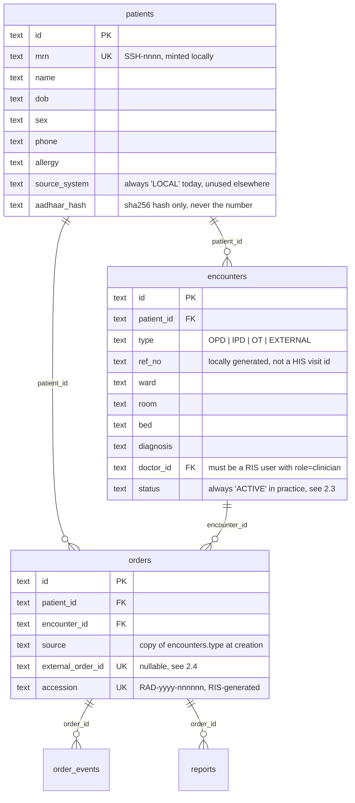
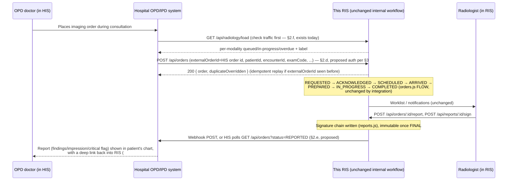

# 04 — OPD / IPD / External Integration Contract

## Audience and scope

This chapter is for the backend team that will connect this Radiology Information System (RIS) to Stavya Spine
Hospital's real OPD and IPD systems (referred to here generically as "the HIS" — Hospital Information System —
since the hospital has not named a specific product in the code). It is the most important chapter for the
hospital's stated goal: **today the RIS is entirely self-contained**. It mints its own patient identifiers, creates
its own encounters, and has no knowledge of any external system. Nothing in this codebase calls out to a hospital
HIS/OPD system, and nothing in this codebase is contacted by one. This chapter specifies the contract a production
build needs to add, without redesigning the clinical workflow underneath it.

Reference implementation: `/Users/stavyaspinehospital/Radiology/radiology-ms/ris`. All file paths below are relative
to that directory. Out of scope, mentioned once: PACS, DICOM, an image viewer, image storage. This system stores no
images and nothing here changes that.

## 1. The current self-contained model

### 1.1 Tables involved

### 1.2 How a patient and an encounter are created today

There are **two separate code paths** that create patients and encounters, and a production integration should know
both exist:

**Path A — the walk-in registration wizard** (`server/registration.js`, used by the reference UI's `#/register`
flow, `POST /api/registration/patients` then `POST /api/registrations`):
- `savePatient()` mints the MRN itself: `let n = db.prepare('SELECT COUNT(*) c FROM patients').get().c + 1001; let mrn = \`SSH-${n}\`;` then increments on collision (`registration.js:93-94`). There is no way to pass in an externally-known MRN through this path.
- `createRegistration()` creates its own `encounters` row with `type = 'EXTERNAL'` and an auto-generated `ref_no` of the form `EXT-RAD-yyyy-nnnnn` (`registration.js:154,156`) — "EXTERNAL" here means "walked into radiology directly, no OPD/IPD visit," which is a different sense of "external" from an external *system* feeding data in.

**Path B — direct patient/encounter creation** (`server/patients.js`, routed but **not called by the reference web
UI at all** — `createPatient`/`createEncounter` are reachable only via the raw API today):
- `POST /api/patients` → `createPatient(body, user)`, role `reception` or `admin`. The caller **supplies the MRN**: `const mrn = requireText(body.mrn, 'MRN', 40); if (db.prepare('SELECT 1 FROM patients WHERE mrn = ?').get(mrn)) throw conflict('MRN_EXISTS', ...)` (`patients.js:14-15`).
- `POST /api/patients/:id/encounters` → `createEncounter(patientId, body, user)`, role `reception`, `admin` or `nurse`. The caller **supplies the reference number**: `const refNo = requireText(body.refNo, 'Reference no', 40);` (`patients.js:35`), plus `type` (one of `OPD`/`IPD`/`OT`/`EXTERNAL`), `ward`/`room`/`bed`/`diagnosis`, and optionally `doctorId`.

Path B's shape — caller supplies the external identifier rather than the RIS minting one — is exactly what an
HIS-fed intake needs, and it already exists in the code. It is unused today (not called by `web/src/`, by
`server/demo-data.js`, or by any test), has had no production hardening, and its auth model is still a human
employee-code login, but it is the closest thing to an integration surface already in the codebase and should be
the starting point rather than a new design. `patients.source_system` (`server/db.js` schema, `TEXT NOT NULL
DEFAULT 'LOCAL'`) is also already in the schema and already unused everywhere in `server/*.js` — it exists but
nothing reads or writes a value other than the default. It is a natural, already-present place to record `'OPD'`,
`'IPD'`, or the HIS's own system code once patients start arriving from outside.

### 1.3 How an order always ties back to patient + encounter

`server/orders.js:createOrder()` requires both: `const patient = ...; const enc = db.prepare('SELECT * FROM
encounters WHERE id = ? AND patient_id = ?')...; if (!enc) throw bad('ENCOUNTER_MISMATCH', ...); if (enc.status !==
'ACTIVE') throw conflict('ENCOUNTER_CLOSED', ...)`. `orders.source` is copied from `encounters.type` at creation
time (`enc.type` passed as `source` into the `INSERT`, `orders.js:160`) and is immutable afterward — it is the
field every worklist, dashboard tile and analytics query groups by (`EQUIPMENT_KEYS`, `visibility()`,
`dashboardSummary()`). This is the one fact a backend team must preserve exactly: **every order's clinical origin
(OPD/IPD/OT/EXTERNAL) is carried by the encounter it is attached to, not by a separate field the caller sets
directly** — so a HIS-fed order must arrive with (or resolve to) a real `encounters` row of the right `type`, not
just a `source` string.

**Important gap found while writing this**: nothing in the codebase ever sets `encounters.status` away from its
default `'ACTIVE'`. A grep for `UPDATE encounters SET status` across `server/*.js` returns nothing. There is no
discharge, no visit-close, no encounter-expiry logic anywhere today — once created, an encounter (and therefore the
ability to place new orders against it) stays open forever in this reference build. This matters directly for
§2.3 below.

## 2. Integration points a production build needs

None of the following exist in the code today. Each is written as a contract — request/response field table —
grounded in the RIS fields that already exist on our side.

### 2.a Patient identity resolution (MRN/UHID)

Today the RIS mints `SSH-nnnn` locally (Path A) or accepts a caller-supplied MRN with no cross-check against a
hospital master (Path B, `createPatient` only checks local uniqueness). A production build must replace this with
the hospital's own patient master as the source of truth.

Proposed shape — **pull** (RIS asks the HIS when it doesn't recognise an MRN):

| RIS calls | Method | Notes |
|---|---|---|
| `GET {HIS_BASE}/patients/{mrn}` | GET | RIS already has an analogous internal shape: `lookupPatients()` in `server/registration.js:31` takes `phone`/`email`/`uhid`/`aadhaar` and returns a masked row — the HIS lookup should return the unmasked fields below so RIS can create/update its local row. |

Proposed shape — **push** (HIS notifies RIS of new/changed patients), since a pure pull model leaves RIS unable to
search a patient who has never been looked up:

| HIS → RIS (proposed, not built) | Method | Body |
|---|---|---|
| `POST /api/integration/patients` | POST | see field table below |

Field mapping (HIS field → RIS column, `patients` table, `server/db.js` + `server/migrations/001_baseline.js`):

| RIS column | Type | Source today | Should come from HIS |
|---|---|---|---|
| `mrn` | TEXT UNIQUE | self-minted (`SSH-`+seq) or caller-supplied, uncheck | the hospital's UHID/MRN, verbatim |
| `name`, `first_name`, `middle_name`, `last_name` | TEXT | reception types it in (`registration.js:savePatient`) | HIS patient master |
| `dob` | TEXT (ISO date) | reception types it in | HIS patient master |
| `sex` | TEXT, one of `M`/`F`/`O` | reception picks it | HIS patient master |
| `phone`, `email` | TEXT | reception types it, OTP-verified (`otp.js`) | HIS patient master (RIS's own OTP step becomes unnecessary for HIS-sourced patients — see open question) |
| `address`, `country`, `state`, `city`, `zipcode` | TEXT | reception types it | HIS patient master, if held there |
| `allergy` | TEXT, default `'None recorded'` | reception/clinical staff type it directly into RIS; this is a RIS-local clinical field, not demographic — **do not let the HIS silently overwrite it** |
| `aadhaar_hash`, `aadhaar_last4` | TEXT | RIS validates (Verhoeff, `registration.js:19`) and hashes (`aadhaarHash()`, SHA-256) the number itself, keeping only the hash + last 4 digits, never the number | if the HIS already holds Aadhaar, send RIS only the same hash/last-4 shape, never the raw number |

### 2.b OPD encounter/visit feed

Today an OPD encounter is either created ad hoc through Path B (`POST /api/patients/:id/encounters`, caller
supplies `refNo`, `type: 'OPD'`) or never created at all for the demo traffic (`server/demo-data.js` writes the
`encounters` row directly with its own `OPD-2026-nnnn` reference). There is no real OPD visit concept.

**(i) RIS receiving a new OPD encounter, so the patient becomes orderable** — reuse Path B's existing contract
rather than building a new one:

| Field (`POST /api/patients/:id/encounters` body) | Required | Maps to |
|---|---|---|
| `type` | yes, must be `'OPD'` | `encounters.type` |
| `refNo` | yes | `encounters.ref_no` — **this should be set to the HIS's own OPD visit/consultation id**, not a RIS-generated one |
| `doctorId` | optional, but see gap below | `encounters.doctor_id` |
| `diagnosis` | optional | `encounters.diagnosis` |

**Gap**: `createEncounter` validates `doctorId` against `SELECT 1 FROM users WHERE id = ? AND role = 'clinician'`
(`patients.js:33`) — i.e. the OPD doctor must already exist as a provisioned RIS user (one of the roster entries in
`server/roster.js`) before an encounter can name them. A real OPD feed will identify its doctor by the HIS's own
doctor id, which has no relationship to a RIS `users.id` today. A production build needs a doctor
cross-reference table (HIS doctor id ↔ RIS `users.id`) maintained as part of staff provisioning, not invented
per-request.

**(ii) RIS placing an order that carries the OPD encounter reference back out** — this already works for free, with
no schema change, *if* `ref_no` is populated with the HIS visit id per (i): every order detail row already joins
and returns it. `orders.js:baseRow()` selects `e.ref_no encounter_ref` (`orders.js:49`) on every order read (`GET
/api/orders`, `GET /api/orders/:id`), so an order placed against that encounter is automatically traceable back to
the exact OPD consultation — the order already carries `encounter_ref` = the HIS's own visit id, with zero new
fields needed on the `orders` table.

### 2.c IPD admission feed (ADT)

Ward/room/bed/diagnosis are typed in locally today, either by reception via `createEncounter` (Path B) or by
`demo-data.js` directly. A real ADT (admission-discharge-transfer) feed should supply, at admission, exactly the
fields `encounters` already has:

| `encounters` column | A real ADT admission message would supply |
|---|---|
| `type = 'IPD'` | the event type (admission) |
| `ward`, `room`, `bed` | the assigned location |
| `doctor_id` | the admitting doctor (same cross-reference gap as §2.b) |
| `diagnosis` | the admitting diagnosis |
| `admitted_at` | the admission timestamp (currently set to `now()` at encounter-creation time only, `patients.js:38`) |
| `ref_no` | the HIS's own admission/encounter id |

`ward` is not cosmetic: `orders.js:visibility()` restricts what a `nurse` role can see to `(o.requested_by = ? OR
(e.ward IS NOT NULL AND e.ward = ?))` (`orders.js:38`), keyed on the exact string in `encounters.ward` matching the
logged-in nurse's `users.ward`. A transfer between wards, or any mismatch between the ADT feed's ward names and
`server/roster.js`'s `ward:` values, silently breaks a ward nurse's visibility into her own patients' orders — the
ward vocabulary must be a controlled, shared list, not free text from either side.

**Discharge is the real gap.** As noted in §1.3, nothing today flips `encounters.status` or otherwise marks an
encounter as closed. A production ADT discharge event needs a decision the reference code does not make for you:
- It should **not** silently cancel open radiology orders on discharge — a patient can be discharged with a
  follow-up scan still pending, and `orders.transition()`'s cancel path already requires a human reason
  (`REASON_REQUIRED`, `orders.js:187`) from the requester, reception or a radiologist; an automatic system-driven
  cancellation would bypass that safeguard.
- It should mark the encounter (e.g. a new `encounters.status = 'DISCHARGED'` plus a discharge timestamp column)
  so ward-nurse visibility and the day board stop treating it as active, while still allowing already-open orders
  to run their course and allowing `GET /api/patients/:id` (`patientOverview`, which lists all encounters
  regardless of status) to show the full history.
- Whether a *new* order can still be placed against a discharged IPD encounter (e.g. a courtesy follow-up) is a
  clinical policy decision for the hospital, not something inferable from this codebase.

### 2.d Order intake from the OPD/IPD system (external order entry)

If the HIS becomes the system of order *entry* instead of this RIS's own New Request page, `orders.external_order_id`
(added in `server/migrations/002_foundation.js:34`) is the column to use, and `createOrder()` already implements
the idempotency semantics around it (`orders.js:130-142`):

| Behaviour | Where |
|---|---|
| `external_order_id` is nullable, but unique when present: `CREATE UNIQUE INDEX ... ON orders(external_order_id) WHERE external_order_id IS NOT NULL` | `migrations/002_foundation.js:35` |
| Format: must match `^[A-Za-z0-9][A-Za-z0-9._:/-]*$`, max 80 chars, else `400 EXTERNAL_ORDER_ID_INVALID` | `orders.js:132` |
| **Idempotent intake**: resending the same `externalOrderId` for the same patient/exam/side returns the existing order with `replayed: true` and does **not** create a duplicate | `orders.js:137-141` |
| Resending the same `externalOrderId` against a *different* patient, exam code, or side throws `409 EXTERNAL_ORDER_ID_CONFLICT` | `orders.js:139` |
| This is independent of the transport-level `Idempotency-Key` header (`server/idempotency.js`), which is keyed per `(user, key)` and guards against a lost HTTP response being retried; use both — `Idempotency-Key` for the HTTP retry, `externalOrderId` for the business-level "this is accession/order X from your system" guarantee | `app.js:191-196` |

**Amendment and cancellation from the source system — a genuine gap.** There is no "amend an order" endpoint. Once
created, an order's exam/priority/indication cannot be changed; only its *status* can move through the
`FLOW` state machine in `orders.js:16-25` (`POST /api/orders/:id/transition`). Cancellation is only reachable from
states `REQUESTED`, `ACKNOWLEDGED`, `SCHEDULED`, `NO_SHOW`, `ARRIVED`, `PREPARED` (the `'cancel'` group in `FLOW`) —
not once the exam is `IN_PROGRESS` or later — and the caller must be the original `requested_by`, reception, or a
radiologist (`orders.js:183`). A production contract needs to decide, and the reference code does not decide for
you: does the HIS get its own order-cancelling identity that satisfies that check, or does RIS need a new rule
("an order created with a given `externalOrderId` may be cancelled by the system that created it")? Until that is
built, the pragmatic interim contract is **cancel-and-resubmit with a new `externalOrderId`** for any amendment,
relying on the uniqueness/conflict behaviour above to prevent accidental duplication.

### 2.e Result/report return to the source system

Nothing today pushes a result anywhere; `notify()` (`server/notifications.js`) only writes rows to the internal
`notifications` table, polled by the RIS web UI via `GET /api/notifications`. A production contract needs one of:

- **Webhook (push)**: RIS calls a HIS-provided URL when `reports.signReport()` commits (`server/reports.js:78-111`)
  or when `reports.addAddendum()` commits (`reports.js:113-131`). No such outbound call exists today — it would be
  new code, triggered alongside the existing `notify(...)` calls in those two functions.
- **Polling (pull)**: the HIS calls `GET /api/orders?status=REPORTED,DISPATCHED,COLLECTED&source=OPD` periodically.
  Note the gap: `listOrders()`'s date filter (`dateRange()`, `util.js:74`) filters on `orders.created_at`, not
  `reported_at` — there is no "orders reported since my last poll" filter today, so a naive poll would need to
  re-scan a wide created_at window and diff client-side, or RIS needs a small new `reported_at`-based filter added
  to `listOrders()`.

Either way, the payload available on the RIS side (already in the `reports` row and `orders` detail, nothing to
invent) is:

| Field | Source |
|---|---|
| `report.technique`, `.findings`, `.impression`, `.recommendation` | `reports` table, status `FINAL` |
| `report.critical_declared` (`'YES'`/`'NO'`), `.critical_summary` | set at signing, `reports.js:93-99` |
| `report.signed_at`, `.author_name` | set at signing |
| `report.signature_hash` | SHA-256 chain hash, `signatureFor()`, `reports.js:20-31` — can be surfaced to the HIS as a tamper-evidence proof |
| `order.accession`, `order.encounter_ref` | ties the result back to the HIS's own order/visit id (§2.b.ii) |
| Deep link into the RIS UI | `https://<ris-host>/#/order/{order.id}` (`web/src/App.jsx`'s hash router, `parseHash()`) |
| Printable HTML | already exists: `GET /api/orders/:id/print` → `reports.printableReport()`, `reports.js:134-150` |

Addenda are additional signed versions (`reports.version` increments, `kind: 'ADDENDUM'`) layered onto the same
chain — a correction is never a silent edit, and the HIS-facing contract should treat a new addendum exactly like
a new result push, not an update to the original.

### 2.f The radiology load endpoint — the quick, low-risk starting point

`GET /api/radiology/load` → `server/load.js:radiologyLoad()` **already exists, is already built, and needs no new
code** to be useful to the OPD/IPD system today. It returns, per modality (`MRI`, `CT`, `XR`, `DEXA`, `USG`,
`OPEN_MRI`, always in that order):

| Field | Meaning |
|---|---|
| `modality` | one of the six above |
| `queued` | orders in `REQUESTED`/`ACKNOWLEDGED`/`SCHEDULED` |
| `inProgress` | orders in `IN_PROGRESS` |
| `overdue` | subset of the above past their SLA `due_at` |
| `total` | `queued + inProgress` |
| `label` | `'Quiet'` / `'Busy'` / `'Very busy'`, from `config.loadThresholds` (`RIS_LOAD_BUSY_AT`/`RIS_LOAD_VERY_BUSY_AT`, defaults 3/6) |

It requires only an authenticated session (any role — `route('GET', '/api/radiology/load', ...)` has no
`requireRole` call), does one cheap `GROUP BY` query (no order rows loaded), and never blocks or affects order
placement — it is read-only, informational, and already rendered in the reference UI as `RadiologyLoadStrip`
(`web/src/ui.jsx:142-154`), shown to clinicians before they place a request. **Recommendation: wire the OPD system
to poll or embed this endpoint first**, ahead of any patient/encounter/order integration — it is the lowest-risk,
highest-value starting point, and proves out the service-to-service auth model (§3) against a read-only,
side-effect-free endpoint before that credential is trusted with anything that writes.

## 3. Authentication/trust model — a gap, stated plainly

Every route today authenticates a **human** session: `POST /api/auth/login` takes an employee code and password
(`server/auth.js:37-54`), returns an in-memory bearer token (`sessions` is a plain `Map`, wiped on process restart —
see the placeholder list below), and every subsequent call carries `Authorization: Bearer <token>`. There is no
service account, API key, or OAuth client-credentials concept anywhere in `server/auth.js` or `ROLES` (`ROLES =
['radiologist', 'technologist', 'reception', 'clinician', 'nurse', 'admin', 'auditor']` — no `'service'` or
`'system'` role exists).

This is not something to design in full here — only the contract surface a backend team needs:

- A server-to-server credential (an API key, or OAuth2 client-credentials issuing a short-lived bearer token) needs
  to resolve to **something `requireRole()` can check** — either a new role (e.g. `'integration'`) added to
  `ROLES`, scoped narrowly to the handful of endpoints in §2, or a dedicated internal user row per external system
  with an appropriately restricted role.
- Every write path that currently records a human actor (`audit({ actor: user, ... })`, `order_events.actor_name`,
  `orders.requested_by`) will record the integration's identity instead when the integration places an order —
  decide up front whether `orders.requested_by` should be a shared "HIS Integration" user id (losing which human
  OPD doctor actually ordered it, beyond what `clinical_indication`/notes capture) or whether the HIS must pass
  through the ordering doctor's RIS user id (requiring the doctor cross-reference from §2.b to already exist).
- `config.sessionHours` (default 8) and the in-memory session store mean any login-based credential — human or
  service — is invalidated on every server restart and expires after 8 hours; a long-lived service integration
  needs either much longer-lived credentials than the human login path offers, or its own re-authentication logic,
  not a borrowed human session.

## 4. Proposed end-to-end flow once integrated

## 5. What must NOT change when integration is added

- **The order state machine** (`FLOW` in `orders.js:16-25`) and its role-gated transitions — integration is a new
  way to *create* an order (via `externalOrderId`) and a new way to *read* a finished report, not a new way to move
  an order through its states.
- **Safety gates**: the contrast/pregnancy/MRI-implant screening block (`recordSafety()`, `orders.js:240-271`) and
  the consent-before-`PREPARED` rule (`orders.js:192`) apply identically to an HIS-originated order; nothing in §2
  proposes a way to skip them.
- **Report signing and immutability**: the `reports_final_no_update`/`reports_final_no_delete` database triggers
  (`migrations/002_foundation.js:12-14`) and the SHA-256 signature chain (`reports.js:signatureFor`) are unaffected
  — a result pushed to the HIS is a read of an already-immutable record, never a write path into it.
- **The critical-result loop**: `communicate()`/`acknowledge()` and the 60-minute (`config.criticalMinutes`)
  escalation sweep (`critical.js`) stay entirely internal to RIS; a signed critical report is still surfaced to the
  HIS the same way as any other signed report (§2.e) — the loop itself is not replaced by an HIS notification.
- **The audit log**: every integration call must still produce `audit()` rows exactly as a human-driven call does,
  with the integration's resolved identity (§3) as `actor`.

Integration belongs at the edges — new adapter code in `server/patients.js`/`server/orders.js`/`server/reports.js`
call sites, and new outbound/inbound routes in `server/app.js` — not a rewrite of the state machine, safety
screening, signing, or critical-result modules.

## Placeholder / demo-only values the backend and hospital team must replace

- **Employee codes** (`server/roster.js`): plain numbers 101–902, explicitly marked as placeholders in the file's
  own header comment, to be replaced with real Stavya employee codes before real use.
- **Service/exam prices**: `exam_catalog.price` is `NULL` for any item the hospital's tariff sheet did not give a
  rate for (`price_note` records why); `createOrder()` refuses to order such an item (`EXAM_PRICE_NOT_SET`,
  `orders.js:121`) rather than silently charging 0.
- **Load thresholds** (`RIS_LOAD_BUSY_AT`/`RIS_LOAD_VERY_BUSY_AT`, default 3/6): same for every modality today;
  `config.js:35-38` flags this as provisional, to confirm per-modality with radiology.
- **SLA hours** (`RIS_SLA_HOURS_STAT`/`_URGENT`/`_ROUTINE`, default 1/4/24) and the **60-minute critical-communication
  window** (`RIS_CRITICAL_MINUTES`): provisional defaults (`config.js:32-33`), to confirm with clinical leads.
- **OTP delivery**: `RIS_OTP_WEBHOOK` is unset by default — not configured; `RIS_DEV_OTP=1` is a local-demo-only
  code-in-response mode, refused outright when `NODE_ENV=production` (`config.js:73`).
- **Session storage**: `sessions` is an in-memory `Map` (`auth.js:34`) — a server restart logs every human and any
  borrowed-session integration out at once; see §3.
- **SQLite / single-process assumptions**: one `DatabaseSync` connection (`server/db.js`), WAL mode, a 5-second busy
  timeout — fine for a single-instance deployment, not designed for horizontal scaling or a separate read replica
  that an HIS integration poller might otherwise be pointed at.

## Open questions for the hospital / backend team

- Does the hospital's OPD/IPD system already have a patient master API the RIS can call (§2.a), or does it only
  push flat files/HL7 messages — the proposed REST shapes above assume a callable API that may not exist yet.
- Is Aadhaar held in the HIS at all, and if so, should RIS keep validating/hashing it independently (as it does
  today) or simply accept a hash the HIS already computed?
- Should a patient's `allergy` field (RIS-local, clinically entered) ever be overwritten by an HIS push, or must it
  always stay RIS-authoritative once set (§2.a)?
- Does the hospital want new orders still permitted against a discharged IPD encounter (§2.c), or should discharge
  hard-close the encounter to new orders while leaving in-flight orders untouched?
- Who owns cancellation/amendment authority once an order originates from the HIS (§2.d) — does the HIS get a
  cancelling identity that satisfies `orders.js`'s existing requester/reception/radiologist check, or is a new rule
  required?
- Webhook or poll for result return (§2.e) — and if webhook, what retry/ack contract does the HIS side offer, since
  RIS has no outbound-delivery-retry code today (compare `RIS_OTP_WEBHOOK`, which is fire-and-forget)?
- Is a single shared "HIS Integration" service identity acceptable for `orders.requested_by` (§3), or must every
  HIS-originated order resolve to the actual ordering doctor's own RIS user id?
