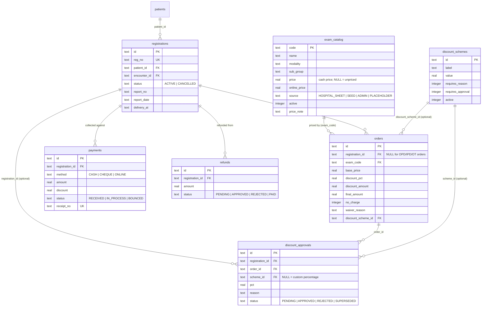
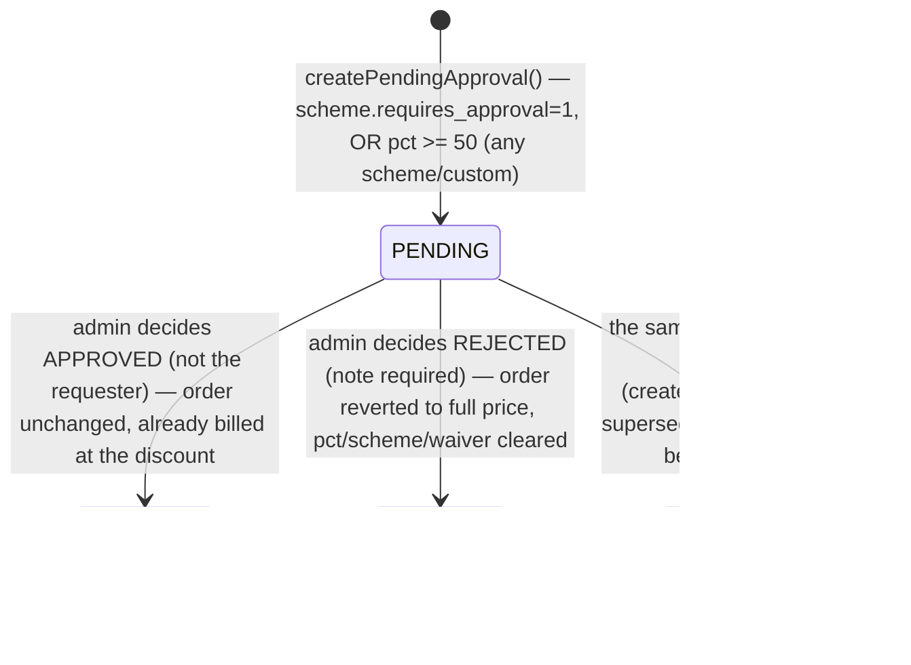

# 05 — Billing, service master and discount module

Reference implementation: `/Users/stavyaspinehospital/Radiology/radiology-ms/ris` (Node 22 + `node:sqlite`, zero
external dependencies). This chapter documents everything money-related: the service/price master, walk-in
registrations as the billing unit, invoice lines on orders, payments (cash/cheque/online), refunds, and the
discount-scheme/approval workflow. It does not cover clinical workflow, reporting or critical results — see the
companion chapters for those. **Out of scope for the whole system**: PACS, DICOM, an image viewer, image storage,
image-based AI. This system stores no images; nothing in billing touches images either.

Primary source files for this chapter:
- `server/billing.js` — payments, refunds, printable invoice/receipt HTML
- `server/discounts.js` — discount resolution and the admin approval queue
- `server/registration.js` — registrations (the billing unit), `summarize()`, the invoice editor
- `server/orders.js` — `createOrder()`'s pricing block (an order *is* an invoice line)
- `server/masters.js` — admin CRUD for `exam_catalog` ("services") and `discount_schemes`
- `server/import-master.js` + `server/data/radiology-master-import.json` — the real hospital tariff import
- `server/migrations/003_service_master.js`, `004_discount_scheme_link.js` — the schema this chapter describes
- `test/agency.test.js`, `test/discounts.test.js` — executable specification for every rule below

## 1. Data model



All money columns are `REAL`, rounded to paisa (`Math.round(v*100)/100`) at every write — see `money()` in
`billing.js` and the identical convention called out in `masters.js`'s `priceOrNull()`. There is no `DECIMAL` type in
SQLite; a production rebuild in a database with fixed-point/decimal support should move billing amounts to that type
rather than float.

## 2. The service and price master (`exam_catalog`)

`exam_catalog` is simultaneously the exam/procedure catalog (modality, body part, prep, safety flags) *and* the
price list — one row per billable service. The columns that matter for billing (added by
`server/migrations/003_service_master.js`, which rebuilt the table to make `price` nullable):

| Column | Meaning |
|---|---|
| `code` | Primary key, e.g. `MRI-LUMBAR-SPINE`. Deterministic, generated by `makeExamCode()` in `server/catalog.js` from modality + slugified item name; stable across re-imports. |
| `modality`, `sub_group`, `body_part` | `modality` is one of `MRI, CT, XR, DEXA, OPEN_MRI, USG` (see `EQUIPMENT_KEYS` in `orders.js`). `sub_group` is the hospital sheet's grouping (e.g. `MRI SPINE`); `body_part` is derived from it by `bodyPartFrom()` for display/keyword matching. |
| `price` | **Cash price. Nullable.** `NULL` means "no confirmed rate yet" — never fabricated as `0`. This is the single most important invariant in the whole billing module (see §2.3). |
| `online_price` | Digital/online rate. Also nullable; defaults to the cash price when the source sheet gives one rate for both. |
| `source` | `HOSPITAL_SHEET` (from the real tariff import), `SEED` (the original hand-written placeholder catalog, `server/reference-data.js`), `ADMIN` (created via the masters screen), or `PLACEHOLDER` (flagged unpriced/unconfirmed — see §2.2). |
| `active` | Inactive services are hidden from `GET /api/catalog/exams` and cannot be newly ordered (`EXAM_INACTIVE`), but stay resolvable for existing orders/invoices (`getExam()` in `catalog.js` is an unconditional lookup). |
| `price_note` | Free text explaining where a price came from or why it's missing, e.g. "Priced via the Full Study tier (₹6000)." or the no-sheet-coverage note. Always read this before trusting a price. |

### 2.1 How the real tariff gets in: `server/import-master.js`

`importMasterData()` is the one-time, idempotent importer that loads
`server/data/radiology-master-import.json` — **the actual Stavya Spine Hospital radiology charge sheet**, 188 rows
— into `exam_catalog` and `discount_schemes`. It runs automatically as part of `npm run seed` (`seed.js` calls it
after `seedCatalog()`) and can be run standalone: `node server/import-master.js`.

Modality coverage in the 188-row sheet (verified by running the importer against an in-memory database):

| Modality | Rows |
|---|---|
| MRI | 84 |
| XR (X-ray) | 50 |
| CT | 50 |
| DEXA | 4 |

**Deliberately excluded from this import**: the hospital's BLOOD (laboratory) and OPD-consultation charge sheets.
Those are out of radiology's scope by design — this importer only ever touches `exam_catalog` rows for imaging
services. If OPD consultation billing is integrated later (see §9, "OPD integration"), it is a *separate* catalog/
price list, not an extension of this one.

Each sheet row is `{ modality, subGroup, item, cash, online, note?, priceTierHint? }`. The importer:
1. Builds a deterministic `code` via `makeExamCode()`, so re-running the import always upserts the same row (never
   duplicates) — codes depend only on the file's content and order, not prior database state.
2. Sets `uses_contrast` from a regex over the item name (`CONTRAST|ANGIO|VENOGRAM|VENOGRAPHY|MYELOGRAM`), `ionising`
   true for everything except MRI, `mri` true only for MRI.
3. Writes `source = 'HOSPITAL_SHEET'`.
4. Any modality the hand-written seed catalog carries that the real sheet never mentions at all — currently
   `OPEN_MRI` and `USG` (ultrasound) — is re-flagged `source = 'PLACEHOLDER'` with a fixed note ("No hospital rate
   sheet supplied for this modality — placeholder price, confirm before billing"), keeping whatever seed price it
   already had. **These two modalities have no hospital-confirmed price at all.**
5. Also upserts the three `discount_schemes` rows from the same file (§4.1) — the discount schemes are *not*
   hand-written; they come from the hospital's own tariff file too.

### 2.2 Unpriced items and the CT generic-tier mechanism

Not every sheet row carries a direct cash rate. Running the importer against a clean database gives the authoritative counts (do not trust a stale or rounded figure — re-run `node server/import-master.js` against a scratch DB to reconfirm before the backend team relies on this number):

```json
{ "catalogRows": 188, "fromSheet": 188, "unpriced": 51, "tierPriced": 8, "placeholdersFlagged": 0, "discountSchemes": 3 }
```

- **51 of 188 items have `price = NULL`** after import — no confirmed rate at all. `EXAM_PRICE_NOT_SET` blocks
  ordering any of these until an admin sets a price via the masters screen (§2.3). Mostly CT individual-study rows
  (lumbar/cervical/dorsal spine, abdomen, thorax, PNS, etc.), four DEXA combination rows, and a handful of MRI
  specials (DTI, "Obese", "Open MRI standing" — itself cross-modality).
- **8 CT angio/venogram items carry no direct rate but do carry a `priceTierHint`** (`ANGIO`) and successfully
  resolve against the one generic tier the sheet actually defines for angio work. `price_note` records this, e.g.
  *"Priced via the Angio tier (₹10000)."*
- The sheet defines exactly **three generic CT tariff tiers** (rows whose `subGroup` matches `GENERIC TIERS?$`):

  | Tier | Cash | Online |
  |---|---|---|
  | CT Screening | ₹4,000 | ₹4,000 |
  | CT Full Study | ₹6,000 | ₹6,000 |
  | CT Angio | ₹10,000 | ₹10,000 |

  **Only the Angio tier is actually referenced by any row's `priceTierHint` in the current sheet.** The Screening
  and Full Study tiers exist in the catalog as their own orderable rows, but nothing maps an individual CT study
  (lumbar spine, abdomen, thorax, …) onto "Full Study" automatically — those individual rows are simply unpriced
  (`NULL`). **This is a real decision the hospital/finance team needs to make**: either (a) price each CT study
  individually (get real per-study rates from Stavya finance), or (b) formally adopt the 3-tier model and have
  reception always bill CT work as one of the three generic tiers rather than by individual study name. The code
  supports both — it does not decide this for you.

### 2.3 Setting/confirming a price: the admin masters screen

`server/masters.js` (routes under `/api/masters/services*`, admin-only via `requireRole(user, ['admin'])`) is how a
human confirms or corrects a price after import: `GET/POST /api/masters/services`, `POST /api/masters/services/:code`
(partial update), `.../activate`, `.../deactivate`. `price`/`onlinePrice` go through the same `priceOrNull()`
rounding/validation as payments. Modality is **locked on edit** (`MODALITY_LOCKED`) — changing modality means create
a new service and deactivate the old one, not mutate in place, because downstream orders reference the modality by
value, not by a stable foreign key to "the same service across modality changes".

`orders.js`'s `createOrder()` is the single enforcement point: `if (exam.price == null) throw bad('EXAM_PRICE_NOT_SET', ...)`.
**Every one of the 51 unpriced catalog items is simply un-orderable until a real price is set.** There is no code
path that lets an order be created against a `NULL` price and silently bill ₹0 — that would require `no_charge`/a
100% discount to be chosen explicitly (§4), which is an audited, reasoned action, not a data gap.

## 3. Registrations: the walk-in billing unit

A **registration** (`registrations` table) is the billing container for a walk-in visit: one patient, created by
reception, holding one or more scan orders as invoice lines, against which payments and refunds are recorded.
`server/registration.js`'s `createRegistration()` creates a `registrations` row *and* a new `encounters` row tagged
`type = 'EXTERNAL'` (not `OPD`) — walk-ins never had an OPD visit or IPD admission; `EXTERNAL` is the third traffic
source alongside `OPD` and `IPD` order requests (see the orders/workflow chapter). `reg_no` is sequential per year:
`REG-2026-000001`.

Only `reception` or `admin` can create/modify a registration (`STAFF = ['reception', 'admin']` constant, reused
across `registration.js` and `billing.js`). Up to 12 scans per registration (`TOO_MANY_ITEMS`); each item is created
through the *same* `createOrder()` pricing path as a normal OPD/IPD order, with `opts.skipRoleCheck: true` and
`opts.registrationId` set so the order's `registration_id` FK links it back.

`registrations.status` is `ACTIVE` or `CANCELLED`. `cancelRegistration()` (`POST /api/registrations/:id/cancel`)
refuses if any line has already progressed past `SCHEDULED`/`NO_SHOW` (`LINE_STARTED` — cancel individual scans
instead) or if any payment has been taken at all (`REFUND_FIRST` — refund first, then cancel). Cancelling
transitions every open line to `CANCELLED` via the normal order state machine (`transition()`, see the workflow
chapter) and audits `REGISTRATION_CANCELLED`.

### 3.1 `summarize(regId)` — the single source of truth for a registration's money

Every balance figure shown anywhere in the system (invoice, receipt, registration list, dashboard) comes from
`registration.js`'s `summarize()`, computed fresh from `orders`/`payments`/`refunds` on every call — nothing is
cached or stored redundantly:

| Field | Computation |
|---|---|
| `base_total` | Sum of `orders.base_price` over non-cancelled lines |
| `discount_total` | Sum of `orders.discount_amount` over non-cancelled lines |
| `final_total` | Sum of `orders.final_amount` (what the lines actually charge) |
| `paid_amount` | `RECEIVED` payments minus `PAID` refunds (net) |
| `pay_discount` | Sum of ad-hoc discounts given *at payment time* (`payments.discount`, distinct from a line's scheme discount — see §5) |
| `pending_amount` | `final_total − paid_amount − pay_discount`, floored at 0 |
| `credit_amount` | The negative of `pending_amount` when it would go below 0 (patient has paid/been credited more than currently owed) |
| `cheque_in_process` | Sum of `IN_PROCESS` cheque payments (not yet cleared, not yet collectable again) |
| `available_to_collect` | `pending_amount − cheque_in_process`, floored at 0 — what reception can actually still take a new payment for |
| `refund_open` | Sum of `PENDING`/`APPROVED` (not yet paid) refunds |
| `refundable` | `paid_amount − refund_open`, floored at 0 — the ceiling for a *new* refund request |
| `payment_status` | `'paid'` if nothing pending, `'partial'` if something has been paid but a balance remains, else `'pending'` |

### 3.2 The invoice editor: `updateInvoice()`

`POST /api/registrations/:id/invoice` (reception/admin only) is the one call that can add scans, remove
(cancel) scans, change a line's discount, and set `report_no`/`report_date`/`delivery_at` — all inside one
transaction. Key rules:
- `update[]`: re-prices an existing line via `resolveDiscount()` (§4), recomputes `discount_amount`/`final_amount`
  server-side (never trusts a client-sent total), and **always calls `supersedePendingApprovals()` first** — any
  earlier pending approval for that line no longer describes its current state and must not be decided later
  against stale numbers.
- `remove[]`: only lines still in `REQUESTED/ACKNOWLEDGED/SCHEDULED/NO_SHOW` can be removed (`LINE_STARTED`
  otherwise); removal is a normal cancel transition with a required reason, not a delete.
- `add[]`: a brand-new line via the same `createOrder()` path, `confirmDuplicate: true` forced (an invoice editor
  add is already an explicit staff decision, so the duplicate-order confirmation prompt that OPD/IPD ordering shows
  is skipped).
- Totals are **always server-computed** — the request body never carries a trusted total. This matches the
  agency-feature table in the top-level `README.md` ("Totals are always calculated by the server").

## 4. Discounts: scheme-based and custom, with an approval gate

`server/discounts.js` is the shared resolver used by both `createOrder()` (a new scan, OPD/IPD/walk-in) and
`updateInvoice()` (editing an existing line) — one function, `resolveDiscount(body, user, existing)`, so the rules
below apply identically everywhere a discount can be set.

### 4.1 The three real discount schemes (`discount_schemes`, imported from the hospital's own file)

| Code | Label | Value | Requires reason | Requires approval |
|---|---|---|---|---|
| `STAFF` | Staff | 100% | Yes | **Yes** |
| `NEAREST_RELATIVE` | Nearest relative | 25% | Yes | No |
| `DISTANT_RELATIVE` | Distant relative | 10% | Yes | No |

These are seeded by `importMasterData()` from `data.discounts` in `radiology-master-import.json`, not hand-written —
if the hospital's real discount policy changes, edit that JSON (or use the admin masters screen, which writes to the
same table) rather than code. An admin can also define additional schemes via
`POST /api/masters/discounts` (`createDiscountScheme`): `requiresReason` is forced true automatically for any
scheme worth ≥50% even if not explicitly set (`masters.js` line: `Boolean(body.requiresReason) || value >= 50`).

### 4.2 Resolution logic (`resolveDiscount`)

Given a request body with `noCharge`, `schemeId`, or `discountPct`:
1. `noCharge: true` → `pct = 100`, no scheme.
2. `schemeId` given → look up an **active** `discount_schemes` row (`DISCOUNT_SCHEME_INVALID` if missing/inactive);
   `pct` = the scheme's `value`; carries the scheme's own `requires_reason`/`requires_approval` flags.
3. Otherwise → a **custom percentage**, `discountPct` (falls back to the existing line's current `discount_pct` on
   an edit that doesn't touch discount fields at all).
4. `pct` must be `0–100` (`DISCOUNT_INVALID`).
5. Any `pct > 0` requires the acting user to be `reception` or `admin` (`forbidden`, even if `skipRoleCheck` let the
   *order creation* itself through — this check is independent).
6. **The universal rule, regardless of scheme**: `pct >= 50` **or** the scheme itself demands a reason →
   `waiverReason` is required (`FIELD_REQUIRED` if missing), max 300 chars. This is why `NEAREST_RELATIVE` (25%,
   below the 50% line) still needs a reason — it's a scheme-level flag, not the universal rule; `STAFF` at 100%
   needs one for *both* reasons at once.
7. **Approval gate**: `requiresApproval = pct > 0 AND (scheme.requires_approval OR pct >= 50)`. So: any custom
   percentage ≥50% needs approval even with no scheme at all (confirmed in `test/agency.test.js`, "custom % of 50+
   (no scheme) still needs a reason and still goes to approval"); a scheme under 50% only needs approval if the
   scheme itself says so (none of the three real schemes do, since the highest non-STAFF one is 25%).

### 4.3 Effect on the invoice: the discount is applied immediately, approval is a parallel audit gate

This is the most important behavioural point for a backend rebuild to get right: **a discount that needs approval
still takes effect on the invoice line immediately** — `final_amount` drops right away, the patient is billed (or
not billed, for `noCharge`) the discounted amount from the moment the line is created/edited. The pending approval
does **not** hold up billing; it is a parallel compliance record. `orders.discount_pending` (a computed
`EXISTS (...)` column, not a stored field — see `baseRow()` in `orders.js`) just flags the line for the UI
("Discount pending approval" badge in `web/src/pages/RegistrationDetail.jsx`) and shows up in
`GET /api/discount-approvals?status=PENDING` for an admin to action.

`createPendingApproval()` (`discounts.js`) inserts the `discount_approvals` row and **first calls
`supersedePendingApprovals()`** — so at most one live (`PENDING`) approval request ever exists per order; an order
re-discounted before the first request is decided silently marks the old request `SUPERSEDED` (kept for audit, never
deleted, excluded from the live queue).

### 4.4 Deciding an approval (`decideDiscountApproval`, admin-only)

- **Segregation of duties**: `if (a.requested_by === user.id) throw forbidden(...)` — whoever applied the discount
  (reception *or* admin can both apply one) cannot be the one who approves it. The same pattern as refunds (§6).
- **APPROVED**: no change to the order — it was already charging the discounted amount; the approval row just
  flips to `APPROVED` and the requester is notified.
- **REJECTED**: requires a `note` (reason, `FIELD_REQUIRED` otherwise). The order line is **reverted to full
  price** in the same transaction: `discount_pct = 0, discount_amount = 0, final_amount = base_price, no_charge = 0,
  waiver_reason = NULL, discount_scheme_id = NULL`. The registration's `final_total`/`pending_amount` jump back up
  immediately — if the patient already paid against the discounted figure, this can create a new `pending_amount` >
  0 that reception must now collect. The requester is notified with the rejection reason.
- A `discount_approvals` row already decided cannot be decided again (`INVALID_STATE`, enforced by the `WHERE id = ?
  AND status = 'PENDING'` update guard plus an explicit `r.changes !== 1` check).



## 5. Payments

`POST /api/registrations/:id/payments` → `billing.js`'s `recordPayment()`, reception/admin only. A payment is
always against a registration's remaining balance (`summarize().available_to_collect`); it is refused outright if
the registration is `CANCELLED` (`REGISTRATION_CLOSED`) or the balance is already ≤ 0 (`PAYMENT_COMPLETE`, with a
distinct message when the reason is an uncleared cheque holding the balance). `amount + discount` cannot exceed the
available balance (`AMOUNT_TOO_HIGH`). A payment-time `discount` (as opposed to a line-level scheme discount, §4) is
a separate ad-hoc reduction applied at the point of collection — e.g. "rounded off by the manager" — and like any
discount needs a `discountReason` once `discount > 0`.

Three methods, `oneOf(body.method, ['CASH', 'CHEQUE', 'ONLINE'])`:

- **CASH**: `notes`/`coins` maps of denomination → count, validated against fixed note values `[500,200,100,50,20,
  10,5,2,1]` and coin values `[10,5,2,1]` (`tally()`). The collected total must cover the amount
  (`INSUFFICIENT_CASH`); any excess becomes **change**, which must itself be returned as an explicit
  `returnNotes`/`returnCoins` breakdown that reconciles to the computed change to the paisa
  (`CHANGE_MISMATCH`). Status is `RECEIVED` immediately.
- **CHEQUE**: requires a 6-digit cheque number, a bank name, account holder, a validated IFSC
  (`/^[A-Z]{4}0[A-Z0-9]{6}$/`), cheque date and deposit date. Status starts `IN_PROCESS` — it counts toward
  `cheque_in_process` (reduces what reception can still collect) but **not** toward `paid_amount` until cleared.
- **ONLINE**: a free-text `gateway` (`UPI|Card|NetBanking|Razorpay|Other`) and a `reference` string the staff member
  manually types in from the gateway/UPI app's confirmation screen. **No payment gateway is integrated anywhere in
  this codebase.** The same `reference` cannot be reused for a second ONLINE payment (`REFERENCE_USED`, checked via
  `json_extract(details_json, '$.reference')`).

`processCheque()` (`POST /api/payments/:id/cheque`) is the only transition out of `IN_PROCESS`: `CLEARED` →
`RECEIVED` (no reason required), `BOUNCED` → `BOUNCED` (reason required, `processed_note`). A `BOUNCED` cheque is
excluded from `invoiceHtml()`'s payment table (`status != 'BOUNCED'`) and from `summarize()`'s received total — it
simply never counted as paid.

```mermaid
stateDiagram-v2
    [*] --> RECEIVED: CASH recorded (collected ≥ amount; change returned) or ONLINE reference recorded
    [*] --> IN_PROCESS: CHEQUE recorded (details captured, not yet collected toward paid_amount)
    IN_PROCESS --> RECEIVED: processCheque decision=CLEARED
    IN_PROCESS --> BOUNCED: processCheque decision=BOUNCED (reason required)
    RECEIVED --> [*]: counts toward paid_amount / summarize()
    BOUNCED --> [*]: excluded from paid_amount and from invoice/receipt totals
```



Every payment gets a sequential `receipt_no` (`RCT-2026-000001`, per-year like `reg_no`/`accession`). Receipts
(`GET /api/payments/:id/receipt`) and invoices (`GET /api/registrations/:id/invoice-print`) are server-rendered,
printable HTML (`<button onclick="print()">`) — "Excel" elsewhere in the system means CSV and "PDF" means the
browser's own Print/Save-as-PDF, per the top-level README; there is no PDF-generation library in this codebase.

## 6. Refunds: request → admin approval → paid out

`server/billing.js`, reception/admin for request and payout, **admin only** for the approval decision — the same
request/approve/pay-out shape the discount-approval queue mirrors (§4.4 explicitly notes it copies this pattern).

1. **`requestRefund()`** (`POST /api/registrations/:id/refunds`): amount must be > 0 and ≤
   `summarize().refundable` (= net paid minus refunds already pending/approved — so two staff members can't both
   request a refund against the same money) (`REFUND_TOO_HIGH`). Reason required. Status `PENDING`. Admins are
   notified (`notify(usersWithRoles(['admin']), ...)`).
2. **`decideRefund()`** (`POST /api/refunds/:id/decision`, admin only): **segregation of duties** —
   `if (r.requested_by === user.id) throw forbidden(...)`, identical rule to discount approvals. `decision` is
   `APPROVED` or `REJECTED`, `note` always required (unlike discount rejection, refund decisions always need a note
   regardless of outcome). The requester is notified either way.
3. **`payRefund()`** (`POST /api/refunds/:id/pay`, reception/admin): only an `APPROVED` refund can be paid
   (`INVALID_STATE` otherwise). `via` is `CASH|BANK_TRANSFER|UPI|CHEQUE`; `reference` is required for every method
   except `CASH`. Status becomes `PAID`, recorded with `paid_by`/`paid_via`/`paid_reference`/`paid_at`.

A `PAID` refund reduces `summarize().paid_amount` (net of refunds, §3.1), which can push `pending_amount` back above
zero even though the registration itself stays `ACTIVE` and billable (confirmed in `test/agency.test.js`: paying a
refund leaves `payment_status: 'partial'` because "the scan is still billable"). `cancelRegistration()` explicitly
refuses while any payment exists until it's refunded first (`REFUND_FIRST`, §3).

There is **no refund state diagram requested beyond the lifecycle above**, but structurally it is the same shape as
discount approvals: `PENDING → (APPROVED → PAID) | REJECTED`, with `REJECTED` and a refund never paid both being
terminal with no reversal of any order/invoice data (a refund never touches `orders`, only `payments`'-derived
totals via `summarize()`).

## 7. API surface for this chapter

All routes below are defined in `server/app.js`; `route(method, path, handler)` wraps every handler in auth +
error-to-HTTP-status translation (an `HttpError`'s `code`/`status` become the JSON `{ error, message }` + status
code; see `server/util.js`'s `HttpError`/`bad`/`conflict`/`forbidden`/`notFound`).

| Method | Path | Handler | Role |
|---|---|---|---|
| GET | `/api/catalog/exams` | `catalog.listExams()` | any authenticated user |
| GET | `/api/masters/services` | `masters.listServices()` | admin |
| POST | `/api/masters/services` | `masters.createService()` | admin |
| POST | `/api/masters/services/:code` | `masters.updateService()` | admin |
| POST | `/api/masters/services/:code/activate` | `masters.activateService()` | admin |
| POST | `/api/masters/services/:code/deactivate` | `masters.deactivateService()` | admin |
| GET | `/api/masters/discounts` | `masters.listDiscountSchemes()` | admin, reception (reception sees active-only) |
| POST | `/api/masters/discounts` | `masters.createDiscountScheme()` | admin |
| POST | `/api/masters/discounts/:id` | `masters.updateDiscountScheme()` | admin |
| POST | `/api/masters/discounts/:id/activate` \| `/deactivate` | `masters.*DiscountScheme()` | admin |
| GET | `/api/discount-approvals` | `discounts.listDiscountApprovals()` | admin |
| POST | `/api/discount-approvals/:id/decision` | `discounts.decideDiscountApproval()` | admin |
| GET | `/api/registrations` | `reg.listRegistrations()` | reception, admin, radiologist |
| POST | `/api/registrations` | `reg.createRegistration()` | reception, admin |
| GET | `/api/registrations/:id` | `reg.getRegistration()` | reception, admin, radiologist |
| POST | `/api/registrations/:id/invoice` | `reg.updateInvoice()` | reception, admin |
| POST | `/api/registrations/:id/cancel` | `reg.cancelRegistration()` | reception, admin |
| GET | `/api/registrations/:id/invoice-print` | `bill.invoiceHtml()` | reception, admin, radiologist |
| POST | `/api/registrations/:id/payments` | `bill.recordPayment()` | reception, admin |
| POST | `/api/registrations/:id/refunds` | `bill.requestRefund()` | reception, admin |
| POST | `/api/payments/:id/cheque` | `bill.processCheque()` | reception, admin |
| GET | `/api/payments/:id/receipt` | `bill.receiptHtml()` | reception, admin |
| POST | `/api/refunds/:id/decision` | `bill.decideRefund()` | admin only |
| POST | `/api/refunds/:id/pay` | `bill.payRefund()` | reception, admin |

`HttpError` codes raised in this module (status in parens): `AMOUNT_INVALID` (400), `DENOMINATION_INVALID` (400),
`DISCOUNT_INVALID` (400), `DISCOUNT_SCHEME_INVALID` (400), `IFSC_INVALID` (400), `DATE_INVALID` (400),
`CHEQUE_NUMBER_INVALID` (400), `INSUFFICIENT_CASH` (400), `CHANGE_MISMATCH` (400), `AMOUNT_TOO_HIGH` (400),
`REFUND_TOO_HIGH` (400), `EXAM_PRICE_NOT_SET` (400), `ITEMS_REQUIRED`/`TOO_MANY_ITEMS`/`ITEMS_INVALID` (400),
`CODE_IN_USE` (409), `MODALITY_LOCKED` (400), `VALUE_INVALID` (400), `NOTHING_TO_UPDATE` (400),
`REGISTRATION_CLOSED` (409), `PAYMENT_COMPLETE` (409), `REFERENCE_USED` (409), `INVALID_STATE` (409),
`LINE_STARTED` (409), `REFUND_FIRST` (409), `FIELD_REQUIRED`/`FIELD_INVALID`/`FIELD_TOO_LONG` (400, generic
validators), `FORBIDDEN` (403, segregation-of-duties and role checks), `NOT_FOUND` (404).

## 8. Placeholder / demo-only values — replace before production

| Item | File | Detail |
|---|---|---|
| **51 of 188 imported catalog items have `price = NULL`** | `server/data/radiology-master-import.json`, `server/import-master.js` | Mostly individual CT studies and some DEXA/MRI specials. Un-orderable (`EXAM_PRICE_NOT_SET`) until an admin sets a real price via `/api/masters/services`. See §2.2 for the exact list and the CT generic-tier question that needs a finance decision. |
| **CT per-study pricing is only available as 3 generic tiers** (Screening ₹4,000 / Full Study ₹6,000 / Angio ₹10,000) | `server/data/radiology-master-import.json` | Only the Angio tier is actually wired to specific line items (via `priceTierHint`). Whether to adopt the 3-tier model system-wide or get real per-study CT rates from the hospital is an open finance decision, not a code decision — see §2.2. |
| **`OPEN_MRI` and `USG` (ultrasound) prices are placeholders**, `source = 'PLACEHOLDER'` | `server/import-master.js` (`NO_SHEET_COVERAGE`), original values from `server/reference-data.js`'s `PRICES` | The hospital's sheet never mentions these modalities at all. Confirm real rates before any Open MRI/ultrasound order is billed for real. |
| **No payment gateway is integrated** | `server/billing.js` `recordPayment()` ONLINE branch | `reference`/`gateway` are manually typed by staff from whatever confirmation screen they're looking at. A production build wiring a real gateway (Razorpay etc., mentioned as *not ported* from the agency app in the top-level README) needs webhook verification, idempotent capture handling, and reconciliation — none of which exists here. |
| **Employee/receipt numbering has no external-system coordination** | `billing.js` `receiptNo()`, `registration.js` `reg_no()` | Both are `COUNT(*) WHERE ... LIKE 'PREFIX-YEAR-%' + 1`, computed inside the same transaction as the insert. Correct under SQLite's single-writer model (`BEGIN IMMEDIATE`) but would need a real sequence/lock strategy under a multi-writer production database. |
| **Session storage is in-memory** | noted at the system level (not billing-specific) | A server restart mid-shift logs everyone out, including reception mid-payment-entry; no payment data is lost (it's already committed to SQLite per-step) but the session is. |
| **Single SQLite file, single process** | `server/db.js` (`PRAGMA busy_timeout = 5000`) | All billing writes go through the same WAL-mode SQLite connection as the rest of the app. Fine for one hospital's radiology desk load; a production rebuild should treat this as "replace the datastore," not "fix the billing module." |
| **Hospital name/address on invoices and receipts** | `server/config.js` (`HOSPITAL_NAME`, `HOSPITAL_ADDRESS`), `server/billing.js`'s `HOSPITAL()` | Default name is `"Stavya Spine Hospital · Radiology"`; address defaults to empty. Set via environment before going live. |

## 9. OPD integration (what this chapter does *not* cover, and the seam for it)

The task mentions integrating OPD into the "proper flow" — for billing specifically, note this clearly: **OPD
consultation billing is not part of this system and was deliberately excluded from the tariff import** (§2.1, "BLOOD
and OPD-consultation sheets were deliberately excluded as out of radiology's scope"). What *is* already wired is the
traffic-source distinction on every order: `orders`/`encounters` carry `source`/`type` of `OPD`, `IPD`, or
`EXTERNAL` (walk-in registration, this chapter), so an OPD-originated radiology order already flows through the
exact same `exam_catalog`/pricing/discount machinery described above — it simply isn't tied to a `registrations`
row (OPD/IPD orders have `registration_id = NULL`; only walk-ins create a registration). If the backend team is
asked to bill an OPD *consultation* itself (not a radiology order placed from OPD), that is new scope: a new
service/price master for consultation fees, most likely a sibling table to `exam_catalog` rather than a row in it
(consultations aren't modality/body-part services), and a new billing unit analogous to `registrations` or an
extension of it to carry non-radiology lines. Nothing in the current schema prevents this, but nothing in it does
it either — it would be new tables and new routes, not a change to the ones listed in §7.

## Open questions for the hospital / backend team

- Finance decision needed: price the 51 unpriced catalog items individually, or formally adopt coarser pricing
  (e.g. the CT generic-tier model) for some of them? The code supports either; it currently blocks ordering until
  one is chosen per item.
- Is `OPEN_MRI`/`USG` pricing meant to stay in this system at all, or does Stavya bill those through a different
  desk/system entirely? The placeholder flag assumes "someone will confirm a real price here eventually," which may
  be the wrong assumption.
- The payment-time ad-hoc `discount` (on `payments`, §5) and the line-level scheme/custom discount (on `orders`,
  §4) are two independent discount mechanisms that both exist today, with no approval gate on the payment-time one
  regardless of size (a reception/admin user can apply any payment-time discount percentage with just a reason, no
  50%-or-more approval check — that rule as written in `discounts.js` only governs line-level discounts resolved
  through `resolveDiscount()`). Worth asking the hospital whether that's intentional or a gap.
- No code enforces that a `CHEQUE` payment's `depositDate` is not in the past relative to `chequeDate`, or any
  other cross-field date sanity beyond "both parse as dates" — worth confirming with finance whether that's
  acceptable for audit purposes.
- The scope and shape of OPD-consultation billing (§9) is entirely undefined by this codebase; if it's in scope for
  the rebuild, it needs its own design, not just "add it to exam_catalog."
