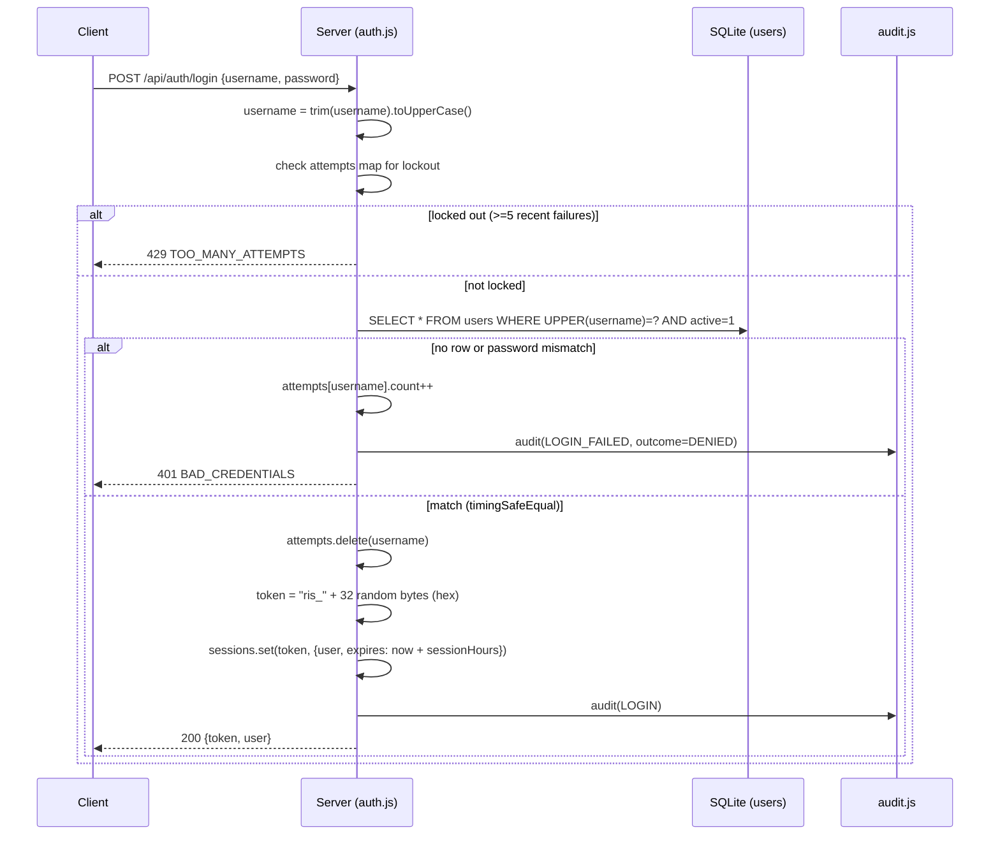
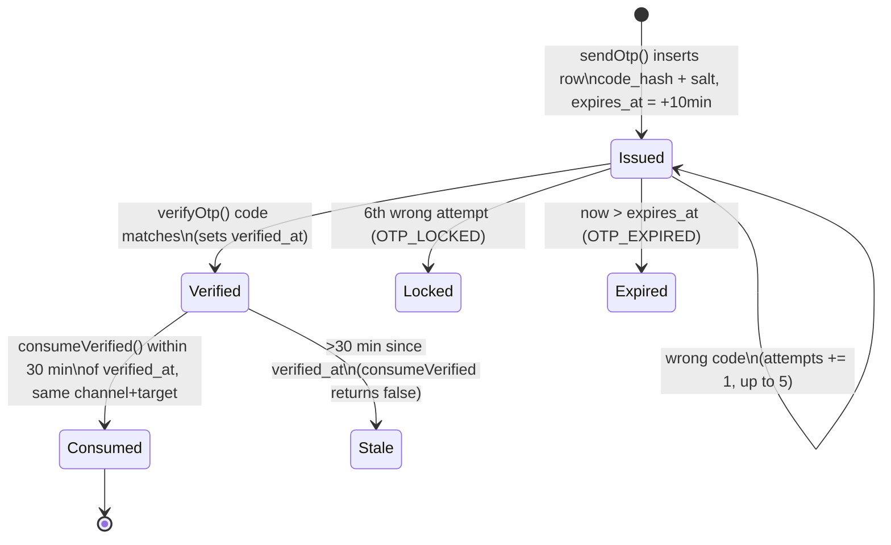
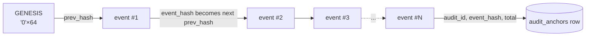

# 06 — Security, Roles, Permissions and Audit

This chapter documents the reference implementation's security model: how a user proves who they are, how one-time
codes are issued and checked, who is allowed to do what (grounded in every `requireRole()` call in the codebase),
how the tamper-evident audit log works and what it does and does not guarantee, how write-once data is enforced at
the database layer, and how safe-retry (idempotency) works. It also lists every placeholder/demo-only security
setting that must be replaced before this system (or its rebuild) goes anywhere near real patient data.

Out of scope: PACS, DICOM, an image viewer, image storage. This system stores no images, so there is no
image-access-control model to document.

All facts below are grounded in `server/auth.js`, `server/otp.js`, `server/audit.js`, `server/idempotency.js`,
`server/migrations/002_foundation.js`, `server/config.js`, `server/roster.js`, and every `requireRole()` call site
across `server/*.js` (enumerated with `grep -n "requireRole(" server/*.js`), cross-checked against
`test/roles.test.js`, `test/flow.test.js`, `test/discounts.test.js`, `test/masters.test.js` and `test/agency.test.js`.

## 1. Identity and authentication

### 1.1 Identity model

There are no email/username-with-domain logins. Every user signs in with an **employee code** — a short string
stored as `users.username` — and a password. Employee codes are case-insensitive: `login()` and `createUser()`
both upper-case the value before comparing or storing it (`server/auth.js:26,38`). The `users` table
(`server/migrations/001_baseline.js:12-15`) has one row per person: `id, username, password_hash, password_salt,
full_name, role, ward, active, created_at`, with `phone` and `designation` added later in the same migration file
(`ensureColumn`, lines 97-98).

`role` is a free-text column but the application only accepts one of seven values, enforced in code, not by a DB
constraint:

```js
export const ROLES = ['radiologist', 'technologist', 'reception', 'clinician', 'nurse', 'admin', 'auditor'];
```
(`server/auth.js:8`)

`ward` is set for `nurse` accounts (`HDU`, `ICU`, `Ward A`, `Ward B`, `Private` in the demo roster) and is used to
scope what a nurse can see (§5). A rebuild on a different database engine should add a real `CHECK` constraint (or
enum type) on `role` — nothing in the reference schema stops a row with `role = 'whatever'` being inserted directly.

### 1.2 Password storage

`hashPassword()` uses Node's built-in `pbkdf2Sync` with a per-user random 16-byte salt, SHA-256, **100,000
iterations**, 64-byte derived key, both stored as hex (`server/auth.js:12-14`). Verification
(`verifyPassword`, lines 15-18) re-derives the hash with the stored salt and compares with
`crypto.timingSafeEqual` — a constant-time comparison, so response timing does not leak how many characters
matched.

Minimum password length is **10 characters**, enforced in two places: `createUser()` (`server/auth.js:24`) and
`resetPassword()` (`server/auth.js:87`). Both checks are skipped when `config.demoWeakPasswords` is true — see
§9, this is a placeholder flag that must never be set in production (and `config.js` already refuses to start if
`RIS_DEMO_WEAK_PASSWORDS=1` and `NODE_ENV=production` are set together — `server/config.js`, `validateConfig()`).

Employee-code format is validated on creation: `^[A-Za-z0-9][A-Za-z0-9._-]{2,30}$`, i.e. 3–31 characters
(`server/auth.js:25`). The roster's real codes are placeholders (§9).

### 1.3 Login flow



`POST /api/auth/login` is the only route that disables idempotency replay (`idem: false`,
`server/app.js:50`) and does not require a prior session (`auth: false`).

### 1.4 Session tokens

A session token is `'ris_' + randomBytes(32).toString('hex')` (68 characters, `server/auth.js:49`). Sessions are
held in a plain in-process `Map<token, { user, expires }>` (`server/auth.js:34`), **not** in the database and not
in an external store (Redis etc.). `getSession()` (lines 56-61) looks the token up, deletes and returns `null` if
`expires < Date.now()`.

**This is the single most important production gap in authentication: a server restart (deploy, crash, process
manager recycle) empties the `sessions` Map and silently logs out every signed-in user**, with no warning to the
client beyond the next API call returning `401 UNAUTHENTICATED`. The backend team must replace this with a
persisted session store (DB table, Redis, signed/stateless JWT, etc.) sized for whatever uptime/HA model the
production deployment uses. The same applies to `attempts` (§1.6, lockout state) — also an in-memory `Map`, also
reset on restart, which also means a restart silently clears anyone's lockout.

Sessions last `config.sessionHours` hours (default 8, `RIS_SESSION_HOURS`, validated to be in `(0, 72]`,
`server/config.js`). There is no refresh/sliding-expiry mechanism — a session is good until its fixed expiry or
until `logout()` or `resetPassword()` deletes it, whichever comes first. Tokens travel as
`Authorization: Bearer <token>` (`server/app.js:185`); the API sets no auth cookies, so there is no CSRF-token
requirement in this design, but also no built-in XSS-hardening for token storage — that is a web-app (chapter 05)
concern, not a server one.

`logout()` deletes the one token and audits `LOGOUT` (`server/auth.js:62-65`). `resetPassword()` deletes **every**
session belonging to that user id after a successful reset (`server/auth.js:98`) — the only place sessions are
revoked in bulk.

### 1.5 Role enforcement primitive

Every protected server function calls:

```js
export function requireRole(user, roles) {
  if (!roles.includes(user.role)) throw forbidden(`Role '${user.role}' cannot perform this action`);
}
```
(`server/auth.js:66-68`)

`forbidden()` is `HttpError(403, 'FORBIDDEN', message)` (`server/util.js:11`). This is the **only** permission
primitive in the codebase — there are no scopes, no per-record ACL table, no permission bitmasks. Row-level
restriction (which orders/patients a given user may see) is a second, separate mechanism — SQL predicates built
per request — documented in §5, and it is not optional: a role can pass `requireRole` for an action and still be
refused the specific row by `getOrderForUser()` / `visibility()`.

### 1.6 Rate limiting and lockout

Login attempts are throttled **per employee code, in memory**, by the `attempts` Map in `server/auth.js:35`:

- Every failed login increments `attempts[username].count`.
- At 5 failures, `until = Date.now() + 5*60_000` is set; further attempts for that username return
  `429 TOO_MANY_ATTEMPTS` until the lock expires (`server/auth.js:39-47`).
- A successful login clears the entry (`attempts.delete(username)`, line 48); a successful password reset also
  clears it (`server/auth.js:99`).

There is **no IP-based rate limiting anywhere in the codebase** — only this per-username counter. An attacker who
knows (or enumerates) many employee codes can still make unlimited login attempts overall, one every account; and
an attacker who can clear or wait out the in-memory map (e.g. by forcing/waiting for a restart) resets every
lockout at once. There is also no general-purpose request throttling (no per-IP or per-token rate limit on any
other endpoint) — the only other backoff in the system is OTP-specific (§2.3: `RESEND_MS`, `MAX_ATTEMPTS`). A
production deployment should add IP-aware rate limiting (e.g. at a reverse proxy or API gateway) in front of
`/api/auth/login`, `/api/auth/forgot` and `/api/auth/reset` at minimum.

## 2. One-time codes (OTP) — `server/otp.js`

OTP is used in exactly two flows, both identified by a `purpose` string stored on the challenge row:

- **`REGISTER`** — verifying a new patient's phone or email during registration, before `registration.js`'s
  `savePatient()` will create a brand-new patient record (`config.requirePatientOtp`, default on;
  `RIS_REQUIRE_PATIENT_OTP=0` disables it). Triggered from `POST /api/registration/otp/send` and
  `/verify` (reception/admin only, `server/app.js:123-124`).
- **`RESET`** — forgotten-password flow, triggered by `auth.forgotPassword()` / `resetPassword()`
  (`server/auth.js:77-101`), unauthenticated routes `POST /api/auth/forgot` / `/api/auth/reset`.

### 2.1 Storage and hashing

`otp_challenges` (`server/migrations/001_baseline.js:111-114`): `id, purpose, channel, target, code_hash, salt,
expires_at, attempts, verified_at, consumed_at, created_at`. The 6-digit code is never stored in the clear — only
`sha256(salt + ':' + code)` (`server/otp.js:10`), and the plaintext code is compared with
`timingSafeEqual` against the stored hash during verification (`server/otp.js:59`).

### 2.2 Lifecycle



Constants (`server/otp.js:9`): `TTL_MS = 10 minutes`, `MAX_ATTEMPTS = 5`, `RESEND_MS = 30 seconds` (asking for a
new code for the same purpose+target inside 30s returns `429 OTP_TOO_SOON`), `VERIFIED_VALID_MS = 30 minutes`
(how long a verified-but-not-yet-consumed challenge stays usable by `consumeVerified()`).

`verifyOtp({ challengeId, code, purpose })` (`server/otp.js:53-63`):
- Unknown id/purpose → `400 OTP_INVALID`.
- Already verified → returns `{ verified: true }` again (idempotent re-check), does **not** re-count attempts.
- Expired → `410 OTP_EXPIRED`.
- `attempts >= 5` → `429 OTP_LOCKED`.
- Wrong code → `attempts` column incremented, `400 OTP_INVALID`.
- Right code → `verified_at` set.

`consumeVerified({ challengeId, purpose, channel, target })` (`server/otp.js:66-73`) is the one-shot check used by
`registration.js`'s `savePatient()` and `auth.js`'s `resetPassword()`: it requires the row to be verified, not yet
consumed, same channel, same normalised target, and within the 30-minute window — then sets `consumed_at` so it
cannot be reused. `resetPassword()` additionally re-checks `ch.consumed_at` itself after calling `verifyOtp()`
(`server/auth.js:85-91`) as a belt-and-braces guard against reuse.

### 2.3 Delivery contract

`otpConfig()` exposes two independent toggles (`server/otp.js:12`):

- `RIS_OTP_WEBHOOK` (a URL) — when set, `deliver()` does `POST <url>` with JSON body
  `{ channel, target, message }` where `message` is the literal string
  `` `Your Stavya verification code is ${code}. It expires in 10 minutes.` `` (`server/otp.js:31`). A non-2xx
  response from the webhook throws `502 OTP_DELIVERY_FAILED`. **This is the entire delivery contract**: the
  backend/deployment team owns building the actual SMS/email gateway behind that webhook URL; nothing else about
  the shape of the call is configurable from this codebase.
- `RIS_DEV_OTP=1` — logs the code to the server console and also returns it in the API response as `devCode`
  (`server/otp.js:35`, `sendOtp()` line 50). **Demo/local only** — `config.js`'s `devOtp` getter forces this off
  whenever `NODE_ENV=production` regardless of the env var (`server/config.js`), and `validateConfig()` makes
  startup fail if both are set together.

If neither is configured, `deliver()` throws `503 OTP_DELIVERY_NOT_CONFIGURED` (`server/otp.js:36`) — new-patient
registration and password reset are simply unusable until one is wired up. `config.js`'s `validateConfig()`
surfaces this as a **warning** (not a startup error) when neither is set.

Phone numbers are normalised to a bare 10-digit Indian mobile number (`normalisePhone`, `server/otp.js:15-20`,
accepts a `91` country-code prefix and strips it); email via a simple regex (`normaliseEmail`, lines 21-24, max
200 chars). Both throw `400 PHONE_INVALID` / `400 EMAIL_INVALID` on failure.

## 3. Roles and the capability matrix

### 3.1 Role groups used in code

```js
export const ROLES = ['radiologist', 'technologist', 'reception', 'clinician', 'nurse', 'admin', 'auditor'];
export const RADIOLOGY_STAFF = ['radiologist', 'technologist', 'reception'];
export const WARD_ROLES = ['clinician', 'nurse'];
```
Plus locally-scoped groups: `STAFF = ['reception', 'admin']` (declared separately, identically, in
`registration.js`, `billing.js` and `masters.js`'s own `ADMIN = ['admin']`), `TECH = ['technologist',
'radiologist']` (`clinical.js`), and order-transition groups `GROUPS = { triage: RADIOLOGY_STAFF, acquire:
['technologist','radiologist'], handover: ['reception','radiologist'] }` (`orders.js:26`).

### 3.2 Full matrix

Built by enumerating every `requireRole()` call site (`grep -n "requireRole(" server/*.js`) and the handful of
routes that have **no** `requireRole()` call at all (any authenticated user, subject only to row-level visibility,
§5). "—" means refused (`403 FORBIDDEN`) or simply has no route/affordance for that role.

| Area / action | radiologist | technologist | reception | clinician | nurse | admin | auditor |
|---|---|---|---|---|---|---|---|
| **Create order** (`POST /api/orders`) | ✓ | — | ✓ | ✓ | ✓ | — ¹ | — |
| Create STAT-priority order | ✓ | — | — ² | ✓ | ✓ | — | — |
| Order transition: triage (ACK/SCHEDULE/ARRIVE/NO_SHOW) | ✓ | ✓ | ✓ | — | — | — | — |
| Order transition: acquire (PREPARE/IN_PROGRESS/COMPLETE) | ✓ | ✓ | — | — | — | — | — |
| Order transition: handover (DISPATCH/COLLECT) | ✓ | — | ✓ | — | — | — | — |
| Cancel an order | ✓ ³ | — ³ | ✓ ³ | own only | own only | — | — |
| Assign technologist/radiologist to order | ✓ | — | ✓ | — | — | — | — |
| Record safety screening | ✓ | ✓ | — | — | — | — | — |
| Override a safety BLOCK | ✓ | — | — | — | — | — | — |
| Save/sign report, addendum | ✓ | — | — | — | — | — | — |
| Communicate critical result | ✓ | — | — | — | — | — | — |
| Acknowledge critical result | — | — | — | ✓ | ✓ | — | — |
| Post message on an order | ✓ | ✓ | ✓ | ✓ | ✓ | ✓ | — ⁴ |
| Read order / patient / message / critical (if visible) | ✓ | ✓ | ✓ | ✓ | ✓ | ✓ | ✓ ⁵ |
| Patient's words / medical consent / past history / scan consent — **write** | ✓ | ✓ | — | — | — | — | — |
| Patient's words / consent / history — **read** | ✓ | ✓ | ✓ ⁶ | — | — | ✓ ⁶ | — |
| Create patient record (`POST /api/patients`) | — | — | ✓ | — | — | ✓ | — |
| Create encounter | — | — | ✓ | — | ✓ | ✓ | — |
| Registration wizard: OTP send/verify, capabilities | — | — | ✓ | — | — | ✓ | — |
| Registration wizard: lookup/get full patient | ✓ | ✓ | ✓ | — | — | ✓ | — |
| Registration wizard: save/create patient (PII write) | — | — | ✓ | — | — | ✓ | — |
| Create/list/view registration, edit invoice, cancel reg. | — ⁷ | view-only | ✓ | — | — | ✓ | — |
| Record payment, process cheque, print receipt | — | — | ✓ | — | — | ✓ | — |
| Request refund, pay out approved refund | — | — | ✓ | — | — | ✓ | — |
| **Decide** a refund (approve/reject) | — | — | — | — | — | ✓ ⁸ | — |
| List/create/update/(de)activate services (exam catalog) | — | — | — | — | — | ✓ | — |
| List discount schemes | — | — | view (active only) | — | — | ✓ | — |
| Create/update/(de)activate discount schemes | — | — | — | — | — | ✓ | — |
| List discount approvals (pending queue) | — | — | — | — | — | ✓ | — |
| **Decide** a discount approval | — | — | — | — | — | ✓ ⁸ | — |
| Admin-only staff roster (`GET /api/staff/roster`) | — | — | — | — | — | ✓ | — |
| Patient timeline (words/past-history, cross-visit) | ✓ | ✓ | ✓ | — | — | ✓ | — |
| Analytics summary | ✓ | — | ✓ | — | — | ✓ | ✓ |
| Audit log read, verify chain, list anchors | — | — | — | — | — | ✓ | ✓ |
| Create audit anchor | — | — | — | — | — | ✓ | — |

Footnotes:
1. `admin` is not in `createOrder`'s direct role check (`['clinician','nurse','reception','radiologist']`,
   `orders.js:109`), so `POST /api/orders` refuses an admin directly. An admin *can* cause orders to be created
   indirectly through `createRegistration()` (walk-in registration), which calls `createOrder(..., {
   skipRoleCheck: true })` internally (`registration.js:162`) after its own `requireRole(user, STAFF)` check —
   i.e. admin can register a walk-in visit with scan line items, but cannot use the plain order-request screen.
2. STAT priority additionally requires `WARD_ROLES.includes(user.role) || user.role === 'radiologist'`
   (`orders.js:125-127`) — reception and nurse/clinician aside, reception specifically **cannot** place a STAT
   order even though it can place ROUTINE/URGENT ones.
3. Cancelling is not governed by the `GROUPS` table: the rule is
   `(isRadiology(user) && user.role !== 'technologist') || order.requested_by === user.id`
   (`orders.js:182-184`). In practice: radiologist or reception can cancel any order they can see; a technologist
   can never cancel (even their own, since technologists cannot create orders); a clinician/nurse can cancel only
   the order they personally requested.
4. `postMessage()` explicitly throws `forbidden('Auditors have read-only access')` for `user.role === 'auditor'`
   (`messages.js:14`) — the one place "auditor is read-only" is enforced as code rather than by simple omission
   from a `requireRole` allow-list.
5. Which rows an auditor (or anyone) can read is **further** restricted by `visibility()` — see §5. Auditor and
   admin both satisfy `canSeeAll()` and so see every order; `reportsForOrder()` separately treats
   `['radiologist','technologist','admin','auditor']` as allowed to see **non-final** (draft) report versions too
   (`reports.js:47`) — every other role only ever sees `status = 'FINAL'` reports.
6. `GET` routes for words/consent/history/scan-consent have **no** `requireRole()` at all — access is gated only
   by `getOrderForUser()`'s visibility check, so in practice only a role that can already see the order can read
   them. `patientTimeline()` (the cross-visit view) is explicitly `['technologist','radiologist','reception',
   'admin']` (`clinical.js:117`) — note this omits `auditor` even though the auditor otherwise has the widest
   order-visibility; an auditor cannot use `GET /api/patients/:id/timeline`.
7. `invoiceHtml()` (the printable invoice) and `listRegistrations`/`getRegistration` allow `[...STAFF,
   'radiologist']` — i.e. a radiologist can view (not edit) registrations/invoices; `receiptHtml()` is
   `STAFF`-only (radiologist excluded, `billing.js:155`).
8. Segregation of duties is enforced in code, not just by role: `decideRefund()` throws `forbidden('You cannot
   approve a refund you requested')` if `r.requested_by === user.id` (`billing.js:106`), and
   `decideDiscountApproval()` has the identical check (`discounts.js:80`). Both are `admin`-only actions, so this
   only matters when two different admin accounts are involved, or when reception requested a discount and admin
   is deciding it.

### 3.3 Endpoints open to **any** authenticated user (no `requireRole`, no row-level restriction)

`GET /api/auth/me`, `POST /api/auth/logout`, `GET /api/catalog/exams`, `GET /api/catalog/suggest`,
`GET /api/radiology/load`, `GET /api/staff`, `GET /api/clinicians`, `GET /api/patients` (search — returns full
rows, not masked, to every signed-in role), `GET /api/masters` and `/api/masters/medicines|diseases|surgery`
(reference lookups), `GET /api/notifications` and its `read`/`read-all` (scoped to `user.id` only). Teams
rebuilding this should decide deliberately whether "any employee can full-text search all patients by name/MRN/
phone" (`patients.js:7-9`, no masking, no audit entry) is acceptable for their jurisdiction — in the reference
implementation it is not role-gated at all, unlike the registration wizard's `lookupPatients()`, which *is*
role-gated and returns **masked** rows (`registration.js:29`, phone shown as `91******89`-style).

## 4. Patient/order visibility beyond role (`orders.js:visibility()`)

Role answers "can this action ever be performed by this kind of user"; `visibility()` answers "can *this* user see
*this* order" and is applied as a SQL `WHERE` fragment on every order list/read (`orders.js:35-39`):

```js
export function visibility(user) {
  if (canSeeAll(user)) return { sql: '1=1', args: [] };                  // radiologist, technologist, reception, admin, auditor
  if (user.role === 'clinician') return { sql: '(o.requested_by = ? OR e.doctor_id = ?)', args: [user.id, user.id] };
  return { sql: '(o.requested_by = ? OR (e.ward IS NOT NULL AND e.ward = ?))', args: [user.id, user.ward || '\u0000'] }; // nurse
}
```

`canSeeAll()` = radiology staff, `admin`, or `auditor`. A **clinician** sees orders they personally requested, or
where they are the encounter's attending doctor (`e.doctor_id`). A **nurse** sees orders they personally
requested, or any order whose encounter's `ward` matches their own `users.ward` — this is the only place `ward`
is used as an access-control attribute, and it is a simple string equality, not a hierarchy (a "HDU" nurse cannot
see "ICU" patients even if organisationally related). `getOrderForUser()` (`orders.js:62-69`) applies the same
predicate to a single-row lookup and throws `403 forbidden('You do not have access to this order')` if it
excludes the row — this is the function nearly every other module (`clinical.js`, `critical.js`, `reports.js`,
`messages.js`) calls first, so visibility is enforced once, centrally, rather than re-implemented per module.

## 5. Audit chain (`server/audit.js`)

### 5.1 Schema

`audit_events` (`server/migrations/001_baseline.js:80-84`): `id` (autoincrement), `event_id` (UUID, unique),
`ts`, `action`, `actor_id`, `actor_name`, `actor_role`, `patient_id` (nullable), `resource` (nullable), `outcome`,
`details_json` (nullable), `prev_hash`, `event_hash`.

### 5.2 Hash chain



Every `audit()` call (`server/audit.js:15-30`) runs inside the **same transaction** as the business write it
records (callers pass it the ambient transaction via `tx()`'s savepoint nesting — `server/util.js:43-60`), so an
event and the data change it describes commit or roll back together; there is no window where a write succeeds
but is unaudited, or vice versa. Inside that transaction it:

1. Reads the current chain head: `SELECT event_hash FROM audit_events ORDER BY id DESC LIMIT 1` → `prev` (or
   `GENESIS = '0'.repeat(64)` if the table is empty).
2. Builds the event object `e` (`event_id` = fresh UUID, `ts` = `now()`, plus the actor/action/patient/resource/
   outcome/details fields).
3. Computes `event_hash = sha256(JSON.stringify({ prev, id: e.event_id, ts: e.ts, action: e.action, actor:
   e.actor_id, name: e.actor_name, role: e.actor_role, patient: e.patient_id ?? null, resource: e.resource ??
   null, outcome: e.outcome, details: e.details_json ?? null }))` — **exactly** this field set and order (object
   key order does not affect `JSON.stringify` output for this literal, but a reimplementation must match the
   field list exactly or recomputed hashes will not match historic rows).
4. Inserts the row with both `prev_hash` and `event_hash`.

`listAudit(limit, offset)` is a plain paged read, newest first. There is no row-level filtering by role beyond the
route guard (`admin`/`auditor` only).

### 5.3 Anchors

`audit_anchors` (`server/migrations/002_foundation.js`) records a **snapshot of the chain head**: `audit_id`
(the `audit_events.id` at the time), `event_hash`, `total` (row count), `created_by`, `created_at`. Created only
by `POST /api/audit/anchors` (`admin`-only, `anchorAudit()`, `audit.js:38-49`), which itself writes an
`AUDIT_ANCHORED` audit event (so the act of anchoring is itself audited).

**The anchor's entire value depends on it being taken somewhere other than this database.** The code comment
says this outright: *"The returned anchor should also be exported or printed and kept outside this server (a
hash held only here proves little)"* (`server/audit.js:37`). The reference implementation has no automated
export — anchoring is a manual admin action, and nothing currently ships the anchor off-host (no email, no
write to WORM storage, no append to an external log). This is a gap the backend/deployment team must close:
anchors need to land somewhere an attacker who compromises the application server and its database cannot also
reach (a separate logging service, a write-once object store, a printed/signed paper record, etc.).

### 5.4 `verifyAudit()` — what it proves and what it does not

```js
export function verifyAudit() {
  const rows = db.prepare('SELECT * FROM audit_events ORDER BY id ASC').all();
  let prev = GENESIS;
  for (const row of rows) {
    if (row.prev_hash !== prev) return { valid: false, ..., message: `Broken link at event ${row.id}` };
    if (digest(prev, row) !== row.event_hash) return { valid: false, ..., message: `Tampered event ${row.id}` };
    prev = row.event_hash;
  }
  const byId = new Map(rows.map((r) => [r.id, r.event_hash]));
  const bad = anchors.find((a) => byId.get(a.audit_id) !== a.event_hash);
  if (bad) return { valid: false, ..., message: `Anchor ${bad.id} (event ${bad.audit_id}) no longer matches the chain: events were removed or rewritten` };
  return { valid: true, total: rows.length, latestHash: prev, anchors: anchors.length, ... };
}
```
(`server/audit.js:52-66`)

**What it detects, confirmed by `test/flow.test.js`'s "analytics and tamper-evident audit" test** (which drops the
immutable-table trigger, mutates a row directly with SQL, and shows `verifyAudit()` flip from `valid: true` to
`valid: false`):
- Any row whose stored `event_hash` no longer matches `digest(prev_hash, row)` — i.e. any field covered by the
  digest (§5.2) was changed after insert ("Tampered event N").
- Any row whose `prev_hash` does not equal the previous surviving row's `event_hash` — a broken link, which is
  what you get if a row is deleted from the middle of the chain or rows are reordered ("Broken link at event N").
- If an anchor exists for an event id, and that id either no longer exists in the table or now has a different
  `event_hash` — any tampering (including wholesale truncation) of rows **at or before** that anchor's position,
  because the anchor is an independent checkpoint outside the chain's own internal linkage.

**What it does NOT detect**, stated plainly because the task calls this out explicitly:
- **Deleting the newest N rows and stopping there** (never adding anything after), when **no anchor was ever
  taken at or after those rows**. The remaining chain is still perfectly self-consistent — `prev_hash`/
  `event_hash` links are unbroken among whatever rows are left, because truncating the *tail* removes no
  mid-chain link. `verifyAudit()` can only compare against anchors it has; it has no independent record of "how
  many events there used to be" otherwise. This is exactly why anchors must be taken regularly and exported
  somewhere the attacker cannot also reach (§5.3) — an anchor taken *after* the now-deleted rows would catch
  this (its recorded `audit_id` would no longer be found, or would map to a different `event_hash`), but an
  anchor taken *before* them would not.
- Tampering performed by someone with **raw file-level access to the SQLite database** (copying the `.db` file,
  editing it with an external SQLite tool, or restoring an older backup over the live file) rather than through
  the application's own connection. The append-only triggers (§6) only block `UPDATE`/`DELETE` statements
  executed *through that same connection*; a `DROP TRIGGER` (as the test itself does to simulate an attack) or
  any access that bypasses SQLite's trigger mechanism entirely removes that protection. There is no OS-level
  write-protection, no separate low-privilege DB role, and no cryptographic signing of individual rows (the hash
  chain proves internal *consistency*, not that the whole file wasn't replaced by an internally-consistent but
  shorter fake chain built by someone with full DB access and enough time to recompute hashes from GENESIS).
- `verifyAudit()` says nothing about **completeness of capture** — if a code path simply forgets to call
  `audit()` for some action, that action leaves no trace and there is nothing to detect, by design (it is not a
  WAL-level write interceptor; it only verifies what was recorded).
- The `outcome` field records what the *application* decided to log (`'SUCCESS'`, `'DENIED'`, etc.) — the chain
  proves that recorded value hasn't been altered since insertion, not that the application categorised the event
  correctly in the first place.

In short: `verifyAudit()` is a strong **tamper-detection** tool for anything that happened through the running
application after the last-recorded anchor, and for any in-place edit of historic rows at any time — but it is
only as strong as (a) how often anchors are taken and exported off-host, and (b) how well the deployment restricts
raw database file access. Both are operational controls outside this codebase.

## 6. Append-only / immutability triggers (`migrations/002_foundation.js`)

```js
export const IMMUTABLE_TABLES = ['audit_events', 'order_events', 'critical_events', 'audit_anchors'];
```

For each, the migration creates two `BEFORE UPDATE` / `BEFORE DELETE` triggers that `RAISE(ABORT, '<table> is
append-only')`, unconditionally — no row in these four tables can ever be changed or removed through ordinary SQL
once the migration has run (`server/migrations/002_foundation.js`, `TRIGGERS_SQL`). A fifth pair of triggers is
conditional: `reports_final_no_update` / `reports_final_no_delete` fire only `WHEN OLD.status = 'FINAL'` — a
**signed** report row becomes immutable the moment `signReport()` flips its status to `FINAL`
(`reports.js:101-103`); a still-`DRAFT` report can be edited freely (`saveDraft()`'s `UPDATE ... WHERE status =
'DRAFT'`, `reports.js:62-63`). Correcting a signed report is only possible by inserting a new `ADDENDUM` row
(`addAddendum()`, `reports.js:113-131`), itself chained to the previous final version via `signatureFor()`'s
`prevHash` argument — a second, report-specific signature chain independent of the audit-event chain, documented
fully in the clinical/reporting chapter.

Operationally, "append-only" here means exactly: **insert-only, enforced at the SQLite trigger level, for these
five tables/conditions**. It is not a general "this database never deletes anything" policy — other tables use
genuine soft-delete (`patient_words.deleted_at`, `patient_documents.superseded_at`) or hard updates in place
(`orders`, `payments`, `refunds`, `discount_approvals` are all updated in place as their status changes; only
their *history* tables — `order_events`, and the audit/critical logs — are append-only). A rebuild on a different
database must reproduce the equivalent guarantee with that engine's own mechanism — `BEFORE` triggers that abort
on Postgres, `REVOKE UPDATE, DELETE` from the application's DB role combined with a separate privileged role for
schema maintenance, or (for genuine tamper-resistance against an attacker with DB credentials) an external
write-once log/ledger. As §5.4 notes, SQLite triggers alone do not resist an attacker with raw file access or
`DROP TRIGGER` privileges on the same connection — which in this reference deployment is the same OS user and
the same DB file as the application itself, so this really is an append-only *guard rail* against
application-level bugs and a basic defence against a non-privileged attacker, not a hardened tamper-proof store.

## 7. Idempotency as a correctness/security control (`server/idempotency.js`)

Every `POST` route is idempotency-aware by default (`idem: true` unless a route opts out —
`server/app.js:48`); a small number of routes explicitly disable it: `POST /api/auth/login`,
`/api/registration/otp/send`, `/api/auth/forgot`, `/api/auth/reset` (all `{ idem: false }` — sending a one-time
code or attempting a login is not something a byte-identical replay should silently "succeed again" on).

Mechanism (`runIdempotent()`, `idempotency.js:20-36`), triggered only when the client sends an
`Idempotency-Key` header on a `POST` with `idem: true` while authenticated (`server/app.js:191-196`):

1. `validKey()` requires `^[A-Za-z0-9._:-]{8,128}$` (`idempotency.js:11-14`), else `400
   IDEMPOTENCY_KEY_INVALID`.
2. A SHA-256 `fingerprint` is computed over `method + path + a key-sorted JSON stringify of the body`
   (`stable()`, `idempotency.js:16-17`) — stable regardless of client-side key ordering.
3. Inside one transaction: expired rows (`created_at` older than `config.idempotencyTtlHours`, default 24h) are
   purged; then `(user_id, key)` is looked up (composite primary key on `idempotency_keys`, so the same key
   string used by two different users never collides).
   - **Not seen before**: the handler runs once, synchronously (`runIdempotent` throws `500 INTERNAL` if the
     handler returns a Promise — idempotent routes must be fully synchronous), its result is stored alongside the
     fingerprint, and returned with `replay: false`.
   - **Seen, same fingerprint**: the *stored* response is returned unchanged, `replay: true`, and the HTTP
     response carries header `Idempotent-Replay: true` — the handler is **not** re-run, so a retried "create
     order" or "record payment" cannot double-create or double-charge.
   - **Seen, different fingerprint** (same key reused for a materially different request): `409
     IDEMPOTENCY_KEY_REUSED` — this is a deliberate refusal, not a silent overwrite, which stops a key-reuse bug
     (client or attacker) from making the second, different request masquerade as a replay of the first.
4. The handler runs **inside** the same transaction as the key-row insert (`tx(db, () => { ...; const out =
   handler(); ...insert...; })`), so if the handler throws, nothing is recorded for that key and a corrected
   retry with the same key is free to succeed — a failed attempt never "poisons" the key.

Why this belongs in a security chapter and not only a correctness one: it is what makes network-level retries
(a client that times out and resends, a mobile app on a flaky ward Wi-Fi) safe for financial writes
(`recordPayment`, `requestRefund`, `payRefund`) and clinical-state writes (`transition`, `signReport`) without the
operator needing to manually reconcile duplicates — and the 409-on-mismatch behaviour specifically defeats a
key-reuse attempt from producing an unintended side effect under someone else's already-approved key.

## 8. Placeholder / demo-only settings — replace before production

| Setting / value | Where | Risk if left as-is |
|---|---|---|
| Employee codes are plain sequential numbers (`101`–`902`) | `server/roster.js:10-33` | Trivially guessable identifiers used as the *login username*; combined with weak/demo passwords this is a real credential-stuffing risk. Must be replaced with the hospital's real employee codes before go-live (the file's own header comment says this explicitly), then the database reseeded or `users.username` updated in place. |
| `RIS_DEMO_WEAK_PASSWORDS=1` | `server/auth.js:23,86`, `server/config.js` | Drops the 10-character minimum password length entirely. `config.js` already hard-fails startup if this is set with `NODE_ENV=production` — but any other environment (staging, a misconfigured prod-like box without `NODE_ENV` set) is not protected by that check. |
| `RIS_DEV_OTP=1` | `server/otp.js:35`, `server/config.js` | Returns the one-time code in the plain API JSON response and logs it to the server console — defeats the entire point of OTP verification. Forced off whenever `NODE_ENV=production`, same caveat as above (relies on that env var being set correctly). |
| `RIS_OTP_WEBHOOK` unset | `server/config.js` | Not a dangerous default (fails closed: `503 OTP_DELIVERY_NOT_CONFIGURED`), but it means registration and password reset are **non-functional** until the deployment team wires an actual SMS/email gateway behind this URL contract (§2.3). |
| In-memory session store (`sessions` Map) | `server/auth.js:34` | Every server restart logs out every signed-in user with no warning; does not scale past a single process (two app instances behind a load balancer would each have their own, inconsistent session set — see also the single-process/SQLite note below). |
| In-memory lockout store (`attempts` Map) | `server/auth.js:35` | Same restart-loses-state issue, but for lockouts: a restart silently un-blocks a brute-force attempt in progress. Also per-process, so it does not work correctly behind multiple app instances. |
| SQLite, single-process assumptions | `server/db.js`, `util.js`'s `tx()` | WAL mode with one `DatabaseSync` connection; the audit chain's "read last hash, then insert" is only atomic because it happens inside one transaction on one connection (the code comment in `audit.js:14` says this plainly: it only stays atomic "if a second process ever writes to the same database" *because* it's inside a transaction — it does not claim to handle a different, concurrent database engine or sharding). A horizontally-scaled rebuild (multiple app servers, or a different DB engine) must re-examine every place that assumes one writer: the hash-chain head read/insert, accession/registration/receipt number generation (`COUNT(*)`-based, e.g. `orders.js`'s `accession()`), and the idempotency key table. |
| Price fields (`exam_catalog.price`) still `NULL` for some services, `price_note` set instead | `server/data/radiology-master-import.json`, enforced in `orders.js:118-121` (`EXAM_PRICE_NOT_SET`) | Not a security bug — the system already refuses to create an order against an unpriced service — but it is a data-completeness gap the hospital must close in the imported tariff before those services are usable at all. |
| `RIS_LOAD_BUSY_AT` / `RIS_LOAD_VERY_BUSY_AT`, SLA hours (`RIS_SLA_HOURS_*`), the 60-minute critical-communication window (`RIS_CRITICAL_MINUTES`) | `server/config.js` | Not security settings, but every one is explicitly commented `PROVISIONAL` in the source and must be confirmed with radiology/clinical leadership — they affect what the UI calls "overdue" or "critical-escalated," which is clinically meaningful. |
| No general IP-based rate limiting | whole app | Only per-username login lockout and per-target OTP throttling exist (§1.6, §2.2); add a reverse-proxy/gateway-level limiter in front of the whole API in production. |
| No CORS headers set | `server/app.js` | The API currently only works same-origin (browsers block cross-origin reads without CORS headers) — fine for the bundled SPA served from the same process, but anyone fronting this API from a separate origin (a different deployment topology) needs to add explicit CORS configuration, not assume it already exists. |

## 9. Open questions for the hospital / backend team

- Is a 10-character minimum (with no complexity/rotation/breach-list requirement) acceptable for production, or
  does the hospital's IT policy require more (complexity rules, periodic rotation, a breached-password check)?
  Nothing beyond length is enforced anywhere in `auth.js`.
- Should login lockout and/or OTP throttling be IP-aware in addition to per-username/per-target? The current
  design assumes the per-username/per-target counters are sufficient.
- Who is the intended operational owner of taking and *exporting* audit anchors (§5.3)? The code supports the
  action but nothing schedules or automates it, and its security value is zero until export happens.
- Is a single admin account sufficient for the "decide a refund/discount you didn't request" segregation-of-duty
  rule, or does the hospital expect a true maker-checker across two *different named individuals*, which the
  current "not the same user id" check does not fully guarantee if only one admin account exists in practice?
- Should `auditor` be given access to `GET /api/patients/:id/timeline` (currently excluded, §3.2 footnote 6)
  given that the role otherwise has the broadest order/report visibility in the system? This looks like it may be
  an oversight rather than a deliberate decision, but nothing in the code or tests confirms intent either way.
- Is "any authenticated employee can search all patients by name/phone/MRN with no masking and no audit trail"
  (§3.3) an acceptable access pattern for the target jurisdiction's patient-privacy rules, or should it be
  tightened to match the already-role-gated, masked `lookupPatients()` used by the registration wizard?
