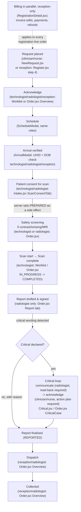

# 09 — UI screens and role flows (functional reference)

This chapter documents the reference UI as a **functional requirements spec for the backend**: for each of the
system's 7 roles, which screens they can reach, and which API calls each screen makes and in what order. It is not a
visual design spec — colours, spacing and the component kit are covered only to flag that they are a reference
styling choice, not a contract.

Even if the frontend is rebuilt from scratch (React, mobile, a different framework — anything), **every call listed
below must still exist and behave the same way**, because these are the exact sequences a working radiology
department depends on: a technologist who cannot record consent before starting a scan is blocked by the state
machine (chapter 03), not by this UI. The backend contract is chapters 01 (data model) and 02 (API reference); this
chapter exists so the team rebuilding the frontend (or testing against the existing one) knows what each screen
needs from that contract.

The reference implementation is at `/Users/stavyaspinehospital/Radiology/radiology-ms/ris`. All page files below are
under `web/src/pages/`, with two shared files outside it: `web/src/queue.jsx` (order-list/row behaviour shared by
several pages) and `web/src/ui.jsx` (the component kit and shared helpers, see §8). Role names are exactly as used in
`requireRole` checks throughout `server/*.js`: `radiologist`, `technologist`, `clinician`, `nurse`, `reception`,
`admin`, `auditor`.

**Out of scope, noted once:** there is no PACS/DICOM viewer, no image storage and no image-based AI anywhere in this
UI. "Scan complete" (`COMPLETED` status) is a button a technologist clicks; no image ever moves through the system.

---

## 1. Navigation shell (`web/src/App.jsx`)

Every role shares one shell: a sidebar built from a static `NAV` array (`view`, `label`, `icon`, `roles`, `group`),
filtered to `allowed = NAV.filter(n => !n.roles || n.roles.includes(user.role))`. Routing is a hand-rolled hash
router (`#/view/id/tab?query`) — `parseHash()` / `useRoute()` — with no server-side routing involved at all; the
server only serves `index.html` for any non-`/api/` path (`serveStatic` in `server/app.js`) and the SPA takes it from
there.

On login, `Shell` polls three endpoints every 20 seconds (`reload()` in a `setInterval`) and holds the results in a
`DataContext` consumed by nearly every page instead of each page re-fetching:

```js
const [o, c, n] = await Promise.all([api.get('/orders'), api.get('/critical'), api.get('/notifications?unread=1')]);
```

A backend rebuild that replaces this polling with push (SSE/websocket) must still deliver: the full open-order list
(for sidebar badge counts and the dashboard queue), the full open-critical-case list (for the critical badge and
bell), and the unread notification count.

Sidebar badge counts (`counts` in `App.jsx`) are derived client-side from the polled order list, not a dedicated
endpoint:
- `orders` badge = count of `REQUESTED`/`ACKNOWLEDGED`
- `worklist` badge = count of `SCHEDULED`/`ARRIVED`/`PREPARED`/`IN_PROGRESS`
- `reporting` badge = count of `COMPLETED`/`REPORT_DRAFTED`
- `critical` badge = count of critical cases in state `OPEN`/`ESCALATED`

`SCOPE(user)` renders a "Your scope" footer that is UI copy only, not an enforced boundary — the actual visibility
rules (who can see which orders) are server-side in `getOrderForUser` / `listOrders` (see chapter 03 §7).

---

## 2. Reception

**Landing page:** `dashboard` (`Dashboard.jsx`) — reception is not in `RADIOLOGY.includes(role)`... actually it is:
`RADIOLOGY = ['radiologist', 'technologist', 'reception']` (`ui.jsx`), so reception sees the staff dashboard title
("Radiology command centre") and the full open-order queue, not the patient-scoped view.

**Nav items available** (from `App.jsx` `NAV`, filtered to `reception`): Command centre, Patients, Day board,
Register patient, Registrations, New request, Imaging orders, Technician, Critical findings, Insights,
Activity/Audit (same `audit` view listed twice — once under Safety, once under Administration — both resolve to
`Audit.jsx`).

### 2.1 Register.jsx — registration wizard

A 4-step wizard (`STEPS` array), state held in the parent `Register` component and handed down.

**Step 1 — Verify identity** (`Step1`): reception picks phone / email / Aadhaar, types an identifier, and calls
`POST /api/registration/lookup { phone|email|aadhaar }`. If matches come back, reception picks one
(`GET /api/registration/patients/:id` loads the full record, jumps to step 3) or, for phone/email, starts a new
patient (`onNew`). Aadhaar alone cannot start a new patient — Aadhaar OTP verification needs a UIDAI-licensed
provider that is not wired up (`caps.aadhaarOtpVerification`, read from `GET /api/registration/capabilities`).

**Step 2 — Verify OTP** (`Step2`): `onNew` already called `POST /api/registration/otp/send { channel, target }`
before entering this step. The user enters the 6-digit code; `POST /api/registration/otp/verify { challengeId,
code, purpose: 'REGISTER' }` returns a `verificationId` consumed in step 3. Resend repeats the send call. In dev mode
(`RIS_DEV_OTP=1`) the send response carries `devCode` and is shown directly in the UI — **this must never ship to
production** (see Placeholders, §9).

**Step 3 — Patient details** (`Step3`): loads `GET /api/masters` for proof types, referrals, occupations and
designations. Captures identity, personal info, contact, occupation, and (conditionally) police-occupation ID
photos and other proof-type photos, all sent as base64 data URLs capped client-side at ~1.1 MB each. Saves with
`POST /api/registration/patients { ...fields, patientId?, verificationId?, aadhaar?, proofs[], occupationIdFront?,
occupationIdBack? }`.

**Step 4 — Diagnosis details** (`Step4`): loads `GET /api/catalog/exams` and `GET /api/masters/discounts`. Reception
ticks a modality, then individual tests (disabled if `price == null`), sets a side (NA/Left/Right/Both) and an
optional discount per line (a scheme id, `'nocharge'`, or `'__custom'` percentage — ≥50% shows a "needs admin
approval" badge, computed client-side from the scheme's `requires_reason`/`requires_approval` flags but enforced
server-side, see chapter 05). Saves with:

```
POST /api/registrations { patientId, referringDoctor, indication?, confirmDuplicate, items: [{ examCode, side?, noCharge?, schemeId?, discountPct?, waiverReason? }] }
```

using an idempotency key (`newKey()`) so a double-click or retry is deduplicated. On a `POSSIBLE_DUPLICATE` error
code the UI shows a confirm line and retries with `confirmDuplicate: true`. Success routes to
`/registration/:id` (`RegistrationDetail.jsx`).

### 2.2 Registrations.jsx — registration list

`GET /api/dashboard/summary?...` (via the shared `useTiles` hook, also used by `Orders`) drives a KPI strip of
per-modality totals, clickable to filter by equipment. The list itself:

```
GET /api/registrations?x=1&<dateQuery>&equipment=<k>&field=<all|patient_name|doctor_name>&q=<text>&payment_status=<pending|partial|paid>?
```

Client-side pagination only (`per`/`page` state slice the already-fetched array — there is no server-side page
param). `ExportButtons` offers CSV export and print, both built from the already-fetched rows, no extra endpoint.
Each row links to `/registration/:id`; a "Pay now" button (shown when `payment_status !== 'paid' && status ===
'ACTIVE'`) links to `/registration/:id/pay`, which opens `RegistrationDetail` with the payment modal pre-opened.

### 2.3 RegistrationDetail.jsx — invoice, billing, refunds

Loads three things in parallel: `GET /api/registrations/:id`, `GET /api/catalog/exams`, `GET /api/masters/discounts`.
This is the busiest screen in the system for reception/admin. Actions, each gated on `staff = ['reception',
'admin'].includes(user.role)` and `r.status === 'ACTIVE'`:

- **Add a scan** (`AddScan` modal) → `POST /api/registrations/:id/invoice { add: [{ examCode, side? }] }`
- **Edit a line's discount** (inline row edit) → `POST /api/registrations/:id/invoice { update: [{ orderId,
  noCharge?, schemeId?, discountPct?, waiverReason? }] }`
- **Remove a line** (only while status is pre-arrival: `REQUESTED`/`ACKNOWLEDGED`/`SCHEDULED`/`NO_SHOW`) →
  `POST /api/registrations/:id/invoice { remove: [{ orderId, reason }] }`
- **Edit report metadata** (`SaveReport`) → same `invoice` endpoint with `{ reportNo, reportDate, deliveryAt }`
- **Pay now** (`PaymentModal`, wide modal, 3 tabs — Cash/Cheque/Online):
  - Cash: a denomination counter for notes (₹500…₹1) and coins (₹10…₹1), computes `collected`, blocks submit unless
    `collected >= amount` and any change is also counted out in a return-denomination counter. Submits
    `POST /api/registrations/:id/payments { method: 'CASH', amount, discount?, discountReason?, notes, coins,
    returnNotes, returnCoins, remarks }`.
  - Cheque: captures cheque number/bank/account holder/IFSC/dates, submits with `method: 'CHEQUE'`. The UI tells the
    user the cheque only counts as paid after it is cleared.
  - Online: captures a gateway label and a reference string typed by reception — **no payment gateway is
    integrated**; this is a manual record of a payment that happened elsewhere.
  - All three share an idempotency key (`newKey()`) so a double-submit records one payment.
- **Process a cheque** (`Simple` modal variant, cheque in `IN_PROGRESS`) →
  `POST /api/payments/:id/cheque { decision: 'CLEARED'|'BOUNCED', note }`
- **Request a refund** (`RefundModal`, shown when `refundable > 0` and no refund is already pending/approved) →
  `POST /api/registrations/:id/refunds { amount, reason }`
- **Approve/reject a refund** (admin only) → `POST /api/refunds/:id/decision { decision, note }`
- **Pay out an approved refund** (`PayoutModal`, staff) → `POST /api/refunds/:id/pay { via, reference }`
- **Cancel the registration** → `POST /api/registrations/:id/cancel { reason }`
- **Print invoice / receipt** — `GET /api/registrations/:id/invoice-print` and `GET /api/payments/:id/receipt`
  return raw HTML (`__html` response shape, server sets `Content-Security-Policy: default-src 'none'`); the UI opens
  a new window and writes the HTML directly, i.e. these are print views, not downloadable files.

Every invoice line links to `/order/:id` (`Order.jsx`) — a registration line **is** an order; `orderId` in the
invoice payloads above is the order id.

---

## 3. Clinician / Nurse (ward roles)

**Landing page:** `dashboard` (`Dashboard.jsx`), patient-scoped view (title "Your patients in radiology", subtitle
explains the scope is "requests you made or patients under your care"). `RadiologyLoadStrip` (the live
per-modality load chips) is shown only to `['clinician', 'nurse']` on this page — reception/radiologist/admin never
see it on the dashboard, only on `NewRequest`.

**Nav items:** Command centre, Patients, New request, Imaging orders, Critical findings. (No Day board, Technician,
Reporting, Insights, Audit, or Admin screens.)

### 3.1 Dashboard.jsx

Entirely driven by the polled `DataContext` (`orders`, `critical`) — no extra API calls of its own beyond what
`App.jsx` already fetched. Computes KPIs, a "Next" smart-card (the single most urgent open order for this user,
chosen by `nextAction(...).key !== 'open'`), a modality/encounter-type breakdown (client-side tally), and an alert
list (open critical cases, overdue orders, STAT orders) — all derived in-browser from the same order/critical arrays.

### 3.2 NewRequest.jsx — placing an imaging order

This is the ward's only write path into radiology.

1. `GET /api/catalog/exams` loads once.
2. `RadiologyLoadStrip` independently calls `GET /api/radiology/load` (informational only — nothing here blocks
   ordering).
3. Patient search: `GET /api/patients?q=<text>` debounced 250ms, 2+ chars.
4. Pick a patient → `GET /api/patients/:id` for the full overview (encounters, allergy, recent orders), and the
   active encounter is pre-selected (`o.encounters.find(e => e.status === 'ACTIVE')`). **If there is no active
   encounter the UI shows a red notice and blocks ordering** — a ward user cannot create an encounter from here; see
   open questions.
5. Typing a clinical indication (6+ chars) debounces a call to `GET /api/catalog/suggest?indication=<text>`, which
   returns exam suggestions as clickable chips.
6. Submit → `POST /api/orders { patientId, encounterId, examCode, priority, clinicalIndication, confirmDuplicate }`
   with an idempotency key. Same `POSSIBLE_DUPLICATE` confirm-and-retry pattern as the registration wizard. Submit
   is disabled client-side if the exam has `price == null` — pricing gates ordering even for ward users, not just
   billing.
7. Success routes to `/order/:id`.

### 3.3 Orders.jsx (shared with other roles, §4.1) and Critical.jsx (shared, §7)

Ward users reach the same `Orders` and `Critical` components other roles use; the role only changes which rows are
visible (server-side scoping) and which actions render (client-side, via `nextAction`/`RowActions` in
`queue.jsx`). A clinician/nurse's actions on an order are limited to: open it, and — if a critical case is open and
not yet acknowledged — acknowledge it (§7).

---

## 4. Technologist

**Landing page:** `dashboard` (staff view, since `technologist` is in `RADIOLOGY`).

**Nav items:** Command centre, Patients, Day board, Imaging orders, Technician (`worklist`), Critical findings,
Activity/Audit is **not** listed for technologist (only auditor and admin get it).

### 4.1 Queues.jsx → Worklist — the technologist's main screen

`Worklist` groups the live (non-cancelled) order list into seven status buckets (`groups` array), each rendered as
its own `Card` + `QueueTable`: New requests to acknowledge (`REQUESTED`), Acknowledged (`ACKNOWLEDGED`/`NO_SHOW`),
Scheduled, Arrived — consent needed (`ARRIVED`), Prepared, ready to scan (`PREPARED`), In progress now
(`IN_PROGRESS`). A `KpiStrip` above (`STAGES` array) shows counts across all seven lifecycle stages including
Report finalisation/Dispatched/Received, for situational awareness even though those later stages aren't actioned
here. All data comes from the already-polled `DataContext` order list — `Worklist` issues no GET of its own besides
the shared `useTiles` summary call for the KPI strip at the top.

Row actions (`RowActions` in `queue.jsx`, driven by `nextAction()`):
- `REQUESTED` → **Acknowledge**: `POST /api/orders/:id/transition { to: 'ACKNOWLEDGED', expectedRevision }`
- `ACKNOWLEDGED`/`NO_SHOW` → **Schedule/Reschedule** (opens `ScheduleModal`): transition to `SCHEDULED` with
  `scheduledAt`
- `SCHEDULED` → **Arrival** (opens `ArrivalModal`, a two-identifier check — UHID + DOB spoken by the patient, never
  read to them): transition to `ARRIVED` with a fixed note
- `ARRIVED` → **Consent**: routes to `/order/:id/scanconsent` (Intake.jsx, §4.3) rather than transitioning directly
  — the transition to `PREPARED` happens as a side effect of saving scan consent (`clinical.js`
  `saveScanConsent`), not from this screen
- `PREPARED` → **Start**: transition to `IN_PROGRESS`
- `IN_PROGRESS` → **Complete**: transition to `COMPLETED`

Every transition call carries `expectedRevision: order.revision` (`useMove()` in `queue.jsx`) — optimistic
concurrency; a stale screen gets `STALE_REVISION` back, shows a toast, and auto-reloads instead of silently
clobbering someone else's change (see chapter 03 §1.5).

### 4.2 Order.jsx — the per-order workspace (shared with radiologist/reception, role gates which tabs/actions show)

`GET /api/orders/:id` returns a combined payload: `order`, `events`, `safety`, `reports`, `templates`, `critical`,
`messages`, `integrity` in one call (the handler composes four modules' worth of data server-side). Tabs shown to
technologist: Overview, Patient's words, Consent, Past history, Patient consent, Conversation, Timeline (Report tab
is visible but read-only — technologist cannot write a report). `showIntake` gates the four intake tabs to
`['technologist', 'radiologist', 'reception', 'admin', 'auditor']`, i.e. ward roles never see consent/history tabs.

**Overview tab** actions for technologist: the same single primary action as the worklist row (`doPrimary()`
dispatches to the right transition or route based on `nextAction`), plus a **Safety screening** form when the order
`uses_contrast`/`ionising`/`mri` and status is `SCHEDULED`/`ARRIVED`/`IN_PROGRESS`:
`POST /api/orders/:id/safety { pregnant, contrastAllergy?, egfr?, mriImplant?, notes, overrideReason? }` — note
`overrideReason` is only ever sent from the radiologist's version of this same form (role check is server-side; the
field is rendered for radiologist only, `user.role === 'radiologist'` in `Safety`).

### 4.3 Intake.jsx — consent, history and safety forms (reached from Order.jsx's tabs)

All four tabs gate editing to `can = TECH.includes(user.role)` (technologist or radiologist) client-side; the server
repeats this with `requireRole(user, TECH)` in `clinical.js`. Reception/admin/auditor can view these tabs
(`showIntake` in `Order.jsx`) but every input is `disabled` for them.

- **Patient's words** (`WordsTab`): free text plus up to 5 audio clips recorded in-browser via `MediaRecorder`
  (webm/mp4/ogg, capped at ~3 MB per blob), base64-encoded. `GET /api/orders/:id/words` lists this visit's entries;
  `GET /api/patients/:id/timeline?module=words` shows history across visits. Save:
  `POST /api/orders/:id/words { text, audio: [{ data }] }` (upload-sized body). Delete: `POST /api/words/:id/delete`.
  Playback of a saved clip: `GET /api/audio/:id` returns the data URL, fetched again into a blob client-side.
- **Medical consent** (`MedicalConsentTab`): checkbox sets for medical devices (pacemaker, artificial heart, metal
  implants, dental plate, hearing aids) and history (past illness, diabetes history, hypertension, other), plus
  weight, allergy yes/no + detail, pregnancy yes/no + months, and a provisional report field.
  `GET`/`POST /api/orders/:id/medical-consent`.
- **Past history** (`PastHistoryTab`): a checklist of 8 disease categories (Diabetes, Blood Pressure, Cholesterol,
  Thyroid, Acidity, Allergy, Surgery, M/H — M/H hidden unless `order.sex === 'F'`), each with its own sub-fields
  (onset date, controlled/uncontrolled, medicine picker backed by `GET /api/masters/medicines?q=`, allergy-to group
  from `masters.medicineGroups`). Surgery has its own sub-table with a 5-level cascading picker
  (`GET /api/masters/surgery?parent=<id>`) or a free-text "Other" surgery name. An "Other disease" section
  cross-references `GET /api/masters/diseases?bodyPart=<name>`. Save:
  `POST /api/orders/:id/past-history { diseases[], notes, otherDisease?, surgeries[] }`.
  `GET /api/patients/:id/timeline?module=pastHistory` shows prior visits' history.
- **Patient consent for the scan** (`ScanConsentTab`): the form is modality-driven — plain-only modalities (XR, USG,
  DEXA) skip the plain/contrast choice entirely; CT contrast adds a route (Oral/Rectal/IV/NBM) and contrast-type
  checklist; MRI contrast adds ml/eGFR/serum-creatinine fields; CT or MRI both get a sedation sub-form (NBM,
  anaesthetist informed, medicine used). Bilingual consent statement text comes from `i18n.js` (`consentText`,
  English/Hindi — Hindi wording for the statement itself isn't available, so Hindi falls back to English with a note
  shown in the UI). Requires a typed full name, date, and an "I agree" checkbox before it can be saved; disabled
  entirely once the order reaches `COMPLETED` or later. Save:
  `POST /api/orders/:id/scan-consent { contrast, fullName, date, agree, language, routes?, contrastTypes?,
  contrastNotes?, mlContrast?, egfr?, serumCreatinine?, sedation? }`. **This is the call whose response can carry
  `prepared: true`**, meaning the server advanced the order to `PREPARED` as a side effect — the UI's toast message
  changes based on this flag, but the transition itself is entirely server-driven (see chapter 03 for the exact
  guard).

---

## 5. Radiologist

**Landing page:** `dashboard` (staff view).

**Nav items:** Command centre, Patients, Day board, Imaging orders, Reporting (radiologist-only nav entry),
Critical findings, Insights. No Technician, no Audit, no Admin screens, but radiologist *does* get write access to
some actions other roles only read (dispatch/collect, addenda, critical communication).

### 5.1 Queues.jsx → Reporting — the radiologist's main screen

Two cards, both sourced from the polled `DataContext` order list, no extra fetch: **To report**
(`COMPLETED`/`REPORT_DRAFTED`, STAT/overdue sorted first per the shared queue sort) and **Recently finalised**
(`REPORTED`/`DISPATCHED`/`COLLECTED`, capped to the 15 most recent). Clicking a row opens `/order/:id/report`.

### 5.2 Order.jsx — report editor (`Report` function, the `report` tab)

`canWrite = user.role === 'radiologist' && ['COMPLETED', 'REPORT_DRAFTED'].includes(order.status)`.

- A **template picker** (`GET` via `templates` already included in the `/api/orders/:id` payload) pre-fills
  technique/findings/impression from a previously-reviewed report, editable afterward.
- Four free-text fields: Technique, Findings, Impression, Recommendation.
- **Save draft**: `POST /api/orders/:id/report { technique, findings, impression, recommendation,
  expectedRevision? }` (revision only sent once a draft already exists — optimistic concurrency on the report row,
  separate from the order's own revision). The response includes `criticalSuggestions` — a list of matched
  critical-wording terms the UI shows as a notice but does not block on.
- **Sign report**: first re-saves the draft, then `POST /api/reports/:id/sign { expectedRevision, criticalDeclared?,
  criticalSummary?, criticalNoReason? }`. If the server responds `CRITICAL_DECLARATION_REQUIRED` (because the
  findings/impression text matched critical wording and no declaration was made yet), the UI opens an inline
  declaration block forcing the radiologist to either sign as **CRITICAL** (with a summary for the clinician,
  required) or sign **not critical** (with a reason, required) — there is no third way to dismiss it. Signing locks
  the report; only addenda are possible afterward.
- **Addendum** (`Addendum`, shown once the order is in a `FINAL` state —`REPORTED`/`DISPATCHED`/`COLLECTED`):
  `POST /api/orders/:id/addendum { reason, findings }` — a separate, immediately-signed record, not an edit to the
  original.
- **Print**: `GET /api/orders/:id/print` returns raw HTML opened in a new window — same print-view pattern as
  billing documents, no download endpoint.
- The signed-report header shows an **integrity badge** (`integrity.valid`) sourced from the same `/api/orders/:id`
  payload — this reads the hash-chain verification for this report's signature, surfaced per-order as well as
  department-wide on the Audit page.

### 5.3 Order.jsx — Safety screening (radiologist variant)

Same `Safety` component as the technologist uses (§4.2), but radiologist additionally sees an **override reason**
field, sent as `overrideReason` in the same `POST /api/orders/:id/safety` call — used to proceed past a `BLOCKED`
safety status (e.g., contraindicated contrast) under the radiologist's own judgement and recorded reason.

### 5.4 Order.jsx — dispatch / collect

Radiologist (like reception) sees the primary action button for `REPORTED` → **Dispatch**
(`POST /api/orders/:id/transition { to: 'DISPATCHED', note: 'Report handed over' }`) and `DISPATCHED` →
**Collected** (`to: 'COLLECTED', note: 'Collected by patient'`).

### 5.5 Critical.jsx — critical-result loop (role-specific half)

See §7 for the full shared flow. The radiologist-only action here is **Record communication**:
`POST /api/critical/:id/communicate { receiverName, channel, readBack, actionPlan? }` — `readBack` is a required
checkbox ("the receiver read the result back to me"), enforcing closed-loop communication in the UI as well as
(per chapter 03) the server.

---

## 6. Admin

**Landing page:** `dashboard` (not in `RADIOLOGY`, so admin gets the **patient-scoped dashboard title**, not the
staff one — worth flagging since admin otherwise has the broadest permissions in the system; this is a UI-copy
quirk, not a visibility restriction, since admin's actual order visibility is whole-department server-side).

**Nav items:** Command centre, Patients, Day board, Imaging orders, Critical findings, Insights, Service catalog,
Discount schemes, Activity/Audit (listed under Administration for admin, same component as the auditor's), Staff
roster. Admin has no New-request, Register-patient, Registrations, Technician or Reporting nav entries — admin is
oversight/configuration, not a clinical-workflow actor, though nothing stops an admin from opening `/order/:id`
directly and most read-level tabs render for them (`showIntake` includes `admin`).

### 6.1 AdminServices.jsx — service/tariff catalog

`GET /api/masters/services` loads the full catalog in one call; grouped client-side by modality then sub-group for
display (`lastModality`/`lastSubGroup` tracking while rendering the flat list). Each row shows a `source` badge
(`HOSPITAL_SHEET` / `PLACEHOLDER` / `ADMIN` / `SEED`) — see chapter 09 §9 and chapter 05 for what each source means
for pricing trust. Actions:
- **Add service**: `POST /api/masters/services { modality, name, subGroup, price, onlinePrice, priceNote }`
- **Edit service**: `POST /api/masters/services/:code { name, subGroup, price, onlinePrice, priceNote }`
- **Activate/deactivate**: `POST /api/masters/services/:code/activate` or `/deactivate`

A service with `price == null` is still listed (red "No price" badge) and is the exact reason `NewRequest.jsx` and
`Register.jsx` step 4 disable that exam from being ordered — this page is the only way to clear that block.

### 6.2 AdminDiscounts.jsx — discount schemes and approval queue

Two cards on one page. **Discount approvals** (`DiscountApprovals`, nested component): `GET /api/discount-approvals`
lists pending/decided requests; `POST /api/discount-approvals/:id/decision { decision, note? }` approves or rejects
(note required on reject). This is where a discount a reception user applied that exceeded the scheme's
auto-approval threshold actually gets sign-off — see chapter 05 for the exact threshold logic.

**Discount schemes** (the page's own default export): `GET /api/masters/discounts` lists schemes;
`POST /api/masters/discounts { code, label, value, requiresReason, requiresApproval }` creates one;
`POST /api/masters/discounts/:id { label, value, requiresReason, requiresApproval }` edits; activate/deactivate
mirror the service-catalog pattern.

### 6.3 AdminRoster.jsx — read-only staff list

`GET /api/staff/roster` — a single read-only table (code, name, role, designation, ward, phone, active). No write
actions anywhere on this page; staff accounts are provisioned outside the UI entirely (see `server/roster.js` and
the placeholder note in §9 — employee codes here are plain sequential numbers, not real Stavya HR codes).

---

## 7. Auditor

**Landing page:** `dashboard` (not in `RADIOLOGY`, patient-scoped title — same quirk as admin, and arguably more
confusing for a role whose entire job is department-wide read access; see open questions).

**Nav items:** Command centre, Patients, Day board, Imaging orders, Critical findings, Insights, Activity/Audit
(listed under Safety for auditor, same `Audit.jsx` admin uses under Administration). Auditor has **no write-capable
nav item at all** — no register, no new request, no technician worklist, no reporting, no admin masters.

Beyond nav, auditor is further restricted inline: on `Order.jsx`'s **Conversation** tab, the message composer is
hidden entirely for `user.role === 'auditor'` (`Thread` component, `{user.role !== 'auditor' && <...composer...>}`)
— auditor can read every message thread but cannot post to one.

### 7.1 Audit.jsx — the auditor's primary screen

Three parallel loads: `GET /api/audit/verify` (hash-chain integrity check — `{ valid, total }` or a failure
message), `GET /api/audit?limit=200` (recent events: timestamp, action, actor name+role, resource, outcome),
`GET /api/audit/anchors` (previously recorded chain-head snapshots). Only `admin` sees the **Record anchor now**
button (`POST /api/audit/anchors`) — auditor can view anchors but not create them; this matches the `requireRole`
split in `server/app.js` (`GET /api/audit*` allows `['admin', 'auditor']`, `POST /api/audit/anchors` is
`['admin']` only). The page's own subtitle explains the point: anchors are meant to be copied and stored somewhere
outside this server, so that later truncation of the audit log is provably detectable.

---

## 8. Shared screens and cross-role mechanics

### 8.1 Patients.jsx (`Patients` + `PatientChart`, all roles)

Not itemised per-role above because every role reaches it from the same nav entry and the same
`GET /api/patients?q=` search. `PatientChart` opens `GET /api/patients/:id` (the same overview payload
`NewRequest.jsx` uses) and links out to individual orders/visits; it performs no writes of its own.

### 8.2 Summary.jsx — visit summary

Reached from Order.jsx's "Visit summary" button (`/summary/:encounterId`). `GET /api/visits/:id/summary` for the
on-screen view; `GET /api/visits/:id/summary-print?modules=<csv>` for the print/PDF HTML, module-filterable
(matches the `words`/`medical-consent`/`past-history`/`scan-consent` modules used elsewhere). Read-only.

### 8.3 Notifications.jsx

`GET /api/notifications?unread=1` (polled by the shell for the bell badge) vs. the full list on this page;
`POST /api/notifications/:id/read` and `POST /api/notifications/read-all` mark read. Every role reaches this from
the header bell, not from the sidebar nav.

### 8.4 Day board, Insights

`DayBoard.jsx` and `Insights.jsx` are both read-only aggregate views (`GET /api/analytics/summary?days=`, restricted
server-side to `['radiologist', 'reception', 'admin', 'auditor']` — note **not** technologist, clinician or nurse).
Neither performs a write.

### 8.5 Order-list row behaviour (`queue.jsx`) — shared by Dashboard, Orders, Worklist, Reporting

`nextAction(order, user, criticalOpen)` is the single function that decides, for any role and any order status,
what the one primary button on that row should say and do. It is **client-side UI logic only** — the actual
permission check happens again, independently, on the server inside `transition()` (`orders.js`, via the `FLOW`/
`GROUPS` tables in chapter 03). A rebuild must replicate the server-side check faithfully; replicating this exact
client-side button logic is optional UX polish, not a contract requirement.

### 8.6 Login.jsx / sign-in and session

Sign-in is by **employee code**, not username or email (`POST /api/auth/login { username, password }` — the field
is still called `username` in the payload but the value is the numeric employee code). Session storage is in-memory
server-side (see §9) — `App.jsx` checks `hasToken()` and calls `GET /api/auth/me` on load to re-establish identity;
a server restart invalidates every token, forcing every logged-in user back to `Login.jsx`.

---

## 9. Design system note (not part of the backend contract)

The UI's visual layer (`web/src/ssie.css`, `web/src/extras.css`, the component kit in `web/src/ui.jsx` — cards,
badges, steppers, the patient banner, etc.) is derived from the hospital's existing SSIE/Nursing design system and
is a **styling reference only**. If the backend team (or a separate frontend team) rebuilds the UI in a different
stack, none of the CSS classes, component names or layout choices in this chapter need to be preserved — only the
API call sequences, payload shapes, status values and role gates described above do.

---

## 10. Placeholder / demo-only items relevant to this chapter

- **OTP delivery** (`RIS_OTP_WEBHOOK` unset): `Register.jsx` step 1 shows a red banner and blocks new-patient
  registration entirely when `caps.otpDelivery` is false and `caps.otpRequiredForNewPatients` is true. In dev mode
  (`RIS_DEV_OTP=1`) the OTP code is returned in the API response and rendered directly in the UI
  (`challenge.devCode` in `Step2`) — this dev-mode code-in-response behaviour must not exist in a production build.
- **Aadhaar OTP verification** is not available for registering a new patient (no UIDAI-licensed provider wired up)
  — Aadhaar can only look up an existing patient. `Step1`'s `foot` text explains this to the user live.
- **Payment gateway**: the Online payment tab in `PaymentModal` is a manual reference-number entry, not a live
  gateway integration; the UI says so explicitly ("No payment gateway is connected to this system").
- **Session storage is in-memory** (`Login.jsx`/`App.jsx` consequence, see §8.6): a server restart silently logs out
  every user mid-task, including anyone mid-way through the registration wizard or a report draft (drafts are saved
  server-side per keystroke-triggered "Save draft" clicks, so unsaved typed text is what's at risk, not the whole
  draft).
- **Audio clip size caps** (3 MB per recording client-side in `Recorder`, ~1.1 MB per proof/consent image in
  `Register.jsx`) are arbitrary UI-chosen limits, not hospital-specified policy.
- **Service/discount source badges** (`HOSPITAL_SHEET` / `PLACEHOLDER` / `ADMIN` / `SEED` in `AdminServices.jsx`)
  surface, in the UI itself, which catalog rows came from the real hospital tariff sheet versus which are
  placeholder/seed data — treat any row not tagged `HOSPITAL_SHEET` as unverified pricing (see chapter 05 for the
  full catalog-import story).
- **Employee codes** shown throughout the UI (header profile, `AdminRoster.jsx`) are the placeholder numeric codes
  from `server/roster.js` (101–902), not real Stavya HR codes.

---

## 11. Patient journey across roles



---

## Open questions for the hospital / backend team

- `NewRequest.jsx` blocks ordering entirely when a patient has no `ACTIVE` encounter, with no way to create one from
  this screen — is encounter creation (OPD check-in / IPD admission) meant to happen in an external HIS the RIS will
  integrate with (see chapter 04), or does the ward need an in-RIS "start encounter" action that doesn't exist yet?
- Both `admin` and `auditor` land on the patient-scoped `Dashboard` (not the staff/department view), even though
  both roles have department-wide read access everywhere else in the UI — is this intentional, or a leftover from
  before those two roles were added to the system?
- `GET /api/analytics/summary` (Day board, Insights) is restricted to `['radiologist', 'reception', 'admin',
  'auditor']`, excluding technologist/clinician/nurse — is that a deliberate access decision, or should technologist
  at least see departmental throughput analytics given how much of the workflow runs through them?
- The Online-payment tab records a manually-typed reference number with no gateway callback or reconciliation —
  when a real gateway (e.g. Razorpay, per the existing workspace notes) is integrated, does reception still type a
  reference manually, or does payment confirmation need to become a server-verified webhook, changing this screen's
  contract?
